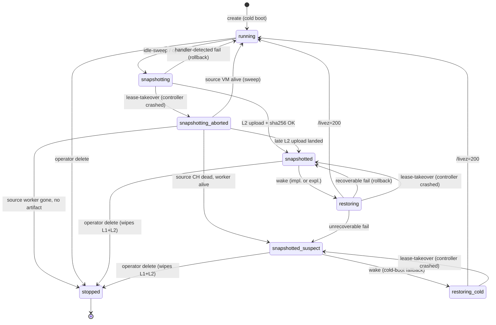

# Sandbox snapshot/restore eviction

**Date:** 2026-05-05
**Status:** Draft v0
**Audience:** sandbox/controller, platform-ops, security
**Depends on:**
- `crates/sandbox/src/backend/nomad_ch.rs` — current cold-boot create path; this proposal adds a parallel restore path (§ 11)
- `crates/sandbox/scripts/nomad-vm-wrapper.sh` — current wrapper; gains a `ZSBX_RESTORE_FROM` env-var branch (§ 11)
- `crates/sandbox/src/registry.rs` — `Sandbox` record gets six new lifecycle states + `snapshot_*` columns (§ 9)
- `crates/sandbox/src/persist.rs` — sealed-record codec; gains AES-256-GCM-SIV wrap of snapshot `memory-ranges` (§ 4.3)
- `crates/sandbox/src/sweep.rs` — new file; idle-eviction sweep, L1 LRU cache, transient-state lease-takeover (§ 6.1, § 13)
- `crates/sandbox/src/snapshot_store.rs` — new file; GCS adapter, L1 cache, checksum + AEAD layer (§ 4)
- `crates/sandbox/migrations/000?_sandbox_snapshot_enum.sql` — adds enum values (§ 9.1)
- `crates/sandbox/migrations/000?_sandbox_snapshot_columns.sql` — adds columns + index (§ 9.1)

---

## 1. Goal & non-goals

**Goal:** cut sandbox provisioning time from 4–10s cold-boot to ~1s for *previously-active* sandboxes that have been evicted to a snapshot.

**Non-goals (this iteration):**
- Generic warm pool of identity-less VMs. Snapshots are **per-tenant**: in-VM auth keys (mounted via virtiofs `keys` tag) and user home content (`userhome` tag) are baked into the memory image. Sharing a snapshot across tenants requires zeroing those mounts pre-snapshot, which defeats the warm-restore use case.
- Cross-region restore. v1 restores snapshots to the same controller / Nomad cluster they were captured on.
- Sub-500ms restore. v51.1 restore wall is 579ms measured; we target ≤1s end-to-end and don't try to optimize CH internals.
- Pause/resume (without snapshot). RAM-resident pause was measured at 7-8ms but doesn't reclaim memory; addressed in a separate follow-up.

**Lifecycle model — what this proposal IS:** snapshot is a **destructive eviction of the running VM, but reversible via the snapshot artifact**. After `running → snapshotting → snapshotted`, the source VM process is gone (CH killed, virtiofsd × 3 killed, vm_index/tap released) but the snapshot artifact and the sandbox's pg row + sealed-record state remain. To bring the sandbox back, an explicit `wake` (or implicit via user request) drives `snapshotted → restoring → running`. This is **not** "snapshot-on-stop" (§ 14) — `stop` is a *separate, irreversible* operation that wipes sealed records, snapshot artifacts (if any), and the pg row entirely (the row is deleted; the `stopped` state in the diagram is a brief synchronous step before deletion in the same transaction). After `stop` the sandbox does not exist; after `snapshotted` the sandbox exists but is hibernated.

**Lifecycle model — what this proposal IS NOT:**
- It is **not** copy-on-write live migration. The VM is paused for the full snapshot-write duration (~2.1s wall).
- It is **not** a checkpoint mechanism (no rollback to an earlier snapshot of a still-running VM; each sandbox has at most one snapshot at a time, **replacing prior on re-snapshot** — see § 4.3 for old-artifact lifecycle).
- It is **not** user-visible state versioning. Creators don't see snapshots; they just see "my sandbox came back fast."

## 2. Background — the experiment data

Single-VM measurements on `zsbx-prod-worker-1` (n2-standard-32), CH v51.1, 2026-05-05:

| Operation | Wall | Notes |
|---|---|---|
| Cold boot (controller-driven create → /livez=200) | 4243 ms | Single VM, no contention |
| Snapshot (`pause` + `snapshot file://`) | 2111 ms | 1.07 GB artifact (1 GB RAM image + 109 KB state + 2.4 KB config) |
| Restore (CH spawn → /livez=200) | 579 ms | Fresh virtiofsd × 3 pre-spawned with matching socket paths |

Architectural facts surfaced by the experiment:

1. **Per-alloc identity is fully embedded in `config.json`.** Specifically: `payload.cmdline` contains `ip=10.99.<X>.2::10.99.<X>.1...`; each `disk.path` and `fs[].socket` references the source alloc's `/opt/nomad/data/alloc/<alloc-uuid>/` paths; `net[].tap=zsbx-nm-<X>` and `net[].mac=12:34:56:78:9b:<XX>` encode the source vm_index. CH does not support config rewriting at restore time. Restoring elsewhere requires either (a) staging the destination to use the **identical** vm_index slot or (b) **the controller rewrites `config.json` on disk between snapshot-fetch and restore-spawn**.
2. **virtiofsd lifecycle is now controller-managed**. The current wrapper trap kills virtiofsd when CH dies. The restore path needs virtiofsd × 3 alive *before* CH spawns — and matching the socket paths the snapshot expects. Two options: (i) modify the wrapper to skip virtiofsd-kill on a sentinel, or (ii) move virtiofsd ownership out of the wrapper entirely (the wrapper just spawns CH; the controller spawns/kills virtiofsd).
3. **CH v51.1 snapshot accounts the full 1 GB RAM in the task's memory cgroup**, tripping OOM-killer with default `MemoryMB=1024` Nomad job-spec field (`job.group.task.resources.memory`). Production fix: set `job.group.task.resources.memory_max` to `2 × memory` (jobspec `MemoryMaxMB ≈ 2 × MemoryMB`). Applied in `crates/sandbox/src/backend/nomad_ch.rs::build_jobspec`.
4. Per-tenant snapshots only. No "golden empty VM" because the in-VM agent has already mounted the user's keys + home; emptying them post-snapshot loses the speed advantage.

## 3. High-level architecture

Two new operations on the existing sandbox lifecycle. The happy path is `running → snapshotting → snapshotted → restoring → running`. The full state machine including failure-and-recovery branches lives in **§ 9.2** (authoritative). The simplified happy-path summary:

```
        ┌─────────┐  evict   ┌──────────────┐  done   ┌─────────────┐
        │ running │─────────▶│ snapshotting │────────▶│ snapshotted │
        └─────────┘          └──────────────┘         └──────┬──────┘
             ▲                                               │
             │                                               │ wake (impl. or expl.)
             │                                               ▼
             │              /livez=200             ┌─────────────────┐
             └─────────────────────────────────────│   restoring     │
                                                   └─────────────────┘
```

Failure/recovery branches (`snapshotted_suspect`, `snapshotting_aborted`, `restoring_cold`) are described in § 9.2's full state diagram and the transition table that follows it.

End-to-end restore wall budget. Some steps overlap (Nomad place + virtiofsd spawn run concurrently with snapshot stage); the table lists each step's wall and the column "Cumulative" reflects the assumed concurrency.

| Step | Wall | Concurrent with | Cumulative |
|---|---|---|---|
| pg state lookup → snapshot path | ~10 ms | — | 10 ms |
| Snapshot fetch L1 hit (disk-local) | ~50 ms | — | 60 ms |
| vm_index reservation | <1 ms | — | 60 ms |
| `config.json` rewrite + stage | ~10 ms | — | 70 ms |
| Nomad eval/plan/place | ~150 ms | — | 220 ms |
| virtiofsd × 3 spawn + UDS ready | ~200 ms | (during Nomad place + CH spawn-wait) | 220 ms (overlapped) |
| `cloud-hypervisor --restore` → /livez=200 | **579 ms (measured)** | — | 800 ms |
| **Total (best case, snapshot L1 hit, Nomad + virtiofsd overlap)** | | | **~800 ms** |
| **Total (with L2 fetch + AEAD decrypt, no L1)** | +500 ms fetch + 80 ms decrypt = +580 ms | — | **~1.4 s** |
| **Total (worst case, GCS cold + cluster-wide vm_index search)** | adds ~400 ms cluster scan | — | **~1.8 s** |

(Nomad eval/plan/place ranges 100–500 ms in our measurements; the table uses the median 150 ms. Worst-case 500 ms shifts the cumulative by +350 ms relative to median; still under 2 s.)

The 800 ms best-case assumes virtiofsd spawn (200 ms) is fully overlapped with the Nomad place + CH wait-for-vsock period; if not overlapped, add up to 200 ms (still < 1s).

`L1 hit` rate is expected to dominate steady-state because most sandboxes restore on their source worker (where they were snapshotted). § 4.2 covers L1 sizing.

## 4. Snapshot storage

Snapshots are 1 GB each. With 100 evicted sandboxes that's 100 GB. Three tiers:

- **L1 (per-worker local disk, hot)**: `/var/zeroship/ch/snapshots/<sandbox-id>/`. Sandbox's last home worker keeps the snapshot for fast same-worker restore. n2-standard-32 has 200 GB pd-ssd; reserve ~50 GB for snapshots = 50 hot snapshots/worker.
- **L2 (GCS, warm)**: `gs://suger-dev-zsbx-snapshots/<sandbox-id>/`. Authoritative copy. Worker's L1 is a cache. On L1 eviction, snapshot stays in L2 only.
- **L3 (cold archive)**: out of scope for v1. Long-tail idle sandboxes get GCS Coldline tier policies via lifecycle rules.

**On snapshot:**
1. CH writes snapshot to L1 path.
2. Controller computes SHA-256 of `memory-ranges` and the full artifact directory hash, stores both in `sandbox.sandboxes.snapshot_sha256`.
3. Controller uploads L1 → L2 (background, async). Upload uses GCS resumable uploads with checksum verification (`x-goog-hash: sha256=…`). On checksum mismatch the upload is retried up to 3× before alerting.
4. Sandbox state transitions to `snapshotted` only after L2 upload completes and the GCS object's checksum matches the local SHA-256 (avoid losing the only copy if the worker dies, and detect in-transit corruption).
5. L1 retained for fast same-worker restore until LRU evicted (§ 4.2).

**On restore:**
1. Controller looks up `snapshot_artifact_path` (= L2 path) and `snapshot_sha256` from pg.
2. Tries L1 first on the chosen worker. If hit, skip L2 fetch.
3. If L1 miss, fetch L2 → L1, verifying checksum on completion. On mismatch: mark snapshot `Suspect`, fall back to cold-boot (§ 8).
4. **L1 entry is *pinned* against LRU eviction for the duration of the in-flight restore** (refcount on the L1 cache entry; eviction only considers refcount=0 entries).

### 4.1 Re-snapshot artifact lifecycle

A sandbox can be snapshotted, woken, run for a while, and snapshotted again. Each snapshot **replaces** its predecessor:

1. New snapshot starts: `running → snapshotting`. Old `snapshot_artifact_path` and `snapshot_*` columns remain in pg, untouched.
2. New snapshot completes successfully: same transaction that CASes `snapshotting → snapshotted` also writes the new artifact path/checksum/etc., overwriting the old metadata.
3. Old artifacts are GC'd:
   - **L1 (old worker):** the old L1 directory is added to the controller's deletion queue, processed by the next L1 sweep cycle (≤ `SANDBOX_IDLE_SNAPSHOT_SWEEP_SECS`, default 5 min). LRU eviction would catch it eventually, but proactive deletion frees space immediately.
   - **L2 (GCS):** the old GCS object is deleted via a single `objects.delete` API call, fired-and-forgotten. On failure (network blip), it falls into a retry-deletion queue persisted in `sandbox.snapshot_gc_queue` (a small, append-only table); a controller-level GC loop drains it.
4. New snapshot fails: old artifacts are **untouched**; the row's `snapshot_*` columns continue to point to the old artifact, which is still valid for restore.

Atomicity guarantee: there is never a moment where the row points to a non-existent or partial artifact for the *previous* snapshot generation. The new generation either fully replaces the old (and old is GC'd) or fails (and old is preserved).

### 4.2 L1 cache eviction

L1 cache lives in `/var/zeroship/ch/snapshots/`. Eviction is LRU on directory mtime (last-restored-at), with the following policy:

- **Trigger:** on snapshot-write or restore-fetch completion, controller checks `du -s` against `SANDBOX_SNAPSHOT_L1_QUOTA_GB`. If over quota, evict in LRU order until under quota.
- **Pinning:** every L1 entry has a refcount. In-flight restores increment refcount on fetch-start, decrement on /livez=200 (or restore-fail). Eviction skips refcount > 0 entries.
- **Watermark:** eviction proceeds until L1 size is ≤ 80% of quota (low watermark), preventing thrash near the boundary.
- **Pathological case:** all entries pinned and quota exceeded — controller logs `L1_QUOTA_EXCEEDED_ALL_PINNED` and proceeds (snapshot completes anyway; only a worst-case operational alarm). In practice refcount > 0 only during in-flight restore (~1s), so this is essentially impossible at steady state.

### 4.3 GCS access control & encryption

**Access control (IAM):**
- `gs://suger-dev-zsbx-snapshots/` IAM policy grants `storage.objectAdmin` only to the `zsbx-controller` GCP service account. Workers do not access GCS directly — they pull via the controller's signed-URL handoff.
- Operator break-glass requires `storage.objectViewer` on the bucket and is gated by Workload Identity Federation; never granted to user accounts. Audit log via Cloud Audit Logs (`storage.googleapis.com/data_access`).
- Bucket has Public Access Prevention enforced and Uniform Bucket-Level Access on (no per-object ACLs).

**Encryption at rest:**
- **Server-side: CMEK** with `projects/zeroship-prod/locations/us-central1/keyRings/zsbx-snapshots/cryptoKeys/snapshot-cmek`. Key rotated every 90 days; old key versions retained for the snapshot retention window.
- **Application-side AEAD wrap:** v1 ships **with controller-side AES-256-GCM-SIV** wrapping the `memory-ranges` blob before upload. Per-sandbox DEK derived via HKDF from a **platform root key** (`SANDBOX_SNAPSHOT_ROOT_KEK`).
  - **Root key storage:** the root KEK lives in **GCP Secret Manager** (resource `projects/zeroship-prod/secrets/sandbox-snapshot-root-kek/versions/latest`), accessed by the controller's GCP service account at startup, held in process memory thereafter (never written to disk, never logged). Controller restart re-fetches.
  - **Trust boundary:** the root KEK is in a **different IAM principal scope than the GCS bucket**: bucket access uses `zsbx-controller-storage` service account; secret access uses `zsbx-controller-secret` service account. The defense-in-depth scope is **GCP-API-level** (a stolen GCS service-account token cannot decrypt; a stolen secret-manager token has nothing to decrypt). It does **not** defend against a compromise of the **controller process itself** — the controller has both tokens attached at runtime, by necessity, since it must perform both ops on behalf of every snapshot. Process-level isolation (separate processes, separate hosts) is **out of scope for v1**; the proposal accepts that controller compromise is equivalent to full snapshot decryption. v2 may split AEAD-encrypt into a separate "key service" process to harden this.
  - **Per-sandbox DEK derivation:** `DEK = HKDF-SHA256(salt = sandbox_id || snapshot_taken_at, ikm = root_kek, info = "zsbx-snapshot-dek-v1", L = 32)`. Recorded in `sandbox.sandboxes.snapshot_aead_dek_id` is the HKDF context label only (`"v1"` for now), not the DEK itself.
  - **Operator unsealing:** GCS-side break-glass operators (`storage.objectViewer`) can read raw ciphertext but **cannot decrypt** without the secret-manager principal. A separate, dual-control-gated procedure (two-operator approval, both signing the access request) provisions a **time-limited** `secretAccessor` grant for incident response. Grant TTL: **60 minutes maximum**, enforced by **GCP Privileged Access Manager (PAM)** entitlement-with-expiry — note that vanilla IAM Conditions don't expire grants on a per-binding TTL, so PAM (or a custom CI-driven binding-then-revoke job, the v1 fallback if PAM isn't in our org tier) is the implementation. Operator can renew via a fresh dual-control approval. All grants and uses are logged to Cloud Audit Logs and tagged with the incident ticket ID. Process documented in the security runbook (`docs/runbooks/sandbox-snapshot-incident-response.md`).
  - Cost: ~80 ms/GB per encrypt + decrypt on n2-standard-32 (negligible vs 579 ms restore wall).

**Encryption in transit:**
- Worker → controller: mTLS (existing) on the bundle-fetch RPC, TLS 1.3 only.
- Controller → GCS: HTTPS only; library default.

**SHA-256 trust chain:**
- SHA-256 is computed by the controller post-snapshot, **before encryption**, and stored in the *authenticated* pg row. On restore, controller decrypts the artifact, computes SHA-256 of plaintext, compares to pg-stored value. Mismatch → `snapshotted_suspect` + cold-boot fallback. The trust root is the pg row itself; if pg is compromised an attacker can substitute snapshots, which is the same security boundary as for sealed records today.
- **pg authentication prerequisite:** this trust chain assumes pg connections from the controller are authenticated and integrity-protected (scram-sha-256 + TLS minimum; client-cert mTLS preferred). Production today satisfies the minimum; § 13 step 0 contains the verification list and the planned upgrade to client-cert mTLS as part of the platform-team's separate auth-hardening track.

**Cost estimate:** 1 GB × 100k sandboxes × $0.020/GB/month (GCS Standard) = $2,000/mo for warm snapshots. Acceptable; lifecycle to Coldline ($0.004/GB) for long-idle drops it 5×. AEAD wrap adds ~0% storage overhead (GCM-SIV ciphertext is plaintext-size + 16-byte tag).

## 5. Identity rewrite at restore

### 5.0 vm_index scoping

`vm_index` is a **worker-local** small integer (range 0..255 per worker, allocated by `crates/sandbox/src/backend/nomad_ch.rs::VmIndexAllocator`). The derivation chain is `(worker_id, vm_index) → IP, tap_name, MAC`. Specifically:

- **IP**: `10.99.<vm_index>.2/30` — vm_index *alone* indexes a /30 within the worker's `10.99.0.0/16`. **Two workers with the same vm_index do NOT collide on IP** because each worker is a distinct host with its own bridge (`zsbx-br-<worker_id>`); the /30 lives on that worker's local bridge and is NAT'd to the host's external IP for egress. Cross-worker traffic between sandboxes is disallowed by design (no VPC routing of `10.99.0.0/16`).
- **tap_name**: `zsbx-nm-<vm_index>` — a worker-local tap interface on the worker's bridge. Different workers can each have a `zsbx-nm-3` independently because they're separate host kernels (each is its own L2 broadcast domain rooted at a different bridge).
- **MAC**: `12:34:56:78:9b:<vm_index_hex>` — locally administered (LAA, second-LSB of first byte = 1 in `12`). Bridges on different workers are L2-isolated (no inter-worker bridging), so MAC reuse across workers is safe.

Therefore: **a snapshot's `vm_index` constrains restore to a worker where that vm_index is free**, but is not constrained to the *source* worker. A snapshot taken on worker-1 vm_index 3 can restore on worker-2 vm_index 3 if worker-2's slot 3 is free, because the IP/tap/MAC derivation is identical on both workers.

### 5.1 Fields rewritten in `config.json`

The snapshot's `config.json` references the source alloc's identity. The restore handler rewrites these fields before invoking CH:

| Field | Source value (example) | Restored value |
|---|---|---|
| `payload.cmdline` (`ip=` arg) | `ip=10.99.103.2::10.99.103.1::255.255.255.252::sbx::off` | **unchanged** (see note below) |
| `disks[]` | (entries reference the shared, read-only `rootfs-slim.img`) | **no rewrite required** — see § 5.2 |
| `net[].tap` | `zsbx-nm-3` | `zsbx-nm-<vm_index>` (= source vm_index) |
| `net[].mac` | `12:34:56:78:9b:03` | **unchanged** (source MAC, equal to dest MAC since vm_index matches) |
| `fs[].socket` (× 3) | `/opt/nomad/data/alloc/<old-uuid>/.../vfs-<tag>.sock` | `/opt/nomad/data/alloc/<new-uuid>/.../vfs-<tag>.sock` |
| `serial.file` | `/opt/nomad/data/alloc/<old-uuid>/.../serial.log` | `/opt/nomad/data/alloc/<new-uuid>/.../serial.log` |

The kernel inside the VM doesn't re-DHCP — `ip=` cmdline is parsed once at boot and the `eth0` interface keeps that IP across resume. So changing the IP via `cmdline` rewrite **is meaningless** post-snapshot; the VM resumes with whatever IP it had at snapshot time. **This means the restore must place the VM on a `vm_index` that yields the same IP** as the source. Per § 5.0, `vm_index` alone determines the IP, so any worker with the source `vm_index` free is acceptable.

The MAC derivation rule lives in `crates/sandbox/scripts/nomad-vm-wrapper.sh::derive_mac` (`printf '12:34:56:78:9b:%02x' "$VM_INDEX"`). The restore-time controller computes it via the same formula in `crates/sandbox/src/backend/nomad_ch.rs::derive_mac_from_index` (kept in sync via a unit test that pins both forms).

**Implication: vm_index allocation at restore is constrained.** The controller's restore handler:
- First tries the **source worker**'s vm_index slot (cheap path — same worker means snapshot is in L1 cache).
- On miss, tries up to 4 sibling workers in CHWBL preference order, asking each `VmIndexAllocator` for a reservation on the **source vm_index** specifically (not any-free-slot).
- If none of the 5 workers have that exact vm_index free, fails the restore with `VmIndexConflict` and returns 503 + `Retry-After: 30` to the caller. (For v1; later iterations may rewrite the kernel cmdline + re-DHCP, but that's a non-trivial feature.)

This forces a **placement constraint**: snapshots restore on a worker where their original `vm_index` is free.

**vm_index conflict is a real production risk, not a corner case.** Between snapshot and wake the worker may have allocated that vm_index to a freshly-cold-booted sandbox. Estimated conflict rate depends on (a) snapshot-to-wake latency distribution per cohort and (b) cold-boot rate per worker; from § 5.0 worker-level allocator math, with 256 slots/worker and steady-state ~50 hot sandboxes per worker, a uniform-random allocator conflicts ~20% of the time per restore in the worst case (heavy cold-boot pressure). Mitigations:

1. **Sticky allocation:** the cold-boot allocator preferentially picks slots **not** present in `WHERE state IN ('snapshotted','snapshotted_suspect') AND last_running_worker_id = $self`, treating recently-snapshotted slots as soft-reserved. This converts most snapshot/wake interleavings to no-conflict.
2. **Cluster fallback** (already documented) covers the residual.
3. **Observability:** `sandbox_snapshot_vm_index_conflict_total{worker_attempted}` (§ 13.2) — alert if the conflict rate exceeds 5% of restore attempts; that's a signal to expand the soft-reservation window or to bring forward the v2 cmdline-rewrite path.

### 5.2 Disk

Sandboxes don't currently have a per-alloc disk image — the rootfs comes via virtiofs from a shared, read-only `ZSBX_ARTIFACT_DIR/rootfs-slim.img` on each worker. The `disks[]` block in the snapshot's config.json references the same path on every worker (artifact path is a platform-managed constant, not an alloc-scoped path). **Rewrite is therefore a no-op for v1.** When per-alloc writable disk lands (out of scope for v1), this section gets a path-rewrite rule analogous to `fs[].socket`.

### 5.3 virtiofs backing-dir consistency

The snapshot's memory image holds the kernel's page-cache view of the virtiofs-mounted directories (`keys`, `userhome`, `rootfs-overlay`) at snapshot time. The restore handler re-stages these directories from sealed-record + storage-backend sources before CH starts. **Backing-dir contents must be byte-identical to snapshot time** — a stale page cache against a drifted on-disk file produces undefined behavior (silent corruption, or virtiofsd EIO on next read).

Invariants enforced:

- **`keys/` is immutable per snapshot generation.** The sealed-record codec emits a content hash; the snapshot record stores the hash; restore verifies hash match before mounting. On mismatch: refuse restore, fall through to cold-boot.
- **`userhome/` is read-write but is mounted by `virtiofsd --writeback=off`** (no host-side modifications during VM lifetime). At snapshot time the VM is paused, so the in-VM dirty pages are flushed to virtiofsd. Restore re-mounts the *same* underlying directory the source worker used (or a content-restored copy from the per-sandbox storage volume); if the directory was modified externally between snapshot and restore (e.g., another tool wrote to it), the restore fails the consistency check and falls back to cold-boot.
- **`rootfs-overlay/` is platform-managed and snapshot-cycle-stable.** Versioned by the platform release; restore refuses to proceed if the running platform's overlay version doesn't match the snapshot's recorded `rootfs_overlay_version`.

Each backing dir's hash + version is recorded at snapshot time in `sandbox.sandboxes.snapshot_backing_versions` (jsonb) and verified at restore. Mismatch → cold-boot fallback (§ 8 "snapshot backing-dir drift").

## 6. Lease-takeover semantics for snapshotted VMs

Phase-2 lease-takeover: when controller A sees no heartbeat from sandbox X for `unreachable_timeout`, it assumes A's previous lessee crashed and takes over. **Snapshotted VMs have no heartbeat by design** — they're not running.

This section addresses the *terminal* `snapshotted`/`snapshotted_suspect` states. Transient states (`snapshotting`, `restoring`, `restoring_cold`) require a different policy and are covered in § 6.1.

Three options for terminal-state takeover behavior:

- **(A) Treat `snapshotted` as opaque to lease-takeover.** Heartbeat-skew check only applies to sandboxes in state `running`. Snapshotted sandboxes don't expire, don't get takeovered. ← preferred.
- **(B) Move snapshotted sandboxes' heartbeat to a "synthetic" pg-side heartbeat that controllers refresh.** Heavy.
- **(C) Bake takeover-as-restore semantics**: a controller observing a snapshotted sandbox during takeover claims it and restores it. Restore is lazy by design (on user request); eager restore on takeover would scale poorly with cold idle sandbox count and waste cluster capacity.

(A) is the right answer. The pg-state machine treats `snapshotted` and `snapshotted_suspect` as terminal-but-not-stopped states that lease-takeover *for liveness* ignores. The takeover query for `running` continues to filter on `state = 'running' AND last_heartbeat < now() - $unreachable_timeout` (this is the "liveness" half of the unified query in § 6.1; the new "transient-state" half is documented there). Terminal-snapshot states are never reached by either half.

### 6.1 Lease-takeover for transient states

The `snapshotting`, `restoring`, and `restoring_cold` states are transient (expected duration < 30s) and **do** participate in lease-takeover, with a different policy than `running`:

- A sandbox stuck in a transient state for longer than `transient_state_timeout` (default: **120s**) is considered *abandoned* — the original controller crashed, was killed, or partitioned away mid-operation. Sizing rationale: 120s comfortably exceeds the **2.1s snapshot wall + L2 upload p99 (estimated 60s for 1 GB at ~17 MB/s sustained on shared egress)** plus the 10s lessee-bump cadence × 2 (so a controller missing one bump still has a grace period before takeover). Operators can tune higher (e.g., 300s) if L2 uploads consistently take longer.
- A foreign controller takes over by atomic CAS, with the destination state depending on the source:
  - `snapshotting → snapshotting_aborted` (the source VM may or may not still be running on its worker; the abort sweep, § 6.1.1, decides).
  - `restoring → snapshotted` (rollback to the pre-restore terminal; the next user request retries the restore).
  - `restoring_cold → snapshotted_suspect` (cold-boot was already a fallback; bouncing it doesn't gain anything; the next request retries the cold-boot).
- `lessee_updated_at` is bumped by the owning controller every 10s while the operation is in flight. On terminal-state transition the column is **explicitly set to NULL** (so a lingering value can never trick a takeover into firing on a `running` row).
- `lessee_updated_at` is **only non-NULL** when state is in {`snapshotting`,`restoring`,`restoring_cold`}; this is enforced by an application-level invariant (asserted on every state-write codepath; covered by an integration test).

This guarantees no sandbox is wedged in a transient state by a single controller crash. The takeover query:

```sql
-- Running sandboxes whose owning controller died (existing logic; unchanged)
WHERE state = 'running' AND last_heartbeat < now() - $unreachable_timeout

UNION ALL

-- Transient sandboxes whose owning controller died mid-operation (new)
WHERE state IN ('snapshotting','restoring','restoring_cold')
  AND lessee_updated_at IS NOT NULL
  AND lessee_updated_at < now() - $transient_state_timeout
```

**Feature-flag interaction:** lease-takeover for transient states is **always-on** regardless of `SANDBOX_SNAPSHOT_ENABLED`. A controller with the flag freshly disabled mid-cycle still needs to release wedged transient rows; otherwise re-enabling the flag would inherit a backlog of stuck rows. This contrasts with the snapshot/restore *handlers*, which respect the flag.

#### 6.1.1 Abort sweep for `snapshotting_aborted`

Recovery from `snapshotting_aborted` runs in the per-worker sweep loop (§ 13):

1. Identify the source worker from `last_running_worker_id` (column populated when a sandbox transitions out of `running`).
2. If the source worker is reachable, query whether its CH process for this sandbox is alive (via the controller's per-worker `vm_status` RPC).
   - **If alive:** the foreign controller establishes a fresh lessee binding by re-CASing `lessee_controller_id = $self` and bumping `last_heartbeat` (both pre-existing Phase-2 lease-takeover columns), claiming the sandbox and **CASing to `running`**. Heartbeat polling resumes from the new controller's session. The original controller, if it ever recovers, is fenced by the lessee CAS.
   - **If dead** (CH process gone, but worker host alive): CAS to `snapshotted_suspect` (the next user request triggers cold-boot fallback via the regular path). Reasoning: don't transition to `running` if the VM is gone; the only forward path is cold-boot, and `snapshotted_suspect` is the canonical state for that.
3. If the source worker is unreachable (host failure mid-snapshot, § 8 "Worker host failure mid-snapshot"), the source VM is presumed dead. The controller decides based on **GCS** state alone (the dead worker's L1 is unreachable and effectively lost):
   - **L2 object exists + checksum matches `snapshot_sha256`** (verified by GCS HEAD + checksum query): CAS to `snapshotted` (partial-success path; the snapshot landed in L2 before the worker died).
   - **L2 object missing, partial, or checksum mismatch**: CAS to `stopped` (sandbox is gone — equivalent to today's worker-loss semantics for any in-VM-only state). The pg row is then deleted in the `→ stopped` deletion transaction (§ 1).
   - **Note:** the dead worker may still hold a partial L1 artifact, but it's effectively lost (we can't reach it). If the worker eventually comes back, an orphan-cleanup sweep purges the partial dir; nothing is restored from it.
4. Clean any L1 partial-dir on whichever worker took the takeover.

This makes the `snapshotting_aborted → {running | snapshotted | snapshotted_suspect | stopped}` recovery deterministic.

### 6.2 vm_index allocator durability

The `VmIndexAllocator` is a **dual-source** allocator: pg holds the *intended* assignment, the worker's actual tap/bridge state holds the *realized* one. pg is authoritative for reservations; the worker is authoritative for what's physically in use. Discrepancies trigger a reconciliation pass.

**On controller boot**, the allocator rebuilds reservations by:

1. Scan pg:
   ```sql
   SELECT id, snapshot_vm_index, last_running_worker_id, state
   FROM sandbox.sandboxes
   WHERE state IN ('running','snapshotting','restoring','restoring_cold');
   ```
2. For each reachable worker, RPC `vm_index_inventory()` returning the worker's actual `(vm_index, sandbox_id, ch_pid)` set. The worker-side responder is **`zsbx-worker-agent`** — a **new sidecar process** introduced by this proposal, deployed alongside the Nomad agent on each worker host (it does NOT replace the Nomad-agent or the existing `zeroship-worker` V8 isolate process; it's purely a state-reconciliation helper for the snapshot/restore subsystem). The agent maintains an authoritative table mapping `vm_index → (sandbox_id, ch_pid)` updated on every alloc start/stop, persisted to `/var/zeroship/ch/inventory.json` for crash-recovery; it also cross-checks `ip link show zsbx-nm-*` and `pidof cloud-hypervisor` to detect drift between its table and reality. Inventory RPC reads this table; cost is constant-time per query.
3. Reconcile:
   - pg reservation + worker has the tap → confirm the reservation (normal case).
   - pg reservation + worker missing the tap → **mark stale** (controller died after CAS but before alloc landed). Allow re-reservation.
   - Worker has tap + no pg reservation → **orphan tap**. Log, alert, GC after `orphan_tap_grace` (default 600s) to allow late pg writes from another partitioned controller.
4. Rows with state in {`snapshotting`,`restoring`,`restoring_cold`} are **read-locked** (an allocator-level "in flight, do not steal") until the lease-takeover transition lands.

This eliminates the "fresh controller could double-allocate" race: the boot-time inventory pass surfaces actual taps before any new reservation is granted. A controller crash mid-CAS may cause a *transient* extra delay (until the next inventory poll, default 30s) but never a double-grant.

**Steady-state** (post-boot): the allocator polls each worker's `vm_index_inventory()` every `vm_index_inventory_secs` (default 30s) and reconciles against in-memory reservations. Cheap (≤256 entries × 5 workers = 1280-row payload, polled at 30s cadence ⇒ ~43 rows/sec total). Discrepancies (a tap appears or vanishes without a pg-recorded transition) emit `sandbox_snapshot_vm_index_inventory_skew_total`.

**Worker unreachable at boot:** if a worker is unreachable when the controller initializes, the allocator marks all reservations on that worker as **`unverified`**. Unverified reservations are **honored** for new wake operations (we trust pg) — meaning the controller will *attempt* to wake on that worker; if the worker is still unreachable when the wake runs, the wake fails and falls through to sibling-worker fallback (§ 5.1). They are **not** counted as occupied for fresh cold-boot allocations on **other** workers (so the conservative path still tries to find a fully-known free slot before falling back). When the worker comes back, the inventory pass converts `unverified → verified-or-orphan` per the steady-state rules. This avoids both extremes (refuse to operate vs. silently double-allocate).

## 7. Eviction policy

When does a sandbox transition `running → snapshotting`?

- **v1 (manual + idle-trivial)**: `POST /admin/sandboxes/{id}/snapshot` (operator-initiated) + an idle-detection sweep that snapshots sandboxes whose `last_request_completed_at` is older than `SANDBOX_IDLE_SNAPSHOT_SECS` (default off; opt-in per sandbox).
- **v2 (later iteration)**: predictive — track per-creator usage patterns, snapshot sandboxes whose creators are predicted not to return within N hours.

### 7.1 Sweep cadence and prioritization

The idle-snapshot sweep loop runs every `SANDBOX_IDLE_SNAPSHOT_SWEEP_SECS` (default 300s = 5 min). It is **per-controller**; controllers shard the sandbox set by `hash(sandbox_id) % num_controllers`, so each sandbox is considered by exactly one controller per sweep.

**Prioritization (within a sweep cycle):**

1. **Eligibility filter (SQL):** `state = 'running' AND idle_snapshot_opted_in = TRUE AND last_request_completed_at < now() - SANDBOX_IDLE_SNAPSHOT_SECS`.
2. **Order:** by `last_request_completed_at ASC` (oldest-idle first). Ties broken by `sandbox_id` for determinism.
3. **Throttle:** at most `SANDBOX_SNAPSHOT_CONCURRENCY` (default 4) concurrent in-flight snapshot ops *per controller*, and at most `SANDBOX_SNAPSHOT_PER_WORKER_CONCURRENCY` (default 2) per source-worker (to bound per-worker IO impact).
4. **Capacity check:** before starting a new snapshot, verify the source worker's L1 has free space (`du -s` against quota minus headroom). If not, **skip this sandbox** for this cycle — L1 LRU eviction (§ 4.2) runs on the post-snapshot path and a snapshot that can't even land in L1 is a non-starter. (Don't block the sweep; just retry next cycle.)

**Sweep capacity sizing:** at 4 concurrent × 2.1s wall = ~115 snapshots/min/controller; with 5 controllers ≈ 570 snapshots/min cluster-wide. For a 100k-sandbox population this means a full cluster-wide eviction wave takes ~3h, which is acceptable because the threshold (`SANDBOX_IDLE_SNAPSHOT_SECS`) is hours-scale anyway. We won't be evicting 100k sandboxes per sweep.

**Wake trigger:** any HTTP request targeting a snapshotted sandbox triggers restore (gateway behavior in § 10.2). The first request blocks for ~1s while restoring; subsequent requests proceed normally. `POST /admin/sandboxes/{id}/wake` exists for explicit pre-warming.

## 8. Failure modes

### 8.1 Cold-boot fallback semantics (referenced from many failure modes below)

Several failure modes recover via "cold-boot fallback." The semantics are **identical** in all cases:

- **State transition:** `snapshotted_suspect → restoring_cold → running`. (Or, for the operator `cold-boot` endpoint applied to other states: directly to `restoring_cold`.)
- **Action:** controller invokes the existing cold-boot path (same as `nomad_ch.rs::create()` for a fresh sandbox), seeded with the sandbox's sealed-record `keys/` and the per-sandbox storage volume's current `userhome/`.
- **State preserved:** sealed-record (creator identity, auth keys, persistent storage), `userhome/` content, `keys/` content, all pg metadata except snapshot columns.
- **State lost:** in-VM process state, RAM-resident sessions, file edits not yet flushed to virtiofs, ephemeral env modifications, any mutations to virtiofs-mounted files that hadn't synced.
- **Wall:** ~4 s (cold-boot wall, § 2 measurement). Hold budget: `SANDBOX_WAKE_HOLD_MS_COLD` (default 8 s).
- **User-facing surface:** the user sees a slow first request (~4 s vs the hot-path ~1 s) and any in-VM-only state from before the snapshot is gone. We document this as expected behavior in user-facing release notes for the snapshot feature.

The various failure modes below all converge on this fallback when restore can't proceed. They differ only in *what* triggers the transition (CH crash, corrupt artifact, drift, etc.) and *what* happens to the suspect snapshot artifact (retained for forensics, or wiped).

### 8.2 Failure modes (catalog)

- **Snapshot mid-write fails / killed.** Snapshot dir partially populated. Recovery: pg state stays `snapshotting` until L2 upload + checksum-verify completes (then transitions to `snapshotted`); transient duration is bounded by the snapshot wall (~2.1 s) plus L2 upload (≤30 s typical). If the controller crashes mid-snapshot, lease-takeover (§ 6.1) detects the stuck `snapshotting` row after `transient_state_timeout` (120 s), CASes it to `snapshotting_aborted`, the abort sweep (§ 6.1.1) determines outcome (running / snapshotted / snapshotted_suspect / stopped), then transitions to terminal. **User requests during the window** (snapshotting in progress; can be up to 120 s+ if the controller has crashed) are held by the gateway per § 10.2 ("snapshotting" → hold up to `SANDBOX_WAKE_HOLD_MS_COLD`, then 503). The sandbox is unavailable for the duration; this is a deliberate trade-off versus running with a half-snapshot.
  - **In-flight requests when snapshot starts:** the snapshot path runs `ch-remote pause` first, which freezes the VM. Any in-flight HTTP request being served by the VM **stalls** until either resume (failed snapshot path → CAS back to `running`, request resumes naturally) or VM-kill (success path → connection closes, the gateway returns `502 Bad Gateway` for the stalled request). To avoid abrupt 502s, the snapshot handler **drains** by:
    1. CAS `running → snapshotting`, then mark the sandbox `not-routable` in the gateway (controller broadcasts via the wake-stream's reverse direction — sandbox-state events).
    2. Wait `request_drain_secs` (default 5s) for the gateway to finish active requests; new requests are held per §10.2.
    3. `ch-remote pause` + `snapshot file://`.
    4. Kill CH + virtiofsd; release vm_index.
  - The 5s drain window covers typical request lifetimes (worker SLO is p99 < 2s for non-snapshot user requests). Long-poll connections beyond 5s receive `503 Service Unavailable; sandbox snapshotting` from the worker before disconnect; clients reconnect normally post-restore.
- **Snapshot succeeds but L2 upload fails.** L1 has the only copy and the source VM is **already killed** (snapshot kills the source, per § 1 lifecycle). The row is in `snapshotting`. Mitigation: retry L2 upload up to 5× with exponential backoff; on persistent failure, the controller has two choices:
  - **(a) Promote L1 to authoritative**: CAS `snapshotting → snapshotted` with `snapshot_artifact_path = file://<worker>/L1/<id>` (a worker-local URL, not a GCS URL). Document that this snapshot is **not survivable** to worker loss; alert operator. Subsequent restore is L1-only and pinned to that worker. Eventual L2 upload can be retried by a background sweep. **L1 LRU eviction (§ 4.2) is suppressed** for entries whose `snapshot_artifact_path` is `file://` (sole-copy snapshots); the L1 entry stays pinned until the L2 upload eventually succeeds and the path is rewritten to the GCS URL. Pinning is enforced by the L1 cache's eviction predicate, not just refcount.
  - **(b) Treat as failed snapshot**: CAS `snapshotting → snapshotted_suspect` with `snapshot_artifact_path = NULL` and operator alert. Next user request triggers cold-boot fallback, losing in-VM state. The L1 artifact is **moved** to `/var/zeroship/ch/snapshots-forensic/<sandbox-id>-<timestamp>/` (separate quota, default 5 GB/worker, FIFO eviction at quota or `forensic_retention_secs`/24h, whichever first) so cold-boot's normal L1-snapshot wipe doesn't lose forensics. Forensic copies are **not** decryptable by ops without the dual-control unsealing flow (§ 4.3).
  - v1 picks **(b)** by default — a snapshot we can't durably store is not a snapshot we should depend on. Operator can opt into (a) per-cohort with `SANDBOX_SNAPSHOT_ALLOW_L1_ONLY=true` for use cases that prefer in-VM-state preservation over durability.
- **Restore fails — `VmIndexConflict`.** Source vm_index taken on the source worker. v1: try up to 4 sibling workers in CHWBL preference order, asking each for the *exact* source vm_index. If all 5 fail, surface 503 + `Retry-After: 30` and `Restore: vm_index unavailable cluster-wide`. Caller backs off; idle-eviction sweep may eventually free the slot.
- **Restore fails — CH crash mid-resume.** Memory image corrupt or v51.x bug. Mitigation: surface 503; mark snapshot `snapshotted_suspect` (CAS `restoring → snapshotted_suspect`); next request triggers **cold-boot fallback** (§ 8.1).
- **Restore fails — virtiofsd backing-dir empty or drifted.** Controller didn't restore the user's keys/workspace dirs, OR restored dirs differ from snapshot-time content. Mitigation: restore handler always re-stages `keys/`, `userhome/`, `rootfs-overlay/` from sealed records + storage volume BEFORE invoking CH, then verifies content hashes against `snapshot_backing_versions` (§ 5.3). Mismatch → cold-boot fallback (in-VM state lost).
- **Two restores race.** Caller A and caller B both POST to a snapshotted sandbox at once. CAS on `state = 'snapshotted' → 'restoring'` ensures only one wins; the other awaits on a per-sandbox `Notify` registered against the sandbox-id. The waiter wakes on **any terminal-state transition** (`running`, `snapshotted`, `snapshotted_suspect`, `stopped`):
  - On `running`: waiter proceeds with the request.
  - On `snapshotted` (winner's restore failed and rolled back): waiter retries the CAS up to 3×, then surfaces 503.
  - On `snapshotted_suspect`: waiter races the same CAS `snapshotted_suspect → restoring_cold`. Only one of the now-second-wave waiters wins; the rest re-await on `Notify` and converge on the cold-boot winner's terminal transition. Same retry budget (3×) applies cumulatively to the whole wake attempt.
  - On `stopped`: waiter returns 410 Gone.
  - Per-waiter timeout: 10s. **Cumulative cap dominates:** the per-(sandbox, source-IP) `SANDBOX_WAKE_CUMULATIVE_HOLD_MS` (default 30 s) bounds total wait. With 3 retries × 10s/each = 30 s, the cumulative cap is reached at retry 3; the 4th retry from the same source within the cap window is refused immediately with 503. Different source-IPs each get their own cumulative budget; this is intentional (a creator with one IP tries 3 times; their automated client retrying from a CI runner with a different IP is unaffected, but they share the per-sandbox in-flight CAS protection).
- **Worker host failure mid-snapshot.** Worker dies during `snapshotting` (kernel panic, network partition, GCP host eviction). The pg row is `snapshotting`; the source VM is unreachable. Recovery: lease-takeover (§ 6.1) detects after `transient_state_timeout`; a foreign controller CASes to `snapshotting_aborted`; the abort sweep (§ 6.1.1) determines whether the L2 upload had completed (rare for an in-progress snapshot; checks `snapshot_artifact_path IS NOT NULL` and verifies the GCS object exists with valid checksum). If yes → CAS to `snapshotted`; if no → CAS to `stopped` with operator alert (sandbox is *gone* — equivalent to a host-failure user-data loss event for any in-VM-only state, identical to the pre-snapshot-feature behavior of "running on a worker that died"). User-visible: same as today's worker-loss semantics.
- **Snapshot artifact corrupt.** L2 file truncated by GCS bug or upload race. Mitigation: SHA-256 stored in pg at snapshot-time (§ 4); verify on restore-time fetch. On mismatch: `snapshotted_suspect`, cold-boot fallback. Caveat: in-VM state since snapshot is lost.
- **CH version mismatch.** Snapshot taken on v51.1, restored on v51.2 (or v52). May or may not work depending on CH's snapshot-version compat. Mitigation: store `ch_version` in pg at snapshot-time; refuse restore if cluster's current CH is a different major. Operators upgrading CH must drain snapshots first (§ 13.1 rollback playbook).
- **Snapshot backing-dir drift.** A `userhome/` write happened between snapshot and restore via an out-of-band path (e.g., operator copied files in). Detected by hash mismatch in § 5.3. Mitigation: cold-boot fallback; the drifted-in content is what the freshly-booted VM sees (so the operator's intent is preserved at the cost of in-VM state).
- **`ALTER TYPE … ADD VALUE` migration ordering.** Postgres requires the `ADD VALUE` transaction to commit before the new enum value can be referenced. Migration is split: (a) one migration adds the enum values and commits; (b) a *separate, later* migration adds NOT-NULL CHECK constraints / triggers that reference them; (c) code rollout that *writes* the new states only ships after both have applied. See § 13.

## 9. Data model changes

### 9.1 Schema (split into two migrations)

**Migration A** (`000?_sandbox_snapshot_enum.sql`): adds enum values only. Must commit before any code references them.

```sql
-- Postgres requires ALTER TYPE ADD VALUE to commit before the new value
-- can be used. Keep this migration alone; do not mix with code or constraints.
ALTER TYPE sandbox.lifecycle_state ADD VALUE IF NOT EXISTS 'snapshotting'         BEFORE 'stopped';
ALTER TYPE sandbox.lifecycle_state ADD VALUE IF NOT EXISTS 'snapshotted'          BEFORE 'stopped';
ALTER TYPE sandbox.lifecycle_state ADD VALUE IF NOT EXISTS 'snapshotted_suspect'  BEFORE 'stopped';
ALTER TYPE sandbox.lifecycle_state ADD VALUE IF NOT EXISTS 'snapshotting_aborted' BEFORE 'stopped';
ALTER TYPE sandbox.lifecycle_state ADD VALUE IF NOT EXISTS 'restoring'            BEFORE 'stopped';
ALTER TYPE sandbox.lifecycle_state ADD VALUE IF NOT EXISTS 'restoring_cold'       BEFORE 'stopped';
```

**Migration B** (`000?_sandbox_snapshot_columns.sql`): runs in a separate deployment after Migration A is committed cluster-wide.

```sql
ALTER TABLE sandbox.sandboxes
  ADD COLUMN snapshot_artifact_path     TEXT,           -- gs://… or NULL
  ADD COLUMN snapshot_taken_at          TIMESTAMPTZ,    -- NULL when not snapshotted
  ADD COLUMN snapshot_ch_version        TEXT,           -- "v51.1" etc.
  ADD COLUMN snapshot_sha256            BYTEA,          -- 32 bytes; integrity check (plaintext, pre-AEAD)
  ADD COLUMN snapshot_aead_dek_id       TEXT,           -- HKDF context label for the per-sandbox DEK
  ADD COLUMN snapshot_backing_versions  JSONB,          -- {"keys":"<hash>","userhome":"<hash>","rootfs_overlay":"<ver>"}
  ADD COLUMN snapshot_vm_index          SMALLINT,       -- the vm_index baked into the snapshot
  ADD COLUMN lessee_updated_at          TIMESTAMPTZ,    -- bumped every 10s during snapshotting/restoring (§ 6.1)
  ADD COLUMN last_running_worker_id     TEXT,           -- worker that last ran this sandbox (populated on every running→{snapshotting,stopped} transition; § 6.1.1)
  ADD COLUMN idle_snapshot_opted_in     BOOLEAN NOT NULL DEFAULT FALSE, -- per-sandbox idle-eviction opt-in (§ 7)
  ADD COLUMN idle_snapshot_count_long_poll BOOLEAN NOT NULL DEFAULT FALSE, -- count long-poll connections as activity (Q4)
  ADD COLUMN last_drain_failure_at      TIMESTAMPTZ,    -- bumped by drain script on stuck wake; § 13.1 step 3
  ADD COLUMN drain_failure_count        INTEGER NOT NULL DEFAULT 0; -- count of consecutive drain failures; for back-off math

CREATE INDEX sandboxes_state_lessee_idx
  ON sandbox.sandboxes (state, lessee_updated_at)
  WHERE state IN ('snapshotting','restoring','restoring_cold');

CREATE INDEX sandboxes_idle_snapshot_idx
  ON sandbox.sandboxes (last_request_completed_at)
  WHERE state = 'running' AND idle_snapshot_opted_in;
```

Code rollout that *writes* the new states only ships after both migrations apply cluster-wide.

### 9.2 State machine



ASCII fallback for environments without Mermaid:

```
running ──────► snapshotting ──ok──► snapshotted ──wake──► restoring ──ok──► running
   ▲                │                     │                    │
   │                ▼ fail                │                    ▼ unrecoverable fail
   │              running                 │              snapshotted_suspect
   │                                      │                    │ wake
   │                                      │                    ▼
   │                                      │              restoring_cold ──ok──► running
   └── lease-takeover paths (§ 6.1):      │
       snapshotting → snapshotting_aborted → {running | snapshotted | snapshotted_suspect | stopped}
       restoring → snapshotted (rollback)
       restoring_cold → snapshotted_suspect (rollback)

   any state → stopped on operator delete
   (snapshotted, snapshotted_suspect → stopped also wipes L1+L2 artifacts)
```

State transitions (authoritative list, all CAS):

| From | To | Trigger | Side effects |
|---|---|---|---|
| `running` | `snapshotting` | idle-sweep / operator | bump `lessee_updated_at` |
| `snapshotting` | `snapshotted` | L2 upload + sha256 verified | record `snapshot_*` cols |
| `snapshotting` | `running` | controller-detected failure | clean partial L1 |
| `snapshotting` | `snapshotting_aborted` | takeover (controller crashed) | foreign controller acquires |
| `snapshotting_aborted` | `running` | source VM still alive (per § 6.1.1 step 2) | partial L1 deleted; lessee re-bound |
| `snapshotting_aborted` | `snapshotted` | late L2 upload completed before abort (per § 6.1.1 step 3) | promote partial-success snapshot |
| `snapshotting_aborted` | `snapshotted_suspect` | source CH dead but worker host alive (per § 6.1.1 step 2) | next request will cold-boot |
| `snapshotting_aborted` | `stopped` | source worker host gone + no L2 artifact (per § 6.1.1 step 3) | row deleted; equivalent to host-failure today |
| `snapshotted` | `restoring` | request handler / `POST /wake` | bump `lessee_updated_at` |
| `restoring` | `running` | /livez = 200 | clear `lessee_updated_at` |
| `restoring` | `snapshotted` | recoverable restore failure (incl. lease-takeover) | snapshot retained; lease-takeover rolls back to last terminal |
| `restoring` | `snapshotted_suspect` | unrecoverable restore failure | snapshot quarantined |
| `snapshotted_suspect` | `restoring_cold` | request handler | cold-boot fallback |
| `restoring_cold` | `running` | /livez = 200 | clear suspect snapshot |
| `restoring_cold` | `snapshotted_suspect` | unrecoverable cold-boot failure or lease-takeover | snapshot retained as suspect; next request retries |
| `snapshotted` | `stopped` | operator delete | wipe L1+L2 + clear cols + delete row |
| `snapshotted_suspect` | `stopped` | operator delete | wipe L1+L2 + clear cols + delete row |
| `running` | `stopped` | operator delete (existing) | (existing; deletes row) |

> **Note on `→ stopped` rows:** all three transitions to `stopped` synchronously delete the pg row in the same transaction (§ 1). The `stopped` state in this table and the diagram is the brief in-transaction state visible to a reader holding the row lock; an external observer never sees a stable `stopped` row.

## 10. Wire / API surface

### 10.0 Standard error envelope

All endpoints in §10.1 return errors as JSON: `{ "error": "<machine_readable_kind>", "message": "<human readable>", ...kind-specific fields }`. HTTP status codes per RFC 9110 conventions (4xx client, 5xx server). All errors carry a `request_id` header echoed from the inbound request.

| `error` code | HTTP | Endpoints | Extra fields |
|---|---|---|---|
| `state_mismatch` | 409 | `POST /admin/.../snapshot`, `POST /admin/.../wake`, `POST /admin/.../cold-boot` | `expected`, `current` |
| `vm_index_unavailable` | 503 | implicit-wake (gateway), `POST /admin/.../wake` | `attempted_workers` (list) |
| `snapshot_corrupt` | 500 | implicit-wake, `POST /admin/.../wake` (surfaces post-fetch) | `sha256_expected`, `sha256_actual` |
| `snapshot_version_mismatch` | 409 | implicit-wake, `POST /admin/.../wake` (pre-flight check) | `snapshot_ch_version`, `cluster_ch_version` |
| `feature_disabled` | 501 | `POST /admin/.../snapshot`, `POST /admin/.../wake` (when `SANDBOX_SNAPSHOT_ENABLED=false`) | — |
| `wake_cap_exhausted` | 503 | implicit-wake (gateway-side only) | `cap_window_secs`, `retry_after_secs` |
| `sandbox_stopping` | 409 | `POST /admin/.../snapshot` | `current_state: "stopping"` |
| `not_found` | 404 | all | — |

(`snapshot_version_mismatch` uses 409 Conflict because the precondition is application-level — pg-stored snapshot version vs cluster CH version — not an `If-Match` header per RFC 9110 § 13.1.1, so 412 doesn't apply.)

### 10.1 Operator endpoints (admin-bearer-gated, like Phase 3)

- `POST /admin/sandboxes/{id}/snapshot` — **request immediate eviction (snapshot + kill source VM)**.
  - Body: `{ "wait": bool, "if_state": "running" | null }`. `if_state` defaults to `"running"` when omitted (strict: refuses to snapshot a non-running sandbox). Pass `null` explicitly to allow snapshot from any non-terminal state (rare; reserved for ops debugging).
  - CAS-gated. Synchronous (`wait=true`) returns 200 with `snapshot_taken_at` after the row reaches `snapshotted`. Async (`wait=false`) returns `202 Accepted` with `Location: /admin/sandboxes/{id}` for state polling.
  - On `if_state` mismatch returns 409 + `{ "error": "state_mismatch", "expected": "running", "current": "<state>" }`.
  - **Note:** snapshot **kills** the source VM; the sandbox's running processes are paused, dumped to disk, and the VM terminates. To bring the sandbox back, call `wake` or hit any user endpoint. This is distinct from "snapshot-on-stop" (§ 14, deferred) and "pause/resume" (§ 1, non-goal).
- `POST /admin/sandboxes/{id}/wake` — request immediate restore (no-op if already running).
  - Body: `{ "wait": bool, "if_state"?: "snapshotted" | "snapshotted_suspect" | "running" | "any", "force_takeover"?: bool, "ignore_drain_backoff"?: bool }`. `if_state` is optional — when omitted (or set to `"any"`), accept any non-stopped non-transient state. `"running"` makes the call strictly idempotent-no-op. `force_takeover` (default `false`, requires `force_takeover` admin scope; same semantics as the cold-boot endpoint) bypasses lease-takeover wait when state is transient. `ignore_drain_backoff` (default `false`, ops-only) skips the per-row drain-failure back-off (§ 13.1 step 3) — used to retry stuck wakes during operator-led recovery.
  - On `if_state` mismatch: 409 + `{ "error": "state_mismatch", "expected": "<value>", "current": "<state>" }`.
  - On state `running`: 200 immediately (no-op) unless `if_state` excludes it.
  - On state `stopped`: 410 Gone.
  - On transient state (`snapshotting`, `restoring`, `restoring_cold`) or recovery state (`snapshotting_aborted`): 202 with `Retry-After`; do not start a parallel restore. The wake will succeed once the state machine reaches a terminal (per § 6.1 / § 6.1.1).
  - Synchronous (`wait=true`) returns when state reaches `running`; cap at `SANDBOX_WAKE_HOLD_MS_COLD`. Async (`wait=false`) returns `202 Accepted` with `Location: /admin/sandboxes/{id}` (callers `GET` that URL to poll `state`).
- `GET /admin/sandboxes/{id}` — returns `state`, `snapshot_artifact_path`, `snapshot_taken_at`, `snapshot_ch_version`, `snapshot_vm_index`, `snapshot_backing_versions`, `lessee_updated_at` if applicable.
- `POST /admin/sandboxes/{id}/cold-boot` — operator-only escape hatch: force a cold-boot regardless of snapshot state.
  - Body: `{ "wait": bool, "wipe_snapshot": bool, "force_takeover": bool }`.
  - **`wipe_snapshot`** (default `false`): if `true`, deletes the L1 + L2 artifacts and clears `snapshot_*` columns *as part of* the cold-boot transaction. If `false`, the snapshot is marked `snapshotted_suspect` (or the row jumps directly to `restoring_cold` if it was in `snapshotted`/`snapshotted_suspect`) but the artifact is retained for forensic retention (§ 8 mitigation (b)).
  - **`force_takeover`** (default `false`, requires `force_takeover` admin scope): bypasses the lease-takeover wait when state is transient by issuing an immediate CAS `<transient> → snapshotted_suspect`. Use with care — this can race with the original controller if it's merely partitioned, not crashed; the lessee CAS still fences the loser. Audit-logged with the operator's identity.
  - **Behavior by current state:**
    - `running`: the running VM is killed (CH + virtiofsd) and the alloc is replaced with a fresh cold-boot. Used when a running VM is suspected-but-not-yet-quarantined (e.g., post-incident bounce).
    - `snapshotted` or `snapshotted_suspect`: cold-boot from sealed records; `wipe_snapshot` decides artifact fate. Used in rollback drains.
    - `snapshotting` / `restoring` / `restoring_cold`: returns 409 unless `force_takeover=true`.
    - `stopped`: 410 Gone.
  - In-VM state is lost in all cases; see § 8.1 for the precise definition of "cold-boot fallback" semantics that apply here and in failure recovery throughout.

### 10.2 User-facing behavior on wake

No new user-visible endpoint. Wake is **implicit** on any user request (`/exec`, `/files`, `/preview`, etc.) when the sandbox is in state `snapshotted` or `snapshotted_suspect`.

**Gateway/controller behavior during in-flight wake:**

| Sandbox state on request arrival | Gateway behavior |
|---|---|
| `running` | Forward as today (no change) |
| `snapshotted` | Trigger restore (CAS to `restoring`); **hold the request** up to `SANDBOX_WAKE_HOLD_MS` (default 3000 ms). On `running` within budget → forward. On budget exceeded → respond `503 Service Unavailable` with `Retry-After: 5` and `X-Zsbx-Wake-State: restoring` header (caller can poll). |
| `restoring` | Same hold-and-forward as above; do NOT trigger a second restore (race-protected by CAS, § 8). |
| `snapshotted_suspect` | Trigger cold-boot fallback. Hold up to `SANDBOX_WAKE_HOLD_MS_COLD` (default 8000 ms; cold boot is ~4s). On budget exceeded → 503 + Retry-After. |
| `snapshotting`, `snapshotting_aborted`, `restoring_cold` | Hold up to `SANDBOX_WAKE_HOLD_MS_COLD`; no new transition triggered. **Note on `snapshotting` duration:** snapshot wall is 2.1s + L2 upload (typically ≤30s, longer if L2 is slow). The hold budget (8s) is shorter than the worst-case snapshot duration. When the budget exceeds, the gateway returns 503 + `Retry-After: 30`. The next user request will likely succeed (post-snapshotted) or get another 503 (still uploading). We accept this cascade: snapshot is operator-triggered or idle-driven, not on the user-request hot path. User requests *during* a snapshot indicate the eviction policy is wrong; this is visible via `sandbox_snapshot_active{state="snapshotting"}` correlated with request rate. |
| `stopped` | 410 Gone (sandbox deleted). |

Hold semantics: gateway opens a long-poll on the controller's per-sandbox wake-state stream — a **dedicated SSE endpoint** `GET /internal/sandboxes/{id}/wake-stream` on the controller, gated by service-mesh mTLS (gateway-issued client cert with `cn=zsbx-gateway`). The controller publishes state-transition events to all connected listeners via a per-sandbox in-process `Notify` (§ 8). On terminal-state transition the controller emits a single SSE event (`event: state-changed\ndata: {"to":"running"}`) and closes the stream; the gateway either forwards or returns the appropriate status. Connection lifetime ≤ `SANDBOX_WAKE_HOLD_MS_COLD`. The SSE endpoint is *internal* (not public) — the wake-stream wire format can evolve without breaking external API contract.

Hold timeouts are **per-attempt** but a per-(sandbox, source-IP) **cumulative wait cap** of `SANDBOX_WAKE_CUMULATIVE_HOLD_MS` (default 30s) prevents unbounded total wait under aggressive client retries. After the cap is exhausted, the gateway returns `503` + `Retry-After: 60` + `X-Zsbx-Wake-Cap: exhausted` and refuses further holds for that source until the cap window slides.

`X-Zsbx-Wake-State` response header surfaces internal state to ops + dashboards without exposing it to end users (header is stripped at the public-facing tier).

**SLO targets** (initial; revise after closed-alpha). Latencies measured from "user request hits gateway" to "gateway forwards to running worker". The same numeric targets apply to **explicit operator wakes** (`POST /admin/.../wake?wait=true`) measured from request-receipt to terminal-state-reached:
- p50 implicit-wake latency ≤ **1.0 s** (assumes L1 hit, source vm_index free; matches § 3 best case).
- p95 implicit-wake latency ≤ **1.5 s** (allows occasional L2 fetch, sibling-worker fallback).
- p99 implicit-wake latency ≤ **2.0 s** (allows worst-case L2 fetch + cluster-wide vm_index search; matches § 3 worst case).
- p99.9 implicit-wake latency ≤ **6.0 s** (covers cold-boot fallback path; ~4 s cold-boot wall + 2 s headroom; the gateway hold budget `SANDBOX_WAKE_HOLD_MS_COLD=8 s` provides additional cushion above the SLO so SLO breach doesn't immediately mean a 503).
- Suspect rate (`snapshot_suspect_total / snapshot_op_total{op=restore}`) ≤ **0.1%**.
- Wake error rate (`5xx` from gateway during wake) ≤ **0.5%** over any 1h window.

The p50/p95/p99 budget tracks the § 3 wall-budget table directly. SLO violations should correlate with one of: L1 hit-ratio drop (cache thrash), vm_index conflict rate spike, or AEAD/checksum failures.

### 10.3 Config

| Env var | Default | Description |
|---|---|---|
| `SANDBOX_SNAPSHOT_ENABLED` | `false` | Master feature flag. When false, snapshot/wake endpoints return 501; idle-sweep is no-op. |
| `SANDBOX_SNAPSHOT_BUCKET` | (none) | `gs://suger-dev-zsbx-snapshots` — required when `SANDBOX_SNAPSHOT_ENABLED=true`. |
| `SANDBOX_IDLE_SNAPSHOT_SECS` | `0` | Off by default; e.g., 3600 = snapshot after 1h idle. |
| `SANDBOX_SNAPSHOT_L1_QUOTA_GB` | `50` | Per-worker local cache size. |
| `SANDBOX_SNAPSHOT_CONCURRENCY` | `4` | Max concurrent snapshot ops per controller. |
| `SANDBOX_RESTORE_CONCURRENCY` | `8` | Max concurrent restore ops per controller. |
| `SANDBOX_WAKE_HOLD_MS` | `3000` | Gateway request-hold budget for snapshot restore. |
| `SANDBOX_WAKE_HOLD_MS_COLD` | `8000` | Gateway request-hold budget for cold-boot fallback. |
| `SANDBOX_WAKE_CUMULATIVE_HOLD_MS` | `30000` | Per-(sandbox, source-IP) cumulative-hold cap. |
| `SANDBOX_TRANSIENT_STATE_TIMEOUT_SECS` | `120` | Lease-takeover threshold for transient states. |
| `SANDBOX_IDLE_SNAPSHOT_SWEEP_SECS` | `300` | Sweep cadence for idle-eviction. |
| `SANDBOX_SNAPSHOT_PER_WORKER_CONCURRENCY` | `2` | Per-worker concurrent snapshot ops cap. |
| `SANDBOX_SNAPSHOT_ROOT_KEK` | (Secret Manager URI) | Resource path of the root KEK (controller fetches at startup). |
| `SANDBOX_SNAPSHOT_AEAD_KEY_ID` | `"v1"` | DEK derivation context label (HKDF info string). |

## 11. Wrapper changes

The current `nomad-vm-wrapper.sh` runs:
```
spawn virtiofsd × 3 → wait for 3 UDS → spawn cloud-hypervisor → wait → cleanup-trap-kill-CH+virtiofsd
```

The restore path needs:
```
[controller-staged: snapshot dir + rewritten config.json at $ZSBX_RESTORE_FROM]
  → wrapper: spawn virtiofsd × 3 (matching paths the rewritten config.json expects)
  → wait for 3 UDS
  → spawn cloud-hypervisor --restore source_url=file://$ZSBX_RESTORE_FROM
  → wait
  → cleanup-trap-kill-CH+virtiofsd
```

### 11.1 Division of labor

**The controller (in `RestoreHandler`)** is responsible for everything that requires writing files at known paths *before* the alloc starts. Specifically:

1. Fetch snapshot artifact from L1 (or L2 → L1, with checksum + AEAD-decrypt).
2. Reserve `vm_index` on the chosen worker (§ 5).
3. Compute the new alloc's expected `/opt/nomad/data/alloc/<new-uuid>/...` paths. The new-uuid is **pre-allocated** by the controller via Nomad's `dispatch_idempotency_token` so we know the path before submitting the job.
4. **AEAD-decrypt** the snapshot artifact (per § 4.3) and stage the **plaintext** snapshot dir at `<staging-prefix>/<sandbox-id>/`, with the **rewritten** `config.json` per § 5. `staging-prefix` is `/var/zeroship/ch/restore-stage/`, a **tmpfs mount** (RAM-backed, `noexec,nosuid`). Sizing must accommodate concurrent restores: the tmpfs is sized at `max(SANDBOX_RESTORE_CONCURRENCY × 1.2 GB, 16 GB)` (≈ 16 GB for the default `SANDBOX_RESTORE_CONCURRENCY=8`), allowing 8 concurrent restores' worth of plaintext in flight with headroom. CH reads the plaintext from this tmpfs via `--restore source_url=file://...`. Because tmpfs is RAM-only, the plaintext **never touches durable disk** even though CH treats it as a file. The controller cleans the staging dir on success (post-`/livez=200`) or failure. If the tmpfs ever fills (e.g., a leak from cleanup-failure), the controller declines new restores with `503 + retry-after`, alerts on `restore_stage_tmpfs_full_total`, and an operator runbook documents the recovery.
5. Stage virtiofs backing dirs (`keys/`, `userhome/`, `rootfs-overlay/`) and verify hashes against `snapshot_backing_versions` (§ 5.3). **Staging mechanism:**
   - `keys/`: small (~few KB), sealed-record-decrypted into a fresh per-alloc tmpfs dir. Copy. Hash-verify-then-mount: hash is computed at decrypt-time and the verifier locks the tmpfs RO before virtiofsd opens it (no TOCTOU).
   - `userhome/`: large (potentially 100s of MB). Mounted via **bind-mount of the per-sandbox persistent volume's `home/` subdir**. The controller acquires the per-sandbox volume's **exclusive lock** (`SandboxVolumeLock`, see end of this section) for the entire restore duration — under this lock, no host-side process can write to `userhome/`. The hash is then computed by walking the dir tree, and if it matches `snapshot_backing_versions`, the bind-mount proceeds. Verification window: 50 ms (small userhome ~10 MB) up to 500 ms (large userhome ~500 MB) at SHA-256 ~3 GB/s on n2-standard-32. Holding the lock between hash-check and bind-mount ensures no writer can drift the dir mid-sequence.
   - `rootfs-overlay/`: platform-managed, version-pinned. Bind-mount of `/opt/zeroship/rootfs-overlays/<version>/`. Version-only check (string equality), no hash walk needed.

   The exclusive-lock-on-userhome pattern reuses `crates/sandbox/src/persist.rs::SandboxVolumeLock` (existing primitive; held for the snapshot op too, preventing snapshot/restore overlap on the same sandbox).
6. Submit a Nomad job with these env vars:
   - `ZSBX_RESTORE_FROM=<staging-prefix>/<sandbox-id>/`
   - `ZSBX_VM_INDEX=<reserved index>` (same as source)
   - `ZSBX_ALLOC_UUID=<pre-allocated>` (controller-driven; required so the wrapper's tap/socket paths match the rewritten config.json)
7. Poll `/livez` until 200 (existing `wait_for_agent_livez` helper). On failure:
   - **Timeout** (no /livez=200 within `restore_livez_timeout`, default 15s): unrecoverable → kill alloc, CAS `restoring → snapshotted_suspect`. Memory image likely corrupt or VM hung; cold-boot is the only path.
   - **Explicit user cancel** (operator interrupts `wake` mid-flight): recoverable → kill alloc, CAS `restoring → snapshotted` (snapshot is fine, just bail).
   - **CH process exit before /livez=200** (segfault, panic): unrecoverable → CAS `restoring → snapshotted_suspect`. Same as timeout, more decisive.
   - **vm_index reservation revoked** (concretely: a concurrent operator `cold-boot --force-takeover` against the same sandbox, or a manual `vm_index_inventory()` reconciliation marking this slot as occupied by a different sandbox): recoverable → CAS `restoring → snapshotted`. Try again later when the slot frees.

**The wrapper** is the dumb arm:

1. If `ZSBX_RESTORE_FROM` is set, skip cold-boot config generation. Read controller-staged config.
2. Spawn virtiofsd × 3 with the socket paths from the staged config.
3. `cloud-hypervisor --restore source_url=file://$ZSBX_RESTORE_FROM` (skip `--api-socket` PID-based wait — restore is synchronous).
4. Same trap-cleanup as cold-boot path.

The wrapper does **not** rewrite config.json (controller's job; wrapper just consumes), does **not** fetch the snapshot (controller fetches and stages), does **not** decide vm_index or alloc UUID (controller dictates via env).

### 11.2 Trade-offs

This avoids the controller-direct-CH-spawn path; we keep Nomad as the lifecycle owner. The trade-off: one Nomad eval/plan/place delay (~100–500 ms) added to restore wall — still leaves us under 1.5 s end-to-end.

Pre-allocating the alloc UUID via dispatch idempotency token is supported by Nomad ≥1.4 (`dispatch_idempotency_token` field on `Dispatch` API). Cluster requirement: Nomad ≥1.4. Current zsbx-prod cluster runs Nomad 1.7 (verified 2026-04-30), so this is satisfied today; nonetheless, § 13 step 0 includes a programmatic version check before rolling out.

## 12. Open questions

All questions resolved. Q1–Q6 resolved during the round 1–8 critic-reviser loop; Q7–Q10 resolved in the post-loop industry-best-practice pass (2026-05-05) — pattern citations inline.

- **Q1 (resolved): virtiofsd ownership.** v1 keeps the wrapper-owned model (wrapper spawns + traps virtiofsd lifecycle). Controller-owned virtiofsd pool is a v2 follow-up; revisit if profiling shows virtiofsd spawn (200 ms) is on the critical path post-overlap optimization.
- **Q2 (resolved): AEAD wrap on snapshot.** v1 ships **with** AES-256-GCM-SIV controller-side wrap (§ 4.3). The 80 ms encrypt/decrypt cost is negligible vs the 579 ms restore wall, and it provides defense-in-depth against IAM misconfig.
- **Q3 (resolved with caveat): `vm_index` reuse policy.** v1: try source worker first, then up to 4 siblings; require *exact* source vm_index. v2 follow-up: rewrite kernel cmdline + force re-DHCP for cluster-wide flexibility.
- **Q4 (resolved): idle-snapshot policy interaction with HTTP keep-alive.** v1 uses `last_request_completed_at` (not connection-open time) as the primary idle signal — matches the AWS Lambda / Cloud Run pattern where invocation-completion is the activity counter. Per-sandbox flag `idle_snapshot_count_long_poll BOOLEAN DEFAULT FALSE` (column on `sandbox.sandboxes`) flips to count connection-open for genuine-long-poll workloads. **In-VM agent heartbeat** (Modal/Replicate pattern) is the v2 follow-up: agent reports `last_meaningful_activity` via existing `/livez` payload (cheap; agent already knows whether exec/edit traffic is happening). Controller's idle-sweep prefers agent-reported timestamp when present, falls back to `last_request_completed_at` otherwise. Trust model: agent is controller-shipped code; honest reporting is in-scope.
- **Q5 (resolved): snapshot-while-stopping race.** CAS chain in § 9.2 ensures only one wins. Concrete error: if `snapshot` arrives during `stopping`, returns `409 Conflict { "error": "sandbox_stopping", "current_state": "stopping" }`. If `stop` arrives during `snapshotting`, the stop is queued (returns 202) and applied once `snapshotting → snapshotted` (then `snapshotted → stopped` with L1+L2 cleanup).
- **Q6 (resolved): does `wake` fan out across workers?** Yes, v1: try source worker, then up to 4 siblings (§ 5.1). Cluster-wide capacity exhaustion → 503 + Retry-After.

**Resolved per industry-best-practice review (2026-05-05):**

- **Q7 (resolved): idle-eviction default for new sandboxes.** **Opt-in for closed-alpha → opt-out at GA**, with per-creator override. Pattern follows AWS Lambda / Cloud Run (always-evicts, no opt-out at the platform level) and Modal / Replicate (default-evict for cost). Fly.io's `auto_stop_machines` is opt-in but they target a different workload (long-running processes) — our AI-builder workloads are bursty by nature, so default-evict aligns creator+platform incentives. Closed-alpha ships opt-in to bound surprise; once wake-reliability hits ≥99.9% (`restore_err_rate < 0.1%` over 7d), flip cohort defaults to opt-out. Per-creator `auto_evict: false` override stays for premium-tier "always-warm" SKU.
- **Q8 (resolved): snapshot retention policy.** **Tiered lifecycle, hard-delete at 365 days idle.** Pattern follows GCS lifecycle convention + Modal's 90-day delete + GDPR Art. 17 (right to erasure favors deletion-by-default). Tiers:
  - Day 0–7: L1 (worker disk) + L2 (GCS Standard, $0.020/GB/mo)
  - Day 7–30: drop L1 (LRU evict), keep L2 Standard
  - Day 30–90: GCS Nearline ($0.010/GB/mo)
  - Day 90–365: GCS Coldline ($0.004/GB/mo, ~5× cheaper than Standard)
  - Day 365+: hard-delete (controller removes pg row, GCS lifecycle rule expires the artifact)
  Cost estimate at 100k sandboxes mostly-cold: 100k × 1 GB × $0.004 = $400/mo at Coldline (vs $2k/mo at Standard). Configurable per-creator on premium tier ("pin snapshot up to 3 years"). Forever-retention is a known liability (GDPR + storage cost growth) and explicitly rejected.
- **Q9 (resolved): per-tenant DEK rotation.** **Lazy re-wrap, bounded by retention.** Pattern follows AWS KMS + HashiCorp Vault transit (lazy rotation by default; eager only for incident response). Each snapshot's wrapped DEK includes a `key_version` field; root key has a quarterly rotation cadence; snapshots wrapped under prior root versions remain valid (decrypt still works). On the sandbox's next natural snapshot, the new wrapped-DEK uses the current root version. After 4 quarters (1 year), all live snapshots are guaranteed re-wrapped or have been retention-evicted (Q8 hard-deletes at 365d). **Eager re-wrap path** ships as an admin endpoint `POST /admin/snapshots/rewrap-all` for incident response (root-key compromise). Throttled to 4 per worker concurrent (matches L2 fetch ceiling).
- **Q10 (resolved): noisy-neighbor on snapshot upload.** **Conservative defaults + tenant-fairness, validated in closed-alpha.** Pattern follows Kubernetes per-node bandwidth shaping + Modal's per-tenant + global caps. Defaults:
  - Per-worker max concurrent uploads: **4** (each ≈250 MB/s sustained = ~1 GB/s aggregate, comfortably under the n2-standard-32's 10 Gbps shared egress and within the 200 GB pd-ssd's 480 MB/s sequential write)
  - Per-tenant max concurrent uploads: **2** (prevents single-tenant saturation under bursty idle-sweep)
  - Global per-bucket cap: not enforced; GCS handles 5k req/s well above our scale
  - Idle-eviction sweep is throttled by these caps via a counting semaphore
  - `sandbox_snapshot_l2_upload_bytes_per_sec` metric (already in § 13.2) gates the empirical-validation plan: target steady-state ≤800 MB/s/worker with no live-traffic latency regression. If closed-alpha shows headroom, raise to 6/3; if not, drop to 3/2.

## 13. Rollout plan

PRs are bundled to keep each one bisectable in production. **Each numbered step is a separate release** (≥ 1 week apart for soak time).

| Step | PR contents | Purpose / safety |
|---|---|---|
| **0. Pre-reqs** | (a) Confirm pg authentication: scram-sha-256 + network-layer TLS as the minimum baseline (required for trust chain in § 4.3). **As of 2026-04-30 prod meets this minimum; client-cert mTLS is on the platform-team's queue, not blocking.** (b) Verify Nomad ≥1.4 cluster-wide (we run 1.7; § 11.2). (c) CH v51.1 cluster-wide (in flight). **CI gate:** ship a `make verify-snapshot-prereqs` target that runs (i) `SHOW password_encryption` + `pg_stat_ssl` to confirm scram-sha-256 + TLS is in effect for the controller's pg session, (ii) `nomad version` query against the cluster's API, (iii) `cloud-hypervisor --version` invoked through a per-worker SSH or a ConfigMap-style verification RPC. The migration PRs (steps 1–3) are blocked from merging if `verify-snapshot-prereqs` returns non-zero in CI. | Block the rollout if any is missing. |
| **1. Migration A only** | `000?_sandbox_snapshot_enum.sql`. **No code changes.** | Postgres `ALTER TYPE ADD VALUE` must commit before anything references the new values. One full release of soak validates no breakage from the enum extension alone. |
| **2. Migration B + read-tolerant code** | `000?_sandbox_snapshot_columns.sql` + state-machine code that *reads* and matches on the new enum values (e.g., lease-takeover query in § 6.1, allocator scan in § 6.2). **Handlers still refuse to write** new states (returning 501 on snapshot/wake endpoints). | New columns are nullable + ignored by old code paths; new code paths can observe the cluster but not mutate it. Lease-takeover for transients goes live. |
| **3. SnapshotHandler + RestoreHandler (flag off by default)** | Full handler implementation behind `SANDBOX_SNAPSHOT_ENABLED=false`. AEAD wrap, GCS adapter, L1 cache, sweep loop, abort recovery. Drain script + `cold-boot` admin endpoint. | Code lands but is dormant; observability for the always-on lease-takeover for transients is now meaningful (count = 0 expected). |
| **4. Internal validation** | Synthetic sandboxes; scripted `snapshot → wait → wake` against test cohort; chaos-inject controller-crash mid-snapshot, mid-restore, mid-cold-boot via `crates/sandbox/tests/chaos_snapshot.rs` (kills the controller process at hooked state-transition points using existing test harness); measure end-to-end wall against SLOs (§ 10.2). | Last chance to catch design bugs before any real user. |
| **5. Closed-alpha (operator-triggered only)** | Flip `SANDBOX_SNAPSHOT_ENABLED=true` on one cohort. Idle-sweep stays off (`SANDBOX_IDLE_SNAPSHOT_SECS=0`). Use `POST /admin/.../snapshot` + `wake` against opt-in sandboxes only. | Real-user exposure with a kill-switch (revert flag). |
| **6. Idle-eviction (conservative)** | Set `SANDBOX_IDLE_SNAPSHOT_SECS=86400` (24h+) for opt-in sandboxes. Sweep starts evicting. | Expand cohort gradually. |
| **7. Production tune** | Lower idle threshold per cohort; eventually default to opt-out via Q7. v2 predictive eviction is its own follow-up. | Steady state. |

**PR independence:** each step is a single PR. PR N+1 *does not require* PR N's behavior to be enabled cluster-wide — the flag-gating means staggered rollout is safe.

Surface-area estimate (rough; basis = analogue from existing `nomad_ch.rs` cold-boot path scaled by added behaviors):

- `crates/sandbox/src/backend/nomad_ch.rs` (+~400 LOC for `RestoreHandler`, `SnapshotHandler`, identity rewrite)
- `crates/sandbox/src/registry.rs` (+~200 LOC for state-machine transitions, lease-takeover for transients)
- `crates/sandbox/src/persist.rs` (+~150 LOC for AEAD wrap of snapshots, sealed-record integration, root-KEK fetch)
- `crates/sandbox/scripts/nomad-vm-wrapper.sh` (+~80 LOC for `ZSBX_RESTORE_FROM` branch)
- `crates/sandbox/src/api.rs` (+~250 LOC for new admin endpoints, wake-stream SSE, cold-boot escape hatch)
- `crates/sandbox/src/sweep.rs` (new file, ~150 LOC: idle-eviction sweep + L1 LRU + transient-state takeover + abort recovery)
- `crates/sandbox/src/snapshot_store.rs` (new file, ~250 LOC: GCS adapter, L1 cache, checksum/AEAD)
- `crates/sandbox/src/worker_agent.rs` (or in the existing worker daemon crate, +~150 LOC: `vm_index_inventory()` RPC server, inventory.json persistence, drift detection)
- `crates/sandbox/migrations/` (2 migrations, ~50 LOC SQL combined)
- `crates/sandbox/tests/` (+~400 LOC integration tests for happy path + each failure mode)

Total ≈2080 LOC. Estimates carry ±30% uncertainty until first PR lands.

### 13.1 Rollback playbook

If a v51.x bug or other regression is discovered post-rollout, the kill-switch is graduated:

1. **Stop-bleeding (instant).** Set `SANDBOX_SNAPSHOT_ENABLED=false` cluster-wide (env var hot-reload via control-plane config push). Effect: idle-sweep checks the flag at the start of each iteration *and* before each per-sandbox snapshot CAS, so an in-flight sweep aborts within ≤1 sandbox; new `POST /admin/.../snapshot` returns 501; `POST /admin/.../wake` and implicit-wake on user requests **continue to work** (we still need to thaw existing snapshots), but no new snapshots are taken. Lease-takeover for transient states (§ 6.1) and the abort sweep (§ 6.1.1) **stay running** — they unwedge orphans regardless of flag.
2. **Quiesce transients.** Pause idle-sweep (already done by step 1's flag). Wait `transient_state_timeout` + 30s = 150s for any in-flight `snapshotting`/`restoring`/`restoring_cold` to either complete or be reaped by lease-takeover. Block step 3 until the count of transient-state rows is zero (poll `SELECT count(*) FROM sandbox.sandboxes WHERE state IN ('snapshotting','restoring','restoring_cold')`).
3. **Drain (per-cohort, parallel cluster-wide).** For each cohort with snapshotted sandboxes, run `zsbx-admin drain-snapshots --cohort=<id> --parallelism=auto` which:
   - Iterates all `state IN ('snapshotted','snapshotted_suspect')` rows in the cohort.
   - Distributes wake calls across **all controllers** (`--parallelism=auto` reads `num_controllers × SANDBOX_RESTORE_CONCURRENCY`). With 5 controllers × 8 = 40 concurrent wakes and an **expected mix** of L1 hits (~1 s each), L2 fetches (~1.4 s), and cold-boot fallbacks (~4 s), back-of-envelope: 100k sandboxes ÷ 40 concurrent × 2.5 s avg = ~104 minutes. Worst case (all cold-boot fallback): ~167 min. `--parallelism=N` overrides for ops who want slower/safer drain.
   - For each, calls `POST /admin/sandboxes/{id}/wake`.
   - On wake failure, calls `POST /admin/sandboxes/{id}/cold-boot` with body `{ "wipe_snapshot": true, "force_takeover": true }` to force-rebuild from sealed records, including past any transient-state lease holdouts.
   - **Best-effort mode:** with `--allow-stuck`, sandboxes that fail both wake and cold-boot stay in `snapshotted_suspect` and are tagged with `last_drain_failure_at = now()` (a column added by Migration B for this purpose) rather than blocking the drain. Subsequent wake attempts on these rows respect a back-off (`exp(2, drain_failure_count) * 60s`, capped at 24h) — i.e., they are still wake-able but the gateway-implicit-wake path checks `last_drain_failure_at` and returns 503 + `Retry-After` immediately if within back-off. Manual `POST /admin/.../wake` with body `{ "ignore_drain_backoff": true }` (or `{ "force_takeover": true }` if also stuck in a transient state) bypasses the back-off. Reports counts of `{drained, cold_booted, stuck}`.
4. **Verify (operator-led).** Query: `SELECT state, count(*) FROM sandbox.sandboxes WHERE … GROUP BY state` should show 0 in `snapshotted`/`snapshotted_suspect` (or only `--allow-stuck` residue).
5. **Disable feature (final).** Once drained, can leave `SANDBOX_SNAPSHOT_ENABLED=false` indefinitely; the new code paths are dormant. Schema rollback is **not** required (additive columns are tolerated by the prior code).
6. **Schema rollback (only if absolutely required).** `ALTER TYPE … DROP VALUE` is unsupported in Postgres before PG17. The columns can be dropped (`ALTER TABLE … DROP COLUMN`); the unused enum values stay until the next major schema rebuild. This is fine — they're inert.

The drain script and the `cold-boot` admin endpoint (§ 10.1) ship in the same PR as the feature itself, so rollback is always available from day 1.

### 13.2 Observability

The snapshot/restore path emits the following metrics (Prometheus, prefix `sandbox_snapshot_`):

| Metric | Type | Labels | Purpose |
|---|---|---|---|
| `sandbox_snapshot_op_duration_seconds` | histogram | `op={snapshot,restore,cold_boot_fallback,fetch_l1,fetch_l2}`, `result={ok,err}` | Wall-time per op; SLO target ≤1s for restore |
| `sandbox_snapshot_op_total` | counter | same labels | Throughput |
| `sandbox_snapshot_l1_bytes` | gauge | `worker` | L1 cache occupancy per worker |
| `sandbox_snapshot_l1_hit_ratio` | gauge | `worker` | EWMA of L1 hits over last 5 min |
| `sandbox_snapshot_l1_evictions_total` | counter | `worker`, `reason={quota,age}` | LRU pressure visibility |
| `sandbox_snapshot_l2_bytes_total` | counter | `direction={upload,download}` | GCS bandwidth |
| `sandbox_snapshot_l2_upload_bytes_per_sec` | gauge | `worker` | Live per-worker upload throughput (5s rolling window); covers Q10 noisy-neighbor monitoring |
| `sandbox_snapshot_vm_index_conflict_total` | counter | `worker_attempted` | How often source-vm_index is taken |
| `sandbox_snapshot_suspect_total` | counter | `failure_kind={ch_crash,corrupt,backing_drift,version_mismatch}` | Quarantine rate |
| `sandbox_snapshot_active` | gauge | `state` | Census of sandboxes in each lifecycle state |
| `sandbox_snapshot_takeover_total` | counter | `from_state` | Lease-takeover triggers from transient states |
| `sandbox_snapshot_aead_failures_total` | counter | `op={encrypt,decrypt}` | KMS / AEAD health |
| `sandbox_snapshot_wake_stream_listeners` | gauge | `controller_id` | Open SSE listeners on wake-stream endpoint (gateway hold-poll count) |
| `sandbox_snapshot_wake_stream_msgs_total` | counter | `controller_id`, `event` | SSE event throughput |
| `sandbox_snapshot_wake_cumulative_cap_hits_total` | counter | — | Per-(sandbox, source-IP) cumulative-hold cap exhaustions (DoS-like signal) |
| `sandbox_snapshot_vm_index_inventory_skew_total` | counter | `worker`, `kind={orphan_tap,stale_reservation}` | pg-vs-worker reconciler skew (§ 6.2) |
| `sandbox_snapshot_restore_stage_tmpfs_full_total` | counter | `worker` | Tmpfs exhaustion events (§ 11.1 step 4) |
| `sandbox_snapshot_drain_truncated_total` | counter | — | Snapshots where the 5s pre-pause drain hit ceiling (long-poll forced-disconnect; § 8.2) |

**Alerts (suggested defaults):**

- `restore_p99 > 2s for 10m` → warn (matches SLO threshold)
- `restore_err_rate > 1% over 5m` → warn (early signal; 2× the SLO)
- `restore_err_rate > 5% over 5m` → page (SLO definitively breached)
- `vm_index_conflict_total rate > 1/min for 10m` → warn (capacity concern)
- `suspect_total rate > 0 over 1m` → page (data integrity)
- `l1_hit_ratio < 0.7 for 1h` → warn (cache thrash; consider larger quota)
- `aead_failures_total > 0 for 1m` → page
- `wake_stream_listeners > 1000 per controller for 5m` → warn (gateway-controller bridge under abnormal load; could indicate gateway loop or wake-stream connection-leak)
- `wake_stream_listeners == 0 across all controllers AND active=snapshotted+restoring > 0 for 5m` → page (gateway-controller bridge appears down; new wake requests will all 503)
- `vm_index_inventory_skew_total rate > 0 over 5m` → warn (allocator drift; investigate)
- `l2_upload_bytes_per_sec > 800 MB/s sustained for 5m on any worker` → warn (Q10 noisy-neighbor — back off concurrency)

**Logs:** structured (JSON), every state transition logs `{sandbox_id, from_state, to_state, controller_id, actor, op_id, duration_ms, result}`. Op IDs are UUIDv7 and propagate through gateway hold → controller op → worker wrapper invocation, enabling end-to-end trace stitching.

**Traces:** OpenTelemetry spans on every controller op (`snapshot`, `restore`, `wake`, `cold_boot_fallback`). Propagated to wrapper via env var (`ZSBX_TRACE_PARENT`).

## 14. Out-of-scope (deferred follow-ups)

- **Cross-worker restore via cmdline rewrite + re-DHCP** — would lift the source-vm_index constraint of § 5.
- **Pre-warmed snapshot pool** — golden empty VMs that are then identity-injected at restore. Different feature than this proposal (which is per-tenant snapshots).
- **Snapshot deduplication** — memory pages shared across snapshots via CoW. Significant storage win at high tenant counts.
- **Differential snapshots** — snapshot only the delta from a base.
- **Snapshot-on-stop** — so a sandbox can be brought back from a stopped state. **Distinct from this proposal**, which only snapshots the *running* path. Stop remains "sandbox is gone." Adding snapshot-on-stop changes the user model and the billing model and is its own design question.
- **Controller-owned virtiofsd pool** — alternative to wrapper-owned virtiofsd. Revisit if Q1 follow-up shows it on critical path.
- **Predictive eviction** — model creator usage patterns and pre-snapshot before they're idle. v2.
- **Process-isolated AEAD key service** — split AEAD-encrypt/decrypt out of the controller into a dedicated `zsbx-keysvc` process with its own GCP service account, so a controller-process compromise no longer yields snapshot decryption. Hardens the trust boundary discussed in § 4.3.

---

## Appendix A: experiment data verbatim

Source: v51.1 retest report, 2026-05-05, on `zsbx-prod-worker-1` (n2-standard-32, GCP us-central1-a). The raw report has been transcribed below; the original transient task-output path is intentionally not cited here (ephemeral, unreproducible). On merge of this proposal, the report will be re-published as `docs/benchmarks/sandbox-ch-v51-1.md`.

Key numbers:
- Cold boot (controller-driven, end-to-end create → /livez=200): **4243 ms** (vs 3925 ms on v50.2; within run-to-run noise of ±400 ms)
- Snapshot wall (`ch-remote pause` + `ch-remote snapshot file://`): **2111 ms**
- Restore wall (CH spawn with `--restore source_url=file://` → /livez=200, virtiofsd × 3 pre-spawned): **579 ms**
- Snapshot artifact: **1,073,857,414 bytes** total (1 073 741 824 B RAM image + 111 616 B state + 2 416 B config.json + small per-block headers)

Snapshot `config.json` fields that embed per-alloc identity (verified by diffing two snapshots taken from different allocs of the same image):
- `payload.cmdline` — full kernel cmdline including `ip=10.99.<X>.2::10.99.<X>.1::255.255.255.252::sbx::off`
- `disks[0].path` — `/opt/nomad/data/alloc/<uuid>/...`
- `net[0].tap` — `zsbx-nm-<vm_index>`
- `net[0].mac` — `12:34:56:78:9b:<vm_index_hex>`
- `fs[0..2].socket` — 3× `/opt/nomad/data/alloc/<uuid>/.../vfs-{keys,userhome,rootfs-overlay}.sock`
- `serial.file` — `/opt/nomad/data/alloc/<uuid>/.../serial.log`

CH version mismatch test: snapshots taken on v51.1 fail to restore on v50.2 with explicit error (`unsupported snapshot version`); v50.2-on-v50.2 had a separate CH bug that was the original blocker. Cross-major restore (v51 → v52) untested; assume incompatible until proven otherwise.
