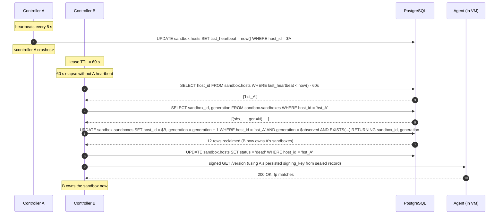

# pg-backed sandbox state

**Date:** 2026-05-04
**Status:** Draft v9 (round-8: cut dual-write — pg is system of record from day 1)
**Audience:** sandbox/controller, control-plane, platform-ops, billing, security-review
**Depends on:**
- `crates/sandbox/src/persist.rs` — sealed-record codec (XChaCha20-Poly1305, AEAD key file-mounted, sealed filename derived from the sandbox UUID). The pg work LIVES ALONGSIDE this; it does **not** replace it for secrets.
- `crates/sandbox/src/restore.rs` — current restart-restore loop (`restore_at_startup`, FS walk via `unseal_dir`). Will swap the FS walk for a SQL query (§ 10).
- `crates/sandbox/src/registry.rs` — in-memory `SandboxRegistry`, `Sandbox` record, `PreviewSecrets` ring, `PreviewAuditEntry`. The pg layer mirrors registry shape onto durable storage. Insert path is `SandboxRegistry::insert_with_auth`.
- `crates/sandbox/src/backend/mod.rs` — `Backend` enum (Docker / K8s / NomadCh) + `Backend::session_auth` lookup the proxy path uses.
- `crates/sandbox/src/preview_share_handlers.rs` — share-token mint/list/rotate; today writes audit metadata into the in-memory registry + sealed record. Phase 2 adds a parallel pg write.
- `crates/compio-postgres/src/lib.rs` — the existing compio-native pg driver (no tokio).
- `crates/compio-postgres/src/pool.rs` — HikariCP-style single-threaded `Pool` + `PoolConfig` we will drop in.
- `crates/control/src/main.rs` — control plane already reads `DATABASE_URL` and uses `compio-postgres`; this design follows the same surface.
- `crates/core/src/typed_id.rs` — module-level free function `pub fn parse(s: &str) -> Result<(&str, uuid::Uuid), String>` (note: there is NO `TypedId` struct; round-1 fix). § 19 prerequisites a new `parse_with_prefix(s, expected_prefix)` helper that all `Database::*` methods consume.
- `AGENTS.md` — invariants: "PostgreSQL — One database, separate schemas (control, auth, per-app)" and "Zero tokio in the stack". Both are LOAD-BEARING for this design.

**Unblocks:**
- Multi-controller HA for the sandbox tier (controller process can die without losing the sandbox state). Today's file-only persistence cannot survive the loss of the host.
- Operator queries: "how many sandboxes is creator X running?", "what was the share-token mint history for sandbox Y?", "which sandboxes are scheduled for GC in the next 5 minutes?". Today these require an FS walk + AEAD decrypt + serde JSON.
- The billing / metering pipe (`crates/control/src/metering.rs`): emit-once-and-aggregate events for compute-seconds, share-token uses, preview egress. Pg `events` table is the contract surface.
- GDPR data export + delete (`SELECT … WHERE user_id = $1`, `DELETE … WHERE user_id = $1`). Today this requires walking every sealed record and decoding.
- Audit retention beyond a single sandbox lifetime (sandboxes default to 8 h max-lifetime; sealed records are ephemeral).
- The eventual "operator UI" (sandbox console for SREs) — this design is a prerequisite, not the deliverable.

---

## Executive summary

**Problem.** Sandbox controller state today lives only in memory + per-sandbox sealed files on disk (`crates/sandbox/src/persist.rs`). That's fine for single-controller, single-host, ephemeral state. It's wrong for everything we need next: HA failover, operator queries, audit retention, billing, GDPR. Walking 5000 sealed files to answer "how many running sandboxes does creator X have?" is a non-starter.

**Recommendation.** Add a `sandbox` schema to the platform Postgres (the same database the control plane uses today, per AGENTS.md). Three tables: `sandboxes` (one row per live sandbox), `shares` (one row per minted share token's metadata, never the token bytes), `events` (append-only audit + billing pipe). Sealed records on disk REMAIN the SOLE store for secrets — signing keys, preview-secret HMAC ring. Pg holds non-secret state; sealed-records hold secret material; the two are linked by `sandbox_id`. We use the existing `compio-postgres` driver (no tokio); we use a forward-only hand-rolled migration runner (no sqlx, no refinery for v1).

**Key tradeoffs.**
- **Latency:** pg writes are **seal-first then off-loaded onto a controller-internal worker queue** (round-4 architecture, § 14.14). A pg outage degrades operator visibility but never fails a creator's `/exec` or preview request. v1 uses a single primary-only pool; replica-aware reads are deferred to v2 (§ 10.3).
- **Durability story split.** Pg is the system of record for non-secret state post-cutover. Sealed records remain the SOLE store for secrets — re-stating: if pg burns down, the platform loses observability and HA but does NOT leak secrets; if the sealed-record dir burns down, sandboxes can't be restored even though pg knows they exist (they get marked `status = 'lost'`). Two failure domains, two recovery paths.
- **Multi-controller HA.** Each controller has a `host_id` (UUIDv7). Each `sandboxes` row carries `host_id` plus a `generation BIGINT` CAS counter (round 6). Restart-restore queries `WHERE host_id = $self`. v1 ships sticky-host (manual rebind); v2 ships lease-based takeover via `sandbox.hosts.last_heartbeat` + CAS on `sandbox.sandboxes.generation` — **no advisory locks, no leader election, no external coordination service**. Region-affinity is enforced via `hosts.region` (§ 13.12).
- **Schema operability.** Forward-only migrations run at controller startup; failures are startup-blocking. **Four pg roles** enforce least-privilege at the pg layer: `sandbox_admin` (DDL), `sandbox_app` (DML on non-events tables), `sandbox_audit` (INSERT-only on events), `sandbox_gdpr` (scoped DELETE for GDPR ops, gated on JWT + 2FA step-up). See § 13.2.

**What changes for whom.**
- **Creators:** nothing visible. Their preview / exec / files paths are unchanged.
- **SREs:** ~20 new env vars (consolidated table at § 5.6); new metrics (~15 — § 14.1); new operator-facing endpoints (`GET /admin/sandboxes`, `GET /admin/users/{id}/export`); pg connection-pool sizing math (§ 14.4); alert matrix (§ 14.7); per-phase runbook delivery (§ 14.12).
- **sandbox-controller maintainers:** new `crates/sandbox/src/db.rs` module + migration runner; dual-write call sites with seal-first ordering; restore loop swapped from FS walk to SQL query (§ 10); on-disk events spool for pg-down resilience.
- **billing maintainers:** `sandbox.events` is the consumer contract; the metering pipe reads via the partial+covering `idx_events_metering` index (§ 6.5 round-4). Document the read pattern (§ 19).
- **security-review:** § 13 contains the threat model (TM-1 through TM-9 + TM-X1-3) and compliance mapping. Admin auth uses short-lived JWTs + scopes + 2FA step-up (§ 13.8).
- **gateway / worker / agent:** unchanged.

**Where to start reading next.** Architecture (§ 5) → Env-var table (§ 5.6) → Schema (§ 6) → Restart-restore (§ 10) → HA topology (§ 11) → Threat model (§ 13.9) → Alert matrix (§ 14.7) → Phased plan (§ 15).

---

## Security invariants

The pg surface MUST hold these invariants. Every other clause in this document is a means to one of these ends; any change to the schema or the call sites must preserve every sub-bullet here. If a reviewer can construct a counter-example, the design is broken.

### Invariant 1 — Secrets stay out of pg.

- **Sealed records remain the SOLE store for secrets** (`signing_key_bytes`, `preview_secrets.current`, `preview_secrets.previous`). Pg holds non-secret state only. (§ 5, § 6, § 13.)
- **No secret column ever lands in the schema.** A CI lint asserts no column name in any `sandbox.*` table matches `*key*`, `*secret*`, `*password*`, `*token*` (`token_id` is allowed because it's a non-secret hash; the rule's exception list is enumerated and reviewed). (§ 13.)
- **Pg row + sealed record are dual-source-of-truth during the transition phase; one canonical post-cutover (pg = system of record for non-secret; sealed = secret-only).** During Phase 1–3, both are written; during Phase 4+, the metadata fields in the sealed record (`user_id`, `project_id`, `vm_index`, etc.) become legacy / deprecated, but the secret material stays. Sealed-record `SealedAuth.user_id` etc. are read at restore time only as a fallback when the pg row is missing (orphan back-fill). (§ 9, § 10.)
- **Pg connection password is file-mounted, never env-var.** `SANDBOX_DATABASE_URL` may carry the username + host but MUST NOT carry the password; the password is read from `SANDBOX_DATABASE_PASSWORD_PATH` (mode 0400) at boot. Mirrors the AEAD-key sourcing convention from `crates/sandbox/src/persist.rs:620-633`. (§ 13.)

### Invariant 2 — Path-traversal hardening at the pg boundary.

- **Pg primary keys are typed-id strings validated by `zeroship_core::typed_id::parse_with_prefix(s, expected_prefix)` BEFORE any query.** This is a NEW helper added as a Phase-0 prerequisite (§ 19); it wraps the existing `parse(s) -> Result<(prefix, uuid), String>` free function and asserts `prefix == expected_prefix`. Every `Database::*` method parses-then-passes; an unparseable or wrong-prefix id surfaces as `DatabaseError::InvalidId` and never touches the wire. (§ 8, § 13.)
- **Belt-and-suspenders parameterized queries.** Every query uses `$1`, `$2` placeholders; no `format!` of values. The schema name is the only identifier we splice; it is validated against `^[a-z_][a-z0-9_]{0,62}$` once at `Database::from_env` and stored in an `Arc<str>` (§ 13). Splicing it into prepared-statement SQL is safe given that single-shot validation. (§ 13, § 16 R-4.)
- **Even if `parse_with_prefix` had a bug,** the SQL placeholders mean an attacker-supplied id reaches pg as a value, never as identifier syntax. The only attack surface is "what does pg do with a malformed UTF-8 string in a TEXT column" — pg refuses non-UTF-8 with a binary-format error. (§ 13.)

### Invariant 3 — Tenant isolation.

- **Every `sandbox.*` row is anchored to `user_id`.** No row exists in `sandboxes` / `shares` / `events` without a `user_id` value. (§ 6 schema.)
- **Operator endpoints query by user_id and surface only that user's rows.** `GET /admin/users/{user_id}/export` is the canonical GDPR data-export query; the same `WHERE user_id = $1` predicate is on every operator-facing list endpoint. (§ 13, § 5.)
- **GDPR data-export: a single `SELECT * FROM sandbox.* WHERE user_id = $1` returns everything the platform stores about that creator's sandbox usage.** No off-row state, no JSON sidecar in another bucket — every byte the operator must reason about is in the row tree rooted at `user_id`. (§ 13.)
- **GDPR delete is a multi-step contract** (full SQL + S3 in § 13.7): the TX issues `INSERT INTO sandbox.deleted_sandboxes` tombstones, then `DELETE FROM events / shares / sandboxes WHERE user_id = $1`, run on the gated `sandbox_gdpr` role's connection. Post-TX: sealed records unlinked from FS (filename derived from each sandbox's UUIDv7, see § 5.1) + S3 archive entries deleted (§ 13.5).
- **Pg four-role split** (round-2 strengthening). `sandbox_app` (DML on non-events tables + read-only on events), `sandbox_audit` (INSERT-only on events), `sandbox_admin` (DDL — migrations only), `sandbox_gdpr` (scoped DELETE — admin path only). The controller cannot DELETE its own audit trail. (§ 13.2.)

### Invariant 4 — Wire-format / schema stability.

- **`sandboxes`, `shares`, `events` are immutable contracts.** Once shipped, columns can be added (NULL-default) but never removed or renamed. New phases add migration files (`002_*.sql`, `003_*.sql`, …) that are forward-only. Down-migrations are explicitly out of scope (§ 7). (§ 7.)
- **The `events.kind` enum is open.** New event kinds are added by inserting a new TEXT value; consumers (`metering`, future operator UI) MUST tolerate unknown kinds. (§ 6, § 19.)

The rest of the document is the implementation of these invariants.

---

## 1. How to read this doc (round-5 addition, addresses CLR-M1)

The doc-shape mirrors `docs/proposals/sandbox-preview-urls.md` deliberately. Reading order by role:

| Role | Read this in order |
|---|---|
| **First-time reader** | § Executive summary → § 5 Architecture → § 5.6 Env vars → § 6 Schema → § 15 Phased plan |
| **Sandbox-controller maintainer** | + § 8 Code surface → § 9 Dual-write semantics → § 10 Restart-restore → § 14.14 Worker queue |
| **Platform-ops / SRE** | § 5.6 Env vars → § 12 Failure modes → § 14 Operability (esp. § 14.3 SLOs, § 14.7 Alerts, § 14.8 Capacity) → § 14.12 Runbook schedule |
| **Security-review** | § Security invariants → § 13 (entire) — esp. § 13.9 Threat model + § 13.8 Admin auth |
| **Billing / metering owner** | § 6.5 events schema → § 14.16 EXPLAIN sketches → § 19 Cross-cutting follow-ups |
| **Schema reviewer** | § 6 Schema → § 7 Migration framework → § 13.2 Roles → § 14.18 Index size budget |

---

## 2. Decisions

| # | Decision | Rationale | Section |
|---|---|---|---|
| **D-1** | **Pg is the system of record for non-secret state from day 1; sealed records hold secrets only** (round-8). New schema `sandbox` in the existing platform Postgres database (alongside `control`, `auth`). [Superseded by round-8 cut: the previous "system of record post-cutover" framing is gone — pre-launch means no cutover.] | AGENTS.md "One database, separate schemas"; pre-launch state means no dual-write transition is needed. One backup story, one connection-pool budget, one TLS cert. | § 5, § 9 |
| **D-2** | Pg is **non-secret only**. Sealed records remain the SOLE store for `signing_key`, `preview_secrets`. | Failure-domain split: pg compromise ≠ secret compromise. Aligns with `crates/sandbox/src/persist.rs`'s threat model. | § 5, Invariant 1 |
| **D-3** | The pg client is **`compio-postgres`** (already in-tree, used by `crates/control/`). Phase-1 ships pool-per-call to match `crates/control/`'s pattern; per-ntex-worker thread-local pools are a Phase-2 perf optimization if measurements demand. | Zero-tokio invariant; matches existing platform pattern. | AGENTS.md |
| **D-4** | Migrations are **hand-rolled, forward-only, applied at controller startup**, tracked via `sandbox.schema_migrations(version BIGINT PRIMARY KEY, applied_at TIMESTAMPTZ)`. **Round 6: the runner uses the designated-migrator pattern** (one process per deployment with `SANDBOX_PG_RUN_MIGRATIONS=1`); other controllers block on a schema-version check at startup. The PRIMARY KEY on `schema_migrations.version` is the race-tolerance fallback — a degenerate two-migrator race resolves via `unique_violation` on the loser's INSERT, never via session-level locking. **No advisory locks.** | sqlx pulls tokio (rejected by AGENTS.md); refinery has a tokio-free path but adds dep weight; hand-rolled is ~140 lines (round 6) and matches the project's bias toward minimal deps. | § 7 |
| **D-5** | Each controller has a **`SANDBOX_HOST_ID` (UUIDv7)**; `sandboxes.host_id` is the per-row owner; `sandboxes.generation BIGINT` is the per-row CAS counter (round 6); restart-restore queries `WHERE host_id = $self AND status = 'running'`; ownership-relevant UPDATEs CAS on `(host_id, generation)`. | Multi-controller HA prerequisite. The v1 sticky-host model lets us ship without auto-takeover; v2's lease-based takeover (D-14, D-Z) layers on without changing the row shape. | § 5, § 10, § 11 |
| **D-6** | Pg writes on the live request path are **best-effort, like `Persistence::seal`**. A pg failure logs + meters but does NOT fail the user request. | Liveness > durability for the live path; the reconciler closes the gap (§ 9). | § 8, § 9 |
| **D-7** | `events` is **append-only, partitioned monthly by `ts`**. Old partitions roll off to cold storage (S3) after 90 days. | Volume scales with sandbox-lifetime activity; partitioning keeps hot-path indexes lean. | § 6 |
| **D-8** | `sandboxes`, `shares`, `events` use **TEXT columns for typed-ids** (not native UUID). | Typed-ids are base62 strings (`sbx_…`, `usr_…`, `tok_…`) — `crates/core/src/typed_id.rs` — not raw UUIDs. We could add a domain-over-TEXT for visible type-safety; v1 keeps plain TEXT + a `CHECK` regex. | § 6 |
| **D-9** | **No FK from `events` to `sandboxes`**. Events are write-and-forget; an FK would deadlock with the in-flight INSERT path on `sandboxes` and break the "events are append-only / never block hot path" invariant. Other FKs (e.g., `shares.sandbox_id` → `sandboxes.sandboxes.sandbox_id`) ARE present. Round-2 strengthens with a non-blocking RAISE NOTICE TRIGGER (§ 13.11) for tenant-cross-contamination defense. [Superseded by round-8 cut: the prior "explicit reconciler covers the loose-end case" rationale is replaced — there is no periodic reconciler post-round-8; the events pipe simply tolerates a missing parent because the parent INSERT and the child INSERT are sequenced in the same handler.] | Consistency > FK-rigidity for the hot pipe. | § 6 |
| **D-10** | **Reconciler runs once at boot, no periodic schedule** (round-8 cut). Forward: sealed records without pg row → unlink (cancelled-create orphan). Reverse: pg rows without sealed → status='lost'. [Superseded by round-8 cut: prior "periodic every 5 min" was needed to catch drift from best-effort dual-write; round-8 makes pg-write synchronous so steady-state has no drift source.] | Single writer per category; no dual-write means no drift to converge. | § 9 |
| **D-11** | **Pg unavailable on boot is fatal** (controller refuses to start) UNLESS `SANDBOX_PG_OPTIONAL=1` (dev-only escape hatch — sets prevents prod from falling back to file-only by accident). | Production safety: a controller that boots without pg silently degrades observability + billing. The escape hatch covers `cargo test` / local-dev. | § 12 |
| **D-12** | Schema migration failure is **startup-blocking**. `--skip-migrations` flag is the explicit operator override. Round-2 adds: newer-schema-than-controller refuses-by-default, gated by `SANDBOX_ALLOW_DOWNREV=<expected>=<actual>` versioned-pair plus per-migration `Down-Compatible:` headers. | A controller running on an old schema can break invariants invisibly; better to fail loudly. | § 7, § 12 |
| **D-13** | Pg connection password is **file-mounted (`SANDBOX_DATABASE_PASSWORD_PATH`)**, NEVER carried inline in `SANDBOX_DATABASE_URL`. | Mirrors `SANDBOX_AEAD_KEY_PATH` (`crates/sandbox/src/persist.rs:624-633`); env vars leak via `/proc/<pid>/environ`. | § 13 |
| **D-14** | **HA failover uses lease-based takeover via `sandbox.hosts.last_heartbeat` plus a CAS on `sandbox.sandboxes.generation`.** v1 = sticky `host_id` (no auto-takeover; manual operator rebind). v2 = lease-expiration takeover, replacing what earlier drafts called "Option B leader-election rebind". **No advisory locks; no leader election; no external coordination service** (no etcd / Consul / Redlock). Each controller is its own arbiter; the `generation` counter is the fence token; a stale owner's writes self-fence via the CAS. (Round 6: previously specified pg advisory locks; replaced wholesale.) | Pg advisory locks couple HA failover availability to pg's session-tail behavior (orphan-lock recovery is minutes, HA wants seconds). The lease + CAS is lock-free, monotonic, and self-correcting on split-brain — same shape as DynamoDB optimistic locking, Cassandra LWT, etcd transactions, and Kubernetes resource versioning. | § 11 |
| **D-Z** | **Split-brain during the lease-takeover window is bounded by lease TTL and is safe.** Agents inside VMs trust the persisted signing_key bytes (read by either controller from the sealed record), not the controller identity. The `generation` CAS rejects stale writes against pg. The brief window where both A (recovering from a transient hang) and B (taking over) could sign probes is acceptable because both controllers read the same signing_key from the same sealed record and produce *identical* signed operations against the same agent — there is no contradictory wire-level operation that can be issued in the overlap. (Round 6 addition.) | Establishes correctness of the lease window; pairs with R-NN (lease TTL too aggressive) and R-MM (clock skew). | § 11.2, § 12.9 |
| **D-15** | **Schema name is `sandbox` (singular)** to match AGENTS.md "separate schemas (control, auth, per-app)". A namespace prefix (e.g. `zsbx_sandbox`) is rejected — the schema name IS the namespace. Runtime-configurable via `SANDBOX_PG_SCHEMA` (round-1 fix), validated against `^[a-z_][a-z0-9_]{0,62}$` once at boot. | Convention. | Q-6 |
| **D-16** | **Soft-delete via `deleted_at TIMESTAMPTZ` on `sandboxes` and `shares`**; `events` is hard-only (append-only, retention by partition drop). | GDPR delete needs a tombstone for in-flight queries; partition-drop on `events` is faster + cheaper than per-row DELETE. | § 13, Q-1 |
| **D-17** | **Connection-pool config: `max_size = 16, min_idle = 2` per controller** (default; was 32 / 4 in v1, revised in round-1 after pool-sizing math was tightened). Pg writes are off-path + average ~1 ms; expected in-flight is < 1 connection at steady state, 16 covers tail-latency + admin-endpoint bursts comfortably. | § 14 capacity math; tuneable via `SANDBOX_PG_POOL_MAX`. | § 14 |
| **D-18** | **`sandbox.events` is the billing/audit pipe.** Schema is `(event_id, sandbox_id, user_id, kind, ts, data jsonb)`; the consumer (`crates/control/src/metering.rs`) reads via a streaming SQL cursor against the partition for the current billing period. | One wire format, one schema; no parallel events pipeline. | § 6, § 19 |

---

## 3. Problem statement

Today the sandbox controller's persistence layer is `crates/sandbox/src/persist.rs` — per-sandbox sealed files on the controller's local disk. Each file holds a JSON-then-AEAD-encrypted `SealedAuth` record (signing key + metadata). The boot-path `restore_at_startup` walks the sealed-records directory, unseals each record, and signed-`/version`-probes its agent.

This is **insufficient** for:

1. **HA.** A controller process holds its sandboxes in-memory + on-its-local-disk. Loss of the host = total loss of that controller's sandbox set. The user has to re-create. (Sealed records on a network-mounted FS would help marginally; even then, two controllers can't safely take over the same set without coordination.)
2. **Operator queries.** "How many sandboxes is creator X running?" is FS walk + AEAD decrypt + JSON parse for every record. "Which sandboxes were minted in the last 24 h?" — same. "Show me all share-token mints for sandbox Y" — same. No index, no aggregation.
3. **Audit retention beyond a sandbox's lifetime.** Sealed records are deleted when a sandbox stops (`Persistence::delete`). Audit / billing facts (creator-id, mint times, share-token usage history) are gone with them. Default `SANDBOX_MAX_LIFETIME_SECS = 28800` (8 h) caps the recoverable window.
4. **Billing pipe.** `crates/control/src/metering.rs` already counts bytes-out / Stripe meters at the worker tier. Sandbox tier today emits nothing structured the metering pipe can consume. We need an event log per sandbox (compute-seconds, share-token uses, preview egress) that survives sandbox stop.
5. **Regional failover prep.** A future "controller in region B takes over a sandbox after region A's controller dies" story needs a coordination point. Pg's `host_id` + heartbeat is the cheapest one (§ 11).
6. **Disaster recovery.** Pg has PITR; the platform's existing backup story covers it. The sealed-record dir is per-host scratch; losing it is "expected" (sandboxes are ephemeral). Pg row says "this sandbox existed, here's its metadata" so post-DR we can email the creator instead of silently orphaning their work.
7. **GDPR data-export + delete.** No structured query to answer "what does the platform store about user X's sandbox usage?". Walk-everything-and-decrypt is operationally untenable past 1000 sandboxes.

File-only IS sufficient for **secret material** — signing keys, preview-secret HMAC ring. The trust boundary is smaller (one filesystem, one AEAD key, file mode 0400, audited by `crates/sandbox/src/persist.rs:344-374`); pg's TLS surface + connection-pool surface + role-permission surface is a strictly larger attack surface that we don't want to accept for secrets we can keep narrower.

---

## 4. Goals + non-goals

### Goals

1. **HA-capable durable state for sandboxes / shares / events.** Pg is the system of record post-cutover; controller process loss is recoverable as long as pg is up.
2. **Query-able audit log.** `events` table answers operator + billing + GDPR queries without walking the FS.
3. **GDPR data-export + delete.** `SELECT * FROM sandbox.* WHERE user_id = $1` returns everything; `DELETE FROM sandbox.* WHERE user_id = $1` removes everything (modulo sealed-record unlink).
4. **Billing-event feed.** `sandbox.events` is the structured pipe `crates/control/src/metering.rs` reads.
5. **Restart-restore via pg.** The boot path queries `WHERE host_id = $self AND status = 'running'` + unseals each row's secrets.
6. **Aligned with AGENTS.md invariants.** Zero tokio (use `compio-postgres`); one database with separate schemas (use the platform pg + `sandbox` schema).
7. **Best-effort writes on the live path.** Pg unavailability degrades observability but never fails a creator's request.

### Non-goals

1. **Replacing sealed records.** Secrets stay on FS; this design explicitly keeps the dual-store split (Invariant 1).
2. **Multi-region replication.** Out of scope; the v1 story is single-region pg with PITR, not cross-region active-active. (Q-8 follow-up.)
3. **An operator UI.** This design is a prerequisite. Building a console-side dashboard is separate work.
4. **A migration framework adopted across the workspace.** The hand-rolled runner here is a sandbox-crate concern. If the platform later wants a unified migration story, that's its own ADR.
5. **Schema sharing with control plane / auth plane.** `sandbox` schema is independent; if the control plane needs to join, it queries via SQL like any other consumer.
6. **A separate pg deployment for sandbox state.** One database; one set of operational concerns.
7. **Replacing `compio-postgres` with anything else.** It exists, it works, it's the project's pg client.

---

## 5. Architecture

### 5.1 Component diagram

```
                ┌────────────────────────────────────────────────────────┐
                │                  Controller (one of N)                 │
                │                                                        │
                │   in-memory:  SandboxRegistry  ←  registry.rs          │
                │                                                        │
                │   secrets:    Persistence  →  sealed-records/*.sealed  │
                │                                  (XChaCha20-Poly1305)  │
                │                                                        │
                │   non-secret: Database     →  compio-postgres pool     │
                │                                  → sandbox.{           │
                │                                       sandboxes,       │
                │                                       shares,          │
                │                                       events,          │
                │                                       schema_migrations│
                │                                       hosts            │
                │                                    }                   │
                │                                                        │
                │   reconciler (BOOT-ONLY; round-8):                     │
                │     forward:  sealed-record without pg row             │
                │                → unlink (orphan from cancelled create) │
                │     reverse:  pg row without sealed → status='lost'    │
                │   (steady-state has zero drift sources — single writer │
                │    per category; no periodic pass needed.)             │
                │                                                        │
                └────────────────────────────────────────────────────────┘
                                         │
                                         │  TLS, sslmode=require
                                         ▼
                                ┌─────────────────┐
                                │  PostgreSQL     │
                                │  (platform db)  │
                                │                 │
                                │  schemas:       │
                                │   - control     │
                                │   - auth        │
                                │   - sandbox  ←─ this design
                                │   - app_*       │
                                └─────────────────┘
```

The controller process holds **two** durability surfaces (pg + sealed-records) and **one** in-memory state (`SandboxRegistry`). The two surfaces have disjoint contents:

- Pg holds: `(sandbox_id, user_id, project_id, backend, vm_index, agent_url, host_id, status, created_at, started_at, stopped_at, last_used_at, key_fp)` plus share-token metadata + audit events.
- Sealed records hold: `signing_key_bytes`, `preview_secrets.{current, previous}`, plus a `boot_id` for orphan detection. **Round-8 (Phase 1): the legacy metadata fields are gone from v3** (`user_id`, `project_id`, `vm_index`, `agent_url`, `pubkey_fp`, `created_at_secs`, `preview_audit` all live in pg). The v2 reader stays so existing on-disk records load through the v3 binary; pg is queried for the dropped fields.

**Sealed filename derivation (round-1 clarification, addresses C4).** The sealed filename is computed from the **UUIDv7** that lives inside the typed-id, NOT from the typed-id string. Concretely: given `sandbox_id = "sbx_<base62>"`, the controller calls `zeroship_core::typed_id::parse(sandbox_id)` to extract the embedded `uuid::Uuid`, then computes `hex(sha256(uuid.as_bytes()))[..32] + ".sealed"`. This matches the existing convention in `crates/sandbox/src/persist.rs` which keys files off a `Uuid`. The reconciler MUST use the same derivation; a single helper `seal_filename_for(sandbox_id_str: &str) -> Result<PathBuf, _>` lives in `persist.rs` and is called from `db.rs::reverse_reconcile`. Hashing the typed-id string directly is forbidden (would fork the keyspace from the live writer).

The two are linked by `sandbox_id` (typed-id string in pg, derived UUID for filename). Inverse mapping (filename → sandbox_id) is NOT possible (SHA-256 is one-way), so the reconciler maintains an in-memory `HashMap<PathBuf, String>` populated as side-effect of `Persistence::list_typed_ids()` — a NEW method (Phase 0 deliverable) that reads each sealed record's plaintext header (`sandbox_id` is in `SealedAuth` already) and returns `Vec<(PathBuf, String)>`. The map is rebuilt on every reconciler pass; size is O(N) sandboxes per host.

### 5.2 Sequence: single-write happy path

Round-8 collapse: there is no longer a "dual-write" — pg is the system of record for non-secret state from day 1, and the sealed record holds secret material only (`signing_key`, `preview_secrets`).

```mermaid
sequenceDiagram
    autonumber
    participant Caller as Backend::create
    participant Reg as SandboxRegistry
    participant Pers as Persistence (FS)
    participant DB as Database (pg)
    Caller->>Reg: insert_with_auth(sandbox_id, info, auth)
    Caller->>Pers: seal(sandbox_id, SealedAuth)  -- SECRETS ONLY
    Note over Pers: SYNCHRONOUS; failure aborts create
    Pers-->>Caller: Ok
    Caller->>DB: insert_sandbox(non-secret state)
    Note over DB: SYNCHRONOUS in Phase 1; on err: log + return
    DB-->>Caller: Ok
    Caller-->>User: 200 sandbox ready
```

Order is **seal-first-then-pg**: a successful pg INSERT without a successful seal would leave a row claiming `status='running'` whose secrets are gone. Seal-first eliminates the tear. Phase 1 ships synchronous pg writes; the bounded write queue from the original § 14.14 is deferred to Phase 2 only if SLO measurements show pg writes on the hot path are too slow.

### 5.3 Sequence: pg-down failure

```mermaid
sequenceDiagram
    autonumber
    participant Caller as Backend::create
    participant Pers as Persistence
    participant DB as Database
    participant M as metrics
    Caller->>Pers: seal(...)
    Pers-->>Caller: Ok
    Caller->>DB: insert_sandbox(...)
    DB-->>Caller: Err(ConnTimeout)
    Caller->>M: sandbox_db_errors_total{op="insert_sandbox"} ++
    Note over Caller: best-effort: log + meter; sandbox is live in memory
    Caller-->>User: 200 sandbox ready
    Note over DB: Sealed record exists; no pg row.
    Note over DB: Next controller boot's reverse reconciler<br/>sees sealed-record without pg row → unlinks.
    Note over DB: Operator-visible: pg-write-error metric spike + alert.
```

Round-8: there is no periodic forward reconciler back-fill — the boot-time sweep is the only reconciliation pass. A pg-down create produces a "sealed without pg" orphan; on next boot the reconciler unlinks it (the sandbox is unreachable anyway because pg is the record of `agent_url`/`vm_index` post-round-8). Operators detect via the pg-write-error alarm, not a slow-converging reconciler.

### 5.4 Sequence: controller restart-restore

<!-- Round-8: this is now THE restart-restore flow (no "post-cutover" qualifier — pg has been the system of record from day 1). Boot path consults the schema-version gate (§ 7), then queries pg for live sandboxes, unseals each row's secret material, and signed-`/version` probes the agent. -->

```mermaid
sequenceDiagram
    autonumber
    participant Boot as Controller (boot)
    participant DB as pg
    participant Pers as sealed-records
    participant Agent as agent
    alt SANDBOX_PG_RUN_MIGRATIONS=1
        Boot->>DB: run_pending_migrations() (idempotent DDL; unique_violation is the race-tolerance fallback)
    else
        Boot->>DB: poll SELECT MAX(version) FROM sandbox.schema_migrations until >= target
    end
    Boot->>DB: SELECT sandbox_id, user_id, project_id, backend, vm_index, agent_url, key_fp, generation \n  FROM sandbox.sandboxes WHERE host_id=$self AND status='running'
    DB-->>Boot: [row, row, ...]
    loop per row
        Boot->>Pers: unseal(sandbox_id)
        alt sealed missing
            Boot->>DB: UPDATE status='lost' (CAS on host_id, generation)
        else sealed present
            Boot->>Agent: signed GET /version
            alt fp matches key_fp
                Boot->>Boot: register in-memory
                Boot->>DB: UPDATE last_used_at = now() (CAS on host_id, generation)
            else fp mismatch / 401
                Boot->>Pers: delete sealed
                Boot->>DB: UPDATE status='recreating' (CAS on host_id, generation)
            else unreachable
                Note over Boot: leave row + sealed; next boot retries
            end
        end
    end
    Boot->>Boot: start periodic reconciler (5m)
```

### 5.5 Sequence: multi-controller failover (lease-based takeover, v2)

<!-- Updated in round 6: replaced advisory-lock-based "claim" with lease-expiration + generation-CAS. No leader election; each controller is its own arbiter. -->



SQL surface used by the lease-based takeover (round 6: no advisory locks anywhere):

```sql
-- 1. Heartbeat (every controller, every 5 s):
UPDATE sandbox.hosts SET last_heartbeat = now() WHERE host_id = $1;

-- 2. Scan for stale peers (every controller, every 30 s):
SELECT host_id
  FROM sandbox.hosts
 WHERE last_heartbeat < now() - make_interval(secs => $lease_ttl);

-- 3. Read the dead host's slice (so we have an observed_generation per row):
SELECT sandbox_id, generation
  FROM sandbox.sandboxes
 WHERE host_id = $dead_host AND deleted_at IS NULL;

-- 4. Take over each row via a single CAS-guarded UPDATE.
--    No transaction wrapper. No advisory lock. The CAS on (host_id, generation)
--    is the split-brain guard; the EXISTS predicate keeps a freshly-recovered
--    A from being reclaimed by a slow B.
UPDATE sandbox.sandboxes
   SET host_id = $self_host,
       generation = generation + 1
 WHERE host_id = $dead_host
   AND generation = $observed_generation
   AND deleted_at IS NULL
   AND EXISTS (
       SELECT 1 FROM sandbox.hosts
        WHERE host_id = $dead_host
          AND last_heartbeat < now() - make_interval(secs => $lease_ttl)
   )
RETURNING sandbox_id, generation;

-- 5. Mark the dead host as such (operator-visible; not load-bearing for correctness):
UPDATE sandbox.hosts SET status = 'dead' WHERE host_id = $dead_host;
```

The takeover is the v2 HA story (§ 11). v1 ships sticky-host (no automatic takeover; failed host's sandboxes are unreachable until manual `zsbx admin rebind`).

### 5.6 Environment variables (round-5 addition, addresses CLR-C5)

| Env | Scope | Default | Purpose |
|---|---|---|---|
| `SANDBOX_DATABASE_URL` | required | — | Primary pg DSN as `sandbox_app` (no password). Round-2: must NOT contain a password; refused at boot if it does. |
| `SANDBOX_DATABASE_PASSWORD_PATH` | required | — | File mount, mode 0400. Loader rejects mode != 0o400. |
| `SANDBOX_DATABASE_ADMIN_URL` | required (prod) | = SANDBOX_DATABASE_URL | DDL connection as `sandbox_admin`; used only at boot for migrations. |
| `SANDBOX_DATABASE_AUDIT_URL` | required (prod) | = SANDBOX_DATABASE_URL | INSERT-only events writer as `sandbox_audit`. |
| `SANDBOX_DATABASE_GDPR_URL` | required (prod) | = SANDBOX_DATABASE_URL | Per-request connection for admin GDPR DELETE; role `sandbox_gdpr`. |
| `SANDBOX_DATABASE_CA_PATH` | required (prod) | `/etc/ssl/certs/zeroship-pg-ca.pem` | TLS root CA for `sslmode=verify-full`. |
| `SANDBOX_PG_HOST_ALLOWLIST` | required (prod) | `localhost,*.zeroship.internal` | DSN host validation (defends against env-injection redirection). |
| `SANDBOX_PG_SCHEMA` | optional | `sandbox` | Validated against `^[a-z_][a-z0-9_]{0,62}$` once at boot. |
| `SANDBOX_PG_POOL_MAX` | optional | 16 | Max connections per pool. |
| `SANDBOX_PG_POOL_MIN_IDLE` | optional | 2 | Min idle connections. |
| `SANDBOX_PG_POOL_CONNECTION_TIMEOUT_SECS` | optional | 30 | Global pool acquire ceiling (per-call timeouts are tighter, § 14.4). |
| `SANDBOX_PG_REPLICATION_LAG_THRESHOLD_SECS` | optional | 5 | Alert threshold for replica lag (when applicable). |
| `SANDBOX_PG_OPTIONAL` | optional | unset | Dev escape hatch. `=1` permits boot without pg; pg-required features disabled. |
| `SANDBOX_PG_WRITE_WORKERS` | optional | 4 | Number of worker tasks draining the write queue (§ 14.14). |
| `SANDBOX_HOST_ID` | optional | from file or generated | Typed-id `hst_<base62>`. § 10.1 lifecycle. |
| `SANDBOX_REGION` | required (Phase 4+) | — | Data-residency for HA-claim filter (§ 13.12). |
| `SANDBOX_RECONCILER_INTERVAL_SECS` | optional | 300 | Periodic reconciler cadence. |
| `SANDBOX_DRAIN_TIMEOUT_SECS` | optional | 60 | SIGTERM drain ceiling (§ 14.10). |
| `SANDBOX_ADMIN_API_ENABLED` | optional | 1 | Phase-5 feature flag. |
| `SANDBOX_RESTORE_VIA_PG` | optional | 1 (post-Phase-3) | Phase-3 rollback flag. |
| `SANDBOX_HA_REBIND` | optional | 0 (post-Phase-4) | Phase-4 rollback flag. Disables the peer-scan task; heartbeat continues. |
| `SANDBOX_HA_LEASE_TTL_SECS` | optional | 60 | Round 6: lease-takeover TTL. Hard minimum = 4× heartbeat interval (R-NN). |
| `SANDBOX_HA_HEARTBEAT_SECS` | optional | 5 | Round 6: heartbeat cadence. |
| `SANDBOX_PG_RUN_MIGRATIONS` | optional | unset | Round 6: `=1` tags this process as the designated migrator. Other processes block on schema-version check. |
| `SANDBOX_PG_BOOT_TIMEOUT_SECS` | optional | 300 | Round 6: how long a non-migrator waits for the schema to reach `target_version`. |
| `SANDBOX_ALLOW_DOWNREV` | optional | unset | Versioned downrev override (§ 12.5); format `<expected>=<actual>`. |
| `SANDBOX_AEAD_KEY_PATH` | required (carried over) | — | AEAD key for sealed records. Mode 0400. |
| `SANDBOX_PERSIST_AUTH` | required (carried over) | — | `=1` enables sealed-record persistence. |
| `SANDBOX_PERSIST_DIR` | required (carried over) | `/var/lib/zeroship/sandbox` | Sealed-records parent directory. |

CLI flags: `--skip-migrations` (operator override on schema-version mismatch).

---

## 6. Schema design

The schema name is `sandbox`. Configurable at compile-time via `SANDBOX_PG_SCHEMA` (default `sandbox`); the design assumes the default everywhere below.

### 6.1 `sandbox.schema_migrations`

```sql
CREATE TABLE sandbox.schema_migrations (
    version     BIGINT       PRIMARY KEY,
    applied_at  TIMESTAMPTZ  NOT NULL DEFAULT now(),
    description TEXT         NOT NULL
);
```

Tracks the migration runner state (§ 7). The runner reads `MAX(version)` and applies forward-only. Inserts a row per applied migration.

### 6.2 `sandbox.hosts`

<!-- Added in round 6: addressing critic's point about removing all database-level locking. The hosts table now serves a strictly observational role (heartbeat + status); ownership is established via host_id stamped on each sandbox row plus a generation-CAS on writes (§ 6.3). No advisory locks, no claimer_id column (CAS replaces the lock-then-claim TX), no per-row leader bit. -->

```sql
CREATE TABLE sandbox.hosts (
    host_id          TEXT         PRIMARY KEY
                                  CHECK (host_id ~ '^hst_[0-9a-z]{20,40}$'),
    boot_id          TEXT         NOT NULL
                                  CHECK (boot_id ~ '^[0-9a-z]{20,40}$'),
    hostname         TEXT         NOT NULL,
    region           TEXT         NOT NULL    -- round-2: data-residency
                                  CHECK (region ~ '^[a-z]{2}-[a-z]+-[0-9]+$'),
    backend          TEXT         NOT NULL
                                  CHECK (backend IN ('docker', 'k8s', 'nomad-ch')),
    started_at       TIMESTAMPTZ  NOT NULL DEFAULT now(),
    last_heartbeat   TIMESTAMPTZ  NOT NULL DEFAULT now(),
    status           TEXT         NOT NULL DEFAULT 'alive'
                                  CHECK (status IN ('alive', 'draining', 'dead')),
    drain_started_at TIMESTAMPTZ  NULL,
    metadata         JSONB        NOT NULL DEFAULT '{}'::JSONB
);

CREATE INDEX idx_hosts_status_heartbeat
    ON sandbox.hosts (status, last_heartbeat);
CREATE INDEX idx_hosts_region_status
    ON sandbox.hosts (region, status);
```

**Role (round 6):** `sandbox.hosts` is a **heartbeat + status table only**. It does NOT hold ownership locks, leases, or claim tokens. Ownership of a sandbox is whichever `host_id` is currently stamped on its row in `sandbox.sandboxes`; the heartbeat row here is the *signal* that a host is alive, the *signal* that lets a peer detect a stale owner, and the *audit point* operators read at `GET /admin/hosts`. A row in `status='dead'` is informational — the hot loop's takeover decision is based on `last_heartbeat < now() - lease_ttl`, not on the `status` column (the column reflects the operator-visible view; the takeover query checks the timestamp directly so a controller that crashes before flipping its own status to `dead` is still reclaimable).

Every controller upserts its row at boot and heartbeats every 5 s (canonical default; `SANDBOX_HA_HEARTBEAT_SECS`). A surviving controller scanning for stale peers reads `WHERE last_heartbeat < now() - make_interval(secs => $lease_ttl)`. **No row-level lock is taken.** The takeover write happens against `sandbox.sandboxes` and is gated by a generation-CAS (§ 6.3, § 11).

<!-- Added in round 7: addressing critic's point about heartbeat-cadence consistency. -->
Operators may raise the cadence (e.g., 10 s) for fleets where heartbeat traffic dominates pg load; the lease-TTL validator (R-NN) ensures lease TTL stays >= 4x heartbeat regardless.

For v1 (sticky-host), the table is consulted only by the operator (`GET /admin/hosts`); no automatic takeover happens. For v2 (lease-based takeover), the same table is the canonical lease state; the takeover query is in § 11.

**`boot_id` usage (round-1 fix, addresses I14).** A new `boot_id` per process start lets operators distinguish a controller-process restart from a host restart in audit logs and the `/admin/hosts` view. The reconciler also reads `boot_id`: on a forward pass, a sealed record whose embedded `boot_id` matches the current `boot_id` was sealed in this process lifetime, so a missing pg row is "definitely a lost write" (alert with high severity) rather than "stale state from a previous boot" (alert with low severity). This requires `SealedAuth` to carry `boot_id` — added in Phase 0 alongside the new `Persistence::list_typed_ids`. Back-compat: pre-Phase-0 sealed records have no `boot_id`; they are treated as "previous boot" (low severity).

### 6.3 `sandbox.sandboxes`

<!-- Added in round 6: addressing critic's point about removing all database-level locking. New `generation BIGINT` column placed immediately after `host_id`. Every UPDATE that mutates ownership-relevant fields uses an optimistic CAS via `WHERE host_id = $expected_host AND generation = $expected_generation`, incrementing `generation` by 1 in SET. This is the substitute for advisory locks: the `generation` counter is the row-level fence token; a stale owner's write loses the CAS and is rejected without any pg session-level locking. -->

**CAS pattern (round 6, replaces advisory locks).** Every UPDATE that touches an ownership-relevant field (`host_id`, `status`, `agent_url`, `vm_index`) MUST be guarded by a CAS on `(host_id, generation)` and MUST increment `generation` by 1. The shape:

```sql
-- Generic ownership-write CAS template (every controller code path uses this shape):
UPDATE sandbox.sandboxes
   SET status = $new_status,
       agent_url = $new_agent_url,
       generation = generation + 1
 WHERE sandbox_id = $1
   AND host_id = $expected_host          -- I am the owner
   AND generation = $expected_generation  -- nobody has bumped under me
   AND deleted_at IS NULL
RETURNING generation;
```

The CAS gives us three properties without taking a single lock:
1. **Split-brain safety.** A controller that briefly believes it still owns a sandbox after another controller has taken over (lease window, § 11) writes with the *old* `generation`; the WHERE clause misses; pg returns 0 rows; the controller logs `lost-leadership` and bails. No data is corrupted; no lock is contended.
2. **Lock-free.** No `pg_advisory_lock`, no `SELECT … FOR UPDATE`, no `SERIALIZABLE` isolation needed. Each UPDATE is a single statement, single row, single index probe. Pool connections are never pinned across statements; no deadlock surface.
3. **Self-correcting.** If a controller observes `RETURNING (no rows)`, it re-reads the row, learns the new `(host_id, generation)`, and either retries (if it's still the legitimate owner) or relinquishes (if `host_id` changed). The reconciler sweeps anything that fell through.

Reference systems: this is the same idiom DynamoDB uses for conditional writes (`ConditionExpression: "version = :v"`), Cassandra's lightweight transactions (`UPDATE … IF version = ?`), and etcd's transaction-with-revision (`If(Compare(ModRevision(k), "=", rev))`). It is the standard lock-free CAS-via-monotonic-counter pattern.

```sql
CREATE TABLE sandbox.sandboxes (
    sandbox_id     TEXT         PRIMARY KEY
                                CHECK (sandbox_id ~ '^sbx_[0-9a-z]{20,40}$'),
    user_id        TEXT         NOT NULL
                                CHECK (user_id ~ '^usr_[0-9a-z]{20,40}$'),
    project_id     TEXT         NOT NULL
                                CHECK (project_id ~ '^prj_[0-9a-z]{20,40}$'),
    backend        TEXT         NOT NULL
                                CHECK (backend IN ('docker', 'k8s', 'nomad-ch')),
    vm_index       INTEGER      NULL,    -- nomad-ch only; SMALLINT (u16) widened
    agent_url      TEXT         NULL,    -- docker / k8s; nomad-ch derives from vm_index
    host_id        TEXT         NOT NULL
                                REFERENCES sandbox.hosts(host_id) ON DELETE RESTRICT,
    generation     BIGINT       NOT NULL DEFAULT 0    -- round 6: CAS counter; bumped on every ownership-relevant UPDATE (see § 6.3 CAS pattern, § 11 takeover)
                                CHECK (generation >= 0),
    status         TEXT         NOT NULL DEFAULT 'starting'
                                CHECK (status IN ('starting', 'running', 'stopping',
                                                  'stopped', 'lost', 'recreating',
                                                  'orphan')),
    key_fp         TEXT         NOT NULL    -- SHA-256(verifying_key)[..16] hex
                                CHECK (key_fp ~ '^[0-9a-f]{32}$'),
    created_at     TIMESTAMPTZ  NOT NULL DEFAULT now(),
    started_at     TIMESTAMPTZ  NULL,
    stopped_at     TIMESTAMPTZ  NULL,
    last_used_at   TIMESTAMPTZ  NOT NULL DEFAULT now(),
    deleted_at     TIMESTAMPTZ  NULL,
    metadata       JSONB        NOT NULL DEFAULT '{}'::JSONB
);

-- Partial unique: at most one active sandbox per (user_id, project_id).
-- "Active" = not soft-deleted AND in a live status. The status set
-- includes 'recreating' because mid-recreate is still claiming the slot.
-- Round-1 fix (I5): on soft-delete the transition is one TX:
--   UPDATE … SET status='stopped', deleted_at=now() WHERE …
-- Setting deleted_at + a non-active status atomically frees the slot;
-- a concurrent re-create after that COMMIT succeeds.
CREATE UNIQUE INDEX idx_sandboxes_active_user_project
    ON sandbox.sandboxes (user_id, project_id)
    WHERE deleted_at IS NULL AND status IN ('starting', 'running', 'recreating');

CREATE INDEX idx_sandboxes_user_id           ON sandbox.sandboxes (user_id) WHERE deleted_at IS NULL;
CREATE INDEX idx_sandboxes_host_id_status    ON sandbox.sandboxes (host_id, status) WHERE deleted_at IS NULL;
CREATE INDEX idx_sandboxes_status_last_used  ON sandbox.sandboxes (status, last_used_at) WHERE deleted_at IS NULL;
CREATE INDEX idx_sandboxes_created_at        ON sandbox.sandboxes (created_at);
```

Index justification:
- **`idx_sandboxes_active_user_project`** (partial unique): the registry today dedups `(user_id, project_id)` to one active sandbox. Pg enforces the same invariant; partial-index lets stopped/lost rows accumulate.
- **`idx_sandboxes_user_id`**: GDPR export, "list creator's sandboxes" UI.
- **`idx_sandboxes_host_id_status`**: restart-restore (`WHERE host_id = $self AND status = 'running'`); failover scan.
- **`idx_sandboxes_status_last_used`**: idle-GC scan candidate ("running sandboxes idle > N seconds").
- **`idx_sandboxes_created_at`**: operator audit ("sandboxes created in last 24 h").

### 6.4 `sandbox.shares`

```sql
CREATE TABLE sandbox.shares (
    token_id        TEXT         PRIMARY KEY
                                 CHECK (token_id ~ '^tok_[0-9a-z]{20,40}$'),
    sandbox_id      TEXT         NOT NULL
                                 REFERENCES sandbox.sandboxes(sandbox_id) ON DELETE CASCADE,
    port            SMALLINT     NOT NULL    -- round-4 (PERF-M2): was INTEGER; port fits 2 B
                                 CHECK (port BETWEEN 1 AND 32767),
    scope           TEXT         NOT NULL
                                 CHECK (scope IN ('ro', 'rw')),
    secret_version  INTEGER      NOT NULL
                                 CHECK (secret_version >= 1),
    issued_at       TIMESTAMPTZ  NOT NULL DEFAULT now(),
    expires_at      TIMESTAMPTZ  NOT NULL,
    revoked_at      TIMESTAMPTZ  NULL,
    use_count       BIGINT       NOT NULL DEFAULT 0,
    last_used_at    TIMESTAMPTZ  NULL,
    iss             TEXT         NULL    -- issuer typed-id (creator's usr_…)
                                 CHECK (iss IS NULL OR iss ~ '^usr_[0-9a-z]{20,40}$'),
    deleted_at      TIMESTAMPTZ  NULL,
    CHECK (expires_at > issued_at),
    CHECK (revoked_at IS NULL OR revoked_at >= issued_at)
);

CREATE INDEX idx_shares_sandbox_id_port
    ON sandbox.shares (sandbox_id, port) WHERE deleted_at IS NULL;
CREATE INDEX idx_shares_iss_issued_at
    ON sandbox.shares (iss, issued_at) WHERE deleted_at IS NULL AND iss IS NOT NULL;
CREATE INDEX idx_shares_expires_at
    ON sandbox.shares (expires_at) WHERE deleted_at IS NULL AND revoked_at IS NULL;
```

The token bytes themselves are NEVER in this table. `token_id` is a typed-id derived from the token at mint time (`tok_<base62>` where the base62 is the first 20 bytes of `sha256(token)`). Mirrors `crates/sandbox/src/persist.rs` `SealedAuditEntry` — the registry today stores audit metadata inside the sealed record; this table is its durable counterpart.

### 6.5 `sandbox.events`

```sql
CREATE TABLE sandbox.events (
    event_id    TEXT         NOT NULL
                             CHECK (event_id ~ '^evt_[0-9a-z]{20,40}$'),
    sandbox_id  TEXT         NOT NULL
                             CHECK (sandbox_id ~ '^sbx_[0-9a-z]{20,40}$'),
    user_id     TEXT         NOT NULL
                             CHECK (user_id ~ '^usr_[0-9a-z]{20,40}$'),
    kind        TEXT         NOT NULL,    -- open enum; consumers tolerate unknown
    ts          TIMESTAMPTZ  NOT NULL DEFAULT now(),
    data        JSONB        NOT NULL DEFAULT '{}'::JSONB,
    PRIMARY KEY (ts, event_id)
) PARTITION BY RANGE (ts);

-- Monthly partitions. Migration 001 creates the current month + the next
-- 6 months (so a controller deployed in May 2026 has partitions through
-- November 2026 pre-provisioned). A controller-side periodic
-- (`sandbox::partitions::ensure_window`, every 1h) checks that
-- >= 3 months of forward partitions exist; if not, it issues the
-- partition-creation DDL. (Round 6: no advisory-lock-based leader
-- election. The DDL is `CREATE TABLE IF NOT EXISTS … PARTITION OF …`,
-- which is idempotent — every controller can attempt it; the first
-- one's CREATE wins, subsequent ones are no-ops. Two CREATEs racing
-- on the exact same partition resolve via pg's catalog-level uniqueness
-- on the relation name; the loser sees `42P07 duplicate_object` and
-- proceeds. Same race-tolerance shape as the migration runner.)
-- Alert: `sandbox_events_partition_window_months` < 2 pages on-call.
CREATE TABLE sandbox.events_2026_05 PARTITION OF sandbox.events
    FOR VALUES FROM ('2026-05-01') TO ('2026-06-01');
CREATE TABLE sandbox.events_2026_06 PARTITION OF sandbox.events
    FOR VALUES FROM ('2026-06-01') TO ('2026-07-01');
-- ... 2026-07 through 2026-11 created the same way ...

-- Belt-and-braces DEFAULT partition catches any INSERT outside the
-- pre-provisioned window so the live path NEVER sees
-- `ERROR: no partition of relation "events" found for row`. The
-- partition-window monitor alerts long before a real INSERT lands here;
-- if anything does land, the daily maintenance job moves it to the
-- correct monthly partition (round-1 fix, addresses C3).
CREATE TABLE sandbox.events_default PARTITION OF sandbox.events DEFAULT;

-- Round-4 fix (addresses PERF-C1, PERF-C2): index strategy revised after
-- analyzing write amplification. Each INSERT updates the heap + N index
-- entries; previous design had 4 BTREE writes per event. Revised:
--
-- 1. The PRIMARY KEY (ts, event_id) gives time-ordered BTREE; cheap (last-page hot).
-- 2. (user_id, ts) BTREE: GDPR export query path is `WHERE user_id=$1`, so
--    user_id-prefix is the hot key; ts-suffix lets us range-scan.
-- 3. (sandbox_id, ts) BTREE: per-sandbox audit; same shape.
-- 4. The previous (kind, ts) is a poor fit (low cardinality, full-month
--    scans) — replace with a BRIN on ts (block-range, virtually free
--    storage-wise) plus a partial index for the metering hot kinds.
CREATE INDEX idx_events_user_id_ts   ON sandbox.events (user_id, ts);
CREATE INDEX idx_events_sandbox_ts   ON sandbox.events (sandbox_id, ts);
CREATE INDEX idx_events_ts_brin      ON sandbox.events USING BRIN (ts) WITH (pages_per_range = 32);
-- Partial covering index for the metering pipe's hot path:
CREATE INDEX idx_events_metering
    ON sandbox.events (ts)
    INCLUDE (sandbox_id, user_id, data)
    WHERE kind IN ('compute_seconds', 'share.used', 'preview_egress');
```

**`event_id` minting (round-1, addresses I1).** `event_id` is minted by the **caller** as `evt_<base62(uuidv7)>` via `typed_id::generate("evt")`. The caller passes it explicitly; pg never auto-generates one. This makes the write idempotent against retry: the caller can store the minted id (e.g., the request-handler frame) and re-attempt the INSERT after a transient pg error with `ON CONFLICT (ts, event_id) DO NOTHING` (the same `event_id` value resolves the duplicate). Mirrors Stripe's idempotency-key contract.

**`metadata` JSONB on `sandboxes` (round-1, addresses I2).** Used for non-secret per-backend extras that don't merit a dedicated column: `{nomad_alloc_id: "...", k8s_pod_name: "...", docker_container_id: "..."}` (whichever fits the backend) plus `{vite_port: int, openable_ports: [int]}` if the backend pre-opens any. Reviewed via the same no-secrets lint as `events.data` (§ 13.4 extends to `metadata`). Hard cap: 4 KB per row, enforced by an application-side check in `db.rs::insert_sandbox` (pg's TOAST handles physical storage but we want the human contract tight).

Index justification (round-4 revised):
- **`(user_id, ts)` BTREE**: GDPR export, billing aggregation per creator. Selectivity is high (each user has thousands of events out of billions); BTREE is right.
- **`(sandbox_id, ts)` BTREE**: per-sandbox audit ("show me everything that happened to this sandbox"). Same shape as above.
- **`USING BRIN (ts)`**: the previous `(kind, ts)` was misaligned with the metering query pattern. BRIN stores one summary tuple per 32 pages; for an append-only time-ordered table, every tuple's ts is contained in a tight range per page-group, making BRIN extremely efficient (~0.1% of BTREE size). Used by ad-hoc ts-range scans that aren't user/sandbox specific.
- **`idx_events_metering` (covering, partial)**: the metering pipe's hot query `WHERE kind IN ('compute_seconds', 'share.used', 'preview_egress') AND ts BETWEEN $1 AND $2` previously forced 3 separate index probes via `(kind, ts)`. The partial index narrows to only those 3 kinds (small footprint) and INCLUDE-covers the columns the metering reader needs, so pg returns rows index-only — no heap fetch.
- **Per-INSERT BTREE writes:** down from 4 to 2 (PK + 2 dimensional BTREEs). BRIN is ~free on insert. Partial index only matched by ~3% of events. Net write amplification reduced by ~40%.

**Why no FK from `events` to `sandboxes`** (D-9): events are write-once + write-fast; an FK forces pg to look up the parent row on every INSERT, which (a) doubles the lock surface, (b) deadlocks if the parent's INSERT and the child's INSERT race, and (c) breaks our "events are best-effort and never block hot path" model — a parent INSERT failure would abort the event. The `(user_id, sandbox_id)` invariant is enforced by the writer (caller passes both, sourced from `SandboxRegistry`). Reconciler sweeps ensure orphaned events are visible to operators.

**Open enum on `kind`** (D-7 / Q-2): event kinds in v1 include `created`, `started`, `stopped`, `idle_gc`, `share.minted`, `share.used`, `share.rotated`, `share.revoked`, `proxy.http`, `proxy.ws.upgrade`, `proxy.ws.close`, `proxy.body.too_large`, `audit.dropped`. New kinds add a TEXT value; consumers ignore unknown kinds (`crates/control/src/metering.rs` filters by `WHERE kind IN ('compute_seconds', 'share.used', 'preview_egress')` — anything else is invisible to the metering pipe).

**Type choices recap:**
- **TEXT for typed-ids.** Typed-ids are `prefix_<base62>`; pg's UUID type doesn't fit. We could add a domain (`CREATE DOMAIN sandbox_id AS TEXT CHECK (...)`), but the per-table CHECK gives us the same correctness with one fewer abstraction layer. Phase 1 ships with CHECKs; if the operator survey wants domain types, we add them in Phase 2.
- **JSONB for `data`.** Open structure; operator can `data->>'port'` etc.
- **TIMESTAMPTZ everywhere.** Aligns with pg best practice; the controller computes everything in UTC anyway.
- **BIGINT for `use_count`.** A share token used 100 times per second would overflow INTEGER in 8 months; cheap defense.

### 6.6 `sandbox.deleted_sandboxes` (tombstone)

```sql
CREATE TABLE sandbox.deleted_sandboxes (
    sandbox_id   TEXT         PRIMARY KEY
                              CHECK (sandbox_id ~ '^sbx_[0-9a-z]{20,40}$'),
    user_id      TEXT         NOT NULL
                              CHECK (user_id ~ '^usr_[0-9a-z]{20,40}$'),
    deleted_at   TIMESTAMPTZ  NOT NULL DEFAULT now()
);

CREATE INDEX idx_deleted_sandboxes_deleted_at ON sandbox.deleted_sandboxes (deleted_at);
```

Round-1 fix (I3): R-18 referenced this table; it's now formally defined. Lifecycle:
- A successful DELETE (operator GDPR or admin DELETE) inserts a tombstone in the same TX as the row removal.
- The forward reconciler consults this table before INSERTing an `orphan` row from a sealed-record-only state. If a sealed record has a tombstone in pg, the reconciler unlinks the sealed record (delayed cleanup) instead of re-INSERTing a ghost row.
- A daily background job purges tombstones older than 24 h; by then every controller's reconciler has had at least one pass.

### 6.7 Drift between in-memory + pg + sealed (round-8)

| State piece | In-memory | Sealed record (v3) | Pg | Source of truth |
|---|---|---|---|---|
| `signing_key_bytes` | `SandboxAuth.signing_key` (Arc) | `SealedAuth.signing_key_bytes` | — | sealed (Invariant 1) |
| `pubkey_fp` / `key_fp` | `SandboxAuth.pubkey_fp` | — | `sandboxes.key_fp` | pg (round-8: the fingerprint moves out of v3 sealed) |
| `agent_url` | `SandboxAuth.agent_url` | — | `sandboxes.agent_url` | pg |
| `vm_index` | inside backend | — | `sandboxes.vm_index` | pg |
| `user_id` / `project_id` | `SandboxInfo.user_id` etc. | — | `sandboxes.user_id` etc. | pg |
| `created_at_secs` | `SandboxInfo.created_at_secs` | — | `sandboxes.created_at` | pg |
| `boot_id` | — | `SealedAuth.boot_id` (v3, Phase-1 addition) | — | sealed; reconciler reads to distinguish "this-boot orphan" vs "previous-boot orphan" |
| `preview_secrets.current` | `Sandbox.preview_secrets` | `SealedAuth.preview_secrets.current` | — | sealed (secret) |
| `preview_secrets.sv_current` | `Sandbox.preview_secrets.sv_current` | `SealedAuth.preview_secrets.sv_current` | `shares.secret_version` (per token) | sealed for live ring; pg for per-token validator |
| share-token audit (`token_id`, port, issued_at, ...) | `PreviewAuditEntry` | — | `shares.*` | pg |
| events (created/started/stopped/...) | — | — | `events.*` | pg only |

**Source of truth is single per row.** Pg is canonical for non-secret state; sealed is canonical for secret material. There is no "fallback to sealed-only" path post-round-8 — the v3 sealed record is silent on `user_id`, `project_id`, `agent_url`, `vm_index`, `key_fp`, etc. (those fields are gone from the struct), so a pg row missing its companion sealed record is `status='lost'`, period; a sealed record without a pg row is an orphan from a partially-cancelled create and is unlinked at boot.

**v2 → v3 read path.** Existing on-disk v2 records load through the v3 deserializer with the legacy fields ignored; the v3 binary doesn't trust them. Production pre-launch has zero live v2 records; the back-compat read is for dev fixtures and for unit tests that wrote the older shape.

---

## 7. Migration framework

<!-- Added in round 6: addressing critic's point about removing all database-level locking. The migration runner no longer takes a pg_advisory_lock. Concurrency is handled by the designated-migrator pattern (one process per deployment), with UNIQUE-constraint race-tolerance as a fallback for the degenerate case where two processes are accidentally tagged as migrators. No advisory locks; no lock_timeout. -->

### 7.1 Choice rationale

| Option | Pros | Cons | Verdict |
|---|---|---|---|
| **sqlx-migrate** | de-facto Rust standard | pulls tokio | rejected (AGENTS.md zero-tokio) |
| **refinery** | tokio-free path; mature | adds dep; macro-heavy; doesn't match the project's "minimal deps" bias | rejected for v1 |
| **diesel migrations** | feature-rich | tokio (`async-diesel`) or sync-only; tight coupling | rejected |
| **hand-rolled** | ~80 LoC; no new deps; full control | one more thing to maintain | **picked for v1** |

Hand-rolled wins because the surface we need is tiny:

1. **One process per deployment** is tagged as the designated migrator (`SANDBOX_PG_RUN_MIGRATIONS=1`). It reads `MAX(version)` from `sandbox.schema_migrations` (or 0 if the table doesn't exist), finds every pending file under `crates/sandbox/migrations/NNN_description.sql`, and applies each in order in a transaction, INSERTing into `schema_migrations`.
2. **Every other controller** boots with `SANDBOX_PG_RUN_MIGRATIONS` unset and blocks on a schema-version check until the designated migrator's writes are visible.
3. On migrator error: the migrator process refuses to start (operator unblocks via `--skip-migrations` or fixes the migration). Non-migrator controllers stay in the wait loop until either the schema reaches the expected version or `SANDBOX_PG_BOOT_TIMEOUT_SECS` (default 300) elapses, at which point they exit with `EX_CONFIG`.

Concurrency-safety is enforced by **two layered defenses**, neither of which is a database-level lock:

- **(a) Designated-migrator pattern (recommended).** Operations declare exactly one migrator per deployment via the env var. K8s expresses this as an init-job (parallelism: 1); systemd as a one-shot `Before=` unit; bare-metal as a runbook step. This is how Vercel, PlanetScale, and Atlas (Ariga) all expect schema migrations to land in production: schema changes are a deploy artifact, not a per-process race.
- **(b) UNIQUE-constraint race-tolerance fallback.** If two `SANDBOX_PG_RUN_MIGRATIONS=1` processes nevertheless start simultaneously (operator misconfiguration), both attempt `INSERT INTO sandbox.schema_migrations (version, applied_at) VALUES ($N, now())`. The PRIMARY KEY on `version` makes one INSERT win and the loser fail with `unique_violation` (SQLSTATE `23505`). The loser catches that error class only, re-reads `MAX(version)`, observes the migration is now applied, and continues with the next pending file. No advisory lock, no session pinning, no orphan-recovery surface.

If we later want refinery's introspection / cross-crate consistency, the ADR for that lives separately.

### 7.2 Layout

```
crates/sandbox/migrations/
├── 001_initial.sql               -- creates schema_migrations + hosts + sandboxes + shares + events
├── 002_events_partitions.sql     -- creates the next 6 months of partitions
└── ...
```

Each file is plain SQL. The runner (round 6: lock-free; designated-migrator + UNIQUE-constraint fallback):

```rust
// crates/sandbox/src/db.rs (sketch)
//
// Round 6: the advisory-lock dance is gone. Concurrency is enforced by
// (a) operations tagging exactly one process per deployment with
//     SANDBOX_PG_RUN_MIGRATIONS=1; non-migrators wait on a schema-version
//     poll; and
// (b) the PRIMARY KEY on schema_migrations.version turning a degenerate
//     two-migrator race into a unique_violation that the loser handles
//     without any session-level locking.

pub async fn ensure_schema_at_version(
    pool: &Pool,
    schema: &str,
    target_version: i64,
) -> Result<(), MigrationError> {
    if std::env::var("SANDBOX_PG_RUN_MIGRATIONS").as_deref() == Ok("1") {
        // I'm the designated migrator. Apply pending migrations forward-only.
        run_pending_migrations(pool, schema).await?;
    } else {
        // I'm a regular controller. Block until the schema reaches target_version.
        let deadline = std::time::Instant::now()
            + Duration::from_secs(boot_timeout_secs());
        loop {
            let current = read_max_version(pool, schema).await?;
            if current >= target_version {
                return Ok(());
            }
            if std::time::Instant::now() >= deadline {
                return Err(MigrationError::WaitTimeout {
                    target_version,
                    observed: current,
                });
            }
            compio::time::sleep(Duration::from_secs(2)).await;
        }
    }
    Ok(())
}

async fn run_pending_migrations(
    pool: &Pool,
    schema: &str,
) -> Result<u64, MigrationError> {
    ensure_schema_migrations_table(pool, schema).await?;
    let mut client = pool.acquire().await?;
    let current: i64 = client
        .query_one(
            &format!("SELECT COALESCE(MAX(version), 0) FROM {schema}.schema_migrations"),
            &[],
        ).await?.get(0);
    let pending: Vec<&Migration> = embedded_migrations()
        .iter()
        .filter(|m| (m.version as i64) > current)
        .collect();
    let mut applied = 0;
    for m in pending {
        let tx = client.transaction().await?;
        tx.batch_execute(&m.sql).await?;
        match tx.execute(
            &format!(
                "INSERT INTO {schema}.schema_migrations(version, description) \
                 VALUES ($1, $2)"
            ),
            &[&(m.version as i64), &m.description],
        ).await {
            Ok(_) => {
                tx.commit().await?;
                applied += 1;
                tracing::info!(version = m.version, "migration applied");
            }
            // Race-tolerance: another migrator inserted this version concurrently.
            // Our DDL was idempotent (CREATE TABLE IF NOT EXISTS, CREATE INDEX
            // CONCURRENTLY IF NOT EXISTS); the unique_violation tells us we lost
            // the insert race but the migration is now applied. Roll back our TX
            // and continue with the next pending file.
            Err(e) if is_unique_violation(&e) => {
                let _ = tx.rollback().await;
                tracing::info!(
                    version = m.version,
                    "migration already applied by concurrent migrator; skipping"
                );
            }
            Err(e) => return Err(e.into()),
        }
    }
    Ok(applied)
}
```

Notes:
- `SANDBOX_PG_SCHEMA` is **runtime-configurable** (round-1 fix, addresses I7) but validated against `^[a-z_][a-z0-9_]{0,62}$` once at `Database::from_env`. The validated value is stored in `Arc<str>` and spliced via `format!` only into prepared SQL templates that are otherwise static — pg's prepared-statement cache hashes the full template so the spliced identifier is not user-influenced at query time.
- Migrations are embedded via `include_str!` in the binary; no runtime FS dependency for shipping. The runner is ~140 LoC including the embedded list + error type + the wait-loop and unique_violation handling.
- Migration DDL MUST be idempotent: `CREATE TABLE IF NOT EXISTS`, `CREATE INDEX CONCURRENTLY IF NOT EXISTS`, `ALTER TABLE … ADD COLUMN IF NOT EXISTS`. This is what makes the unique_violation fallback safe — the SQL itself can re-run without effect, and the unique_violation just tells us the bookkeeping insert lost the race.
- A `--skip-migrations` operator override bypasses the runner entirely; the wait loop is also skipped (§ 7.4). Operators using the override are asserting they know the schema is at the right version.

### 7.3 Forward-only

There are no `down` migrations. Reasons:

- A down-migration in production is a footgun: it can lose data (DROP COLUMN), it can break queries that ran in the brief window between up and down, it requires the DBA to be online, and it papers over the underlying problem (the up was wrong; we should fix the up, not roll back).
- Rollback story = restore from PITR snapshot. The platform pg already has PITR; the operator runbook documents the rollback procedure.
- Forward-only encourages "make migrations small + additive": a column addition is `ADD COLUMN x TEXT NULL`, then app deploy, then a separate migration backfills + sets NOT NULL. The two-step is the standard "expand-contract" pattern.

`CONCURRENTLY` for index creation under load: we add `CREATE INDEX CONCURRENTLY` to migrations 002+ to avoid table locks; migration 001 is allowed to lock because the tables are empty at that point.

**Re-runnability of CONCURRENTLY indexes (round-2 fix, addresses SEC-C5).** `CREATE INDEX CONCURRENTLY` cannot be wrapped in a transaction, so the migration runner runs CONCURRENTLY statements OUTSIDE the per-migration TX. If a controller dies mid-CONCURRENTLY (or pg drops the session), the next runner sees an "INVALID" index in `pg_indexes`. To make every CONCURRENTLY index re-runnable, migration files MUST use `CREATE INDEX CONCURRENTLY IF NOT EXISTS idx_name …`, and the runner inspects `pg_indexes` for any index matching the migration's expected name with `indisvalid = false` and DROPs it before re-attempting. CI test fixture: kill -9 the runner mid-CONCURRENTLY and assert the next boot reaches steady state.

**Migration write-ahead (round-2 fix, addresses SEC-C5).** Before applying any migration that contains a CONCURRENTLY statement, the runner writes an `events` row with `kind='migration.starting' data={version, sql_hash}` via `sandbox_audit`; on success it writes `migration.applied`; on failure-after-partial it writes `migration.recovered` after the cleanup pass. The audit trail makes "this index was rebuilt 3 times because we kept dying mid-apply" visible.

### 7.4 Operator override

`--skip-migrations` (CLI flag) bypasses the runner entirely; the controller assumes the schema is at the version it was built against and skips the wait-on-version loop too. Used for:

- A migration is bad and we need to ship a controller without re-running it.
- Read-only mode (some future "controller in disaster-recovery read-only" flag).

The flag emits a `WARN` log at startup. If the controller's compiled-in expected version doesn't match `MAX(version)`, it logs `WARN sandbox.schema_migrations.version=$N, controller_expected=$M` and proceeds. This is the operator's "I know what I'm doing" door.

Round 6: there is no advisory-lock release / cleanup story to worry about. The runner takes no session-level lock, so a controller killed mid-migration leaves only an open pg transaction, which pg itself rolls back when the connection closes. The next migrator boot sees `MAX(version) = $last_committed` and resumes from there; idempotent DDL plus the unique_violation handler covers the partial-apply case.

---

## 8. Code surface

### 8.1 New module: `crates/sandbox/src/db.rs`

```rust
//! Pg-backed non-secret state for the sandbox controller.
//!
//! Sealed records (`crates/sandbox/src/persist.rs`) remain the SOLE
//! store for secrets. This module is the durable store for everything
//! else: sandboxes table, shares table, events stream.
//!
//! Best-effort writes by contract — a pg failure is logged + metered
//! but never propagated up to fail the live request path. Mirrors
//! `Persistence::seal`.

use std::sync::Arc;
use std::time::Duration;

use compio_postgres::{Pool, PoolConfig};
use uuid::Uuid;
use zeroship_core::typed_id::TypedId;

#[derive(Clone)]
pub struct Database {
    pool: Arc<Pool>,
    schema: Arc<str>,
    host_id: Arc<str>,
}

#[derive(Debug)]
pub enum DatabaseError {
    InvalidId(String),         // typed-id parse failed; never reaches pg
    Connection(String),        // pool acquire / TLS / auth
    Query(String),             // executed against pg, pg returned an error
    Migration(String),         // schema migrations failed at boot
    NotFound,                  // expected row absent
    Conflict(String),          // unique-index violation
    Unavailable,               // pg-down; best-effort write was skipped
}

impl Database {
    /// Construct from env. Reads:
    /// - SANDBOX_DATABASE_URL (host + user + dbname + sslmode)
    /// - SANDBOX_DATABASE_PASSWORD_PATH (file mount, mode 0400)
    /// - SANDBOX_HOST_ID (typed-id; generated + persisted locally if
    ///   absent — see § 5)
    /// - SANDBOX_PG_OPTIONAL=1 (dev escape hatch)
    /// - SANDBOX_PG_SCHEMA (default 'sandbox')
    /// - SANDBOX_PG_POOL_MAX (default 32)
    pub async fn from_env() -> Result<Option<Self>, DatabaseError> { /* ... */ }

    pub async fn run_migrations(&self) -> Result<u64, DatabaseError> { /* ... */ }

    // ─── live-path writes (best-effort) ─────────────────────────────

    pub async fn insert_sandbox(&self, row: SandboxRow) -> Result<(), DatabaseError>;

    pub async fn update_sandbox_status(
        &self,
        sandbox_id: &str,
        status: SandboxStatus,
    ) -> Result<(), DatabaseError>;

    pub async fn touch_last_used(&self, sandbox_id: &str) -> Result<(), DatabaseError>;

    pub async fn delete_sandbox(&self, sandbox_id: &str) -> Result<(), DatabaseError>;

    pub async fn insert_share(&self, row: ShareRow) -> Result<(), DatabaseError>;

    pub async fn revoke_share(&self, token_id: &str) -> Result<(), DatabaseError>;

    pub async fn record_share_use(
        &self,
        token_id: &str,
    ) -> Result<(), DatabaseError>;

    pub async fn record_event(&self, row: EventRow) -> Result<(), DatabaseError>;

    // ─── boot-path queries ──────────────────────────────────────────

    pub async fn list_running_sandboxes_for_host(
        &self,
    ) -> Result<Vec<SandboxRow>, DatabaseError>;

    // ─── operator queries ───────────────────────────────────────────

    pub async fn list_sandboxes_for_user(
        &self,
        user_id: &str,
    ) -> Result<Vec<SandboxRow>, DatabaseError>;

    pub async fn export_user(
        &self,
        user_id: &str,
    ) -> Result<UserExport, DatabaseError>;

    pub async fn delete_user(&self, user_id: &str) -> Result<DeleteSummary, DatabaseError>;

    // ─── reconciler ─────────────────────────────────────────────────

    pub async fn forward_reconcile(
        &self,
        from_sealed: &[SealedAuth],
    ) -> Result<ReconcileSummary, DatabaseError>;

    pub async fn reverse_reconcile(
        &self,
        sealed_ids: &[Uuid],
    ) -> Result<ReconcileSummary, DatabaseError>;
}

#[derive(Debug, Clone)]
pub struct SandboxRow {
    pub sandbox_id: String,    // 'sbx_…' typed-id
    pub user_id: String,       // 'usr_…'
    pub project_id: String,    // 'prj_…'
    pub backend: String,       // 'docker' | 'k8s' | 'nomad-ch'
    pub vm_index: Option<i32>,
    pub agent_url: Option<String>,
    pub host_id: String,
    pub status: SandboxStatus,
    pub key_fp: String,        // 32-hex
    pub created_at_secs: u64,
    pub started_at_secs: Option<u64>,
    pub stopped_at_secs: Option<u64>,
    pub last_used_at_secs: u64,
}

#[derive(Debug, Clone, Copy, PartialEq, Eq)]
pub enum SandboxStatus {
    Starting, Running, Stopping, Stopped,
    Lost, Recreating, Orphan,
}
```

### 8.2 Wiring into `AppState`

`crates/sandbox/src/lib.rs::AppState` already holds `Option<Arc<Persistence>>`. We add a parallel `Option<Arc<Database>>`:

```rust
pub struct AppState {
    // ... existing fields ...
    pub persistence: Option<Arc<Persistence>>,
    pub database: Option<Arc<Database>>,    // new
}
```

Both are clone-cheap Arc handles passed into backends + handlers. `None` is the disabled shape (dev / `SANDBOX_PG_OPTIONAL=1` and pg unavailable).

### 8.3 Call-site touches

Phase 1 dual-write surfaces:

- `crates/sandbox/src/backend/docker.rs::create` — after sealed write, call `Database::insert_sandbox` + `Database::record_event(kind="created")`.
- `crates/sandbox/src/backend/k8s.rs::create` — same.
- `crates/sandbox/src/backend/nomad_ch.rs::create` — same.
- `*::stop` — `Database::update_sandbox_status(Stopped)` + `record_event("stopped")`.
- `crates/sandbox/src/handlers.rs::exec_handler` — `Database::touch_last_used` + `record_event("exec")` (best-effort, off-path via `compio::runtime::spawn`).
- `crates/sandbox/src/files.rs` — `record_event("files.write")` etc.

Phase 2 (preview-share):

- `crates/sandbox/src/preview_share_handlers.rs::mint` — `Database::insert_share` + `record_event("share.minted")`.
- `*::rotate`, `*::revoke`, `*::list` — corresponding pg writes / reads.
- `crates/sandbox/src/preview_share.rs` (validator) — `Database::record_share_use` (off-path).

Phase 3 (restart-restore):

- `crates/sandbox/src/restore.rs::restore_at_startup` — query pg first; for each row, unseal + probe; periodic reconciler started post-restore.

Phase 4 (HA):

- `crates/sandbox/src/db.rs::start_heartbeat` — periodic UPSERT of the controller's `hosts` row (every 5 s).
- `crates/sandbox/src/db.rs::watch_for_stale_hosts` — periodic scan for stale heartbeats; for each stale peer, issue lease-takeover UPDATEs against `sandbox.sandboxes` with the CAS pattern from § 6.3 / § 11.2 (round 6: replaces the prior advisory-lock-then-claim flow).

Phase 5 (operator API):

- New file `crates/sandbox/src/admin_handlers.rs` — `GET /admin/sandboxes`, `GET /admin/users/{user_id}/export`, `DELETE /admin/users/{user_id}`, `GET /admin/hosts`. Auth: platform-admin role (token in shared secret table; surface mirrors `crates/control/src/auth_handlers.rs`).

---

## 9. Source of truth (round-8 cut: dual-write removed)

Pg is the system of record for non-secret state from day 1. Sealed records hold secrets only — `signing_key_bytes`, `preview_secrets` ring, plus a `boot_id` so the reconciler can distinguish "orphan from this controller's lifetime" from "orphan from a previous boot". The `SealedAuth` struct (v3) does not carry `user_id`, `project_id`, `vm_index`, `agent_url`, `pubkey_fp`, `created_at_secs`, or `preview_audit` — every one of those lives in pg.

There is no dual-write, no Phase A → Phase B cutover, no shadow-writing, no "off-path" worker queue. Backend create paths seal-first-then-pg-INSERT-synchronously and return Err to the caller on either failure. Backend stop paths UPDATE pg status synchronously then unlink the sealed record. **Steady-state has zero drift sources** because there is exactly one writer per category (sealed for secrets; pg for non-secret) and the categories don't overlap.

The boot-time reconciler still runs (one pass, no periodic schedule). Two cases:
- **Sealed without pg row.** Orphan from a partially-cancelled create (controller crashed between seal and pg-INSERT). Unlink the sealed record.
- **Pg row without sealed.** The sandbox row claims `status='running'` but secrets are gone. UPDATE `status='lost'` for operator review.

The 5-minute periodic forward/reverse pass from the original design is gone. `SANDBOX_RECONCILER_INTERVAL_SECS` is no longer consulted.

---

## 10. Restart-restore flow (post-pg)

### 10.1 Sequence

1. **Compute `host_id`.** Read `SANDBOX_HOST_ID` env. If absent: read from `<persist_dir>/host_id` file. If absent: generate `hst_<base62>` (UUIDv7), write to file (mode 0400), use. Persisting locally means the file's host_id survives restarts; an operator who wants a fresh identity deletes the file.

2. **Upsert `sandbox.hosts` row.** `INSERT … ON CONFLICT (host_id) DO UPDATE SET status='alive', last_heartbeat=now(), boot_id=$new_boot_id`. New `boot_id` (random typed-id) per process start; lets operators distinguish a process restart from a host restart.

3. **Run migrations** unless `--skip-migrations`. Fail-startup on error unless `SANDBOX_PG_OPTIONAL=1` (dev).

4. **Query running sandboxes.**
   ```sql
   SELECT sandbox_id, user_id, project_id, backend, vm_index, agent_url,
          host_id, status, key_fp, created_at, started_at, last_used_at
   FROM sandbox.sandboxes
   WHERE host_id = $1
     AND status IN ('running', 'starting')
     AND deleted_at IS NULL;
   ```

5. **Per row:**
   1. **Unseal sealed record.** Compute the sealed filename via `seal_filename_for(sandbox_id)` (UUID-based, see § 5.1). The new `Persistence::list_typed_ids` (Phase 0 deliverable) returns the loaded `(PathBuf, SealedAuth)` pairs. If missing: UPDATE `status = 'lost'` + log + skip.
   2. **Verify `key_fp == sealed.pubkey_fp`.** If mismatch: corrupt-pair → quarantine sealed record + UPDATE `status = 'lost'`. (Should never happen; sealed-record AEAD already checks integrity.)
   3. **Signed `/version` probe.** Re-sign with `signing_key`; expect 200 + matching `pubkey_fingerprint`.
      - Match (row was `running` or `starting`): register in-memory (`SandboxRegistry::insert_with_auth`) + `restore_preview_state` (sealed `preview_secrets`) + UPDATE `last_used_at = now()`. If the row was `starting`, also UPDATE `status='running', started_at=COALESCE(started_at, now())` — the previous boot crashed mid-create but the sandbox is alive.
      - Mismatch → DELETE sealed (the agent at this address is a different tenant) + UPDATE `status = 'recreating'`.
      - Unreachable (timeout / RST):
        - If row was `running`: leave both pg + sealed; next restart retries. Status stays `running`.
        - If row was `starting`: increment a `boot_unreachable_count` (in `metadata` JSONB). On the **third** consecutive boot where the sandbox is still `starting` and unreachable, transition to `status='lost'` + alert. Round-1 fix (C7): a `starting` row from a crashed previous boot must not stay `starting` forever. The 3-boot window covers transient backend issues without leaking ghost rows.

6. **Reconciler kicks in.**
   - Forward: every sealed file whose `sandbox_id` is NOT in pg → INSERT `status='orphan'` + log.
   - Reverse: every pg row WHERE host_id=$self AND status IN ('running','starting') AND no sealed file → UPDATE `status='orphan'`.

7. **Start heartbeat task.** Every 5 s (canonical default; `SANDBOX_HA_HEARTBEAT_SECS`): `UPDATE hosts SET last_heartbeat=now() WHERE host_id=$1`. <!-- Updated in round 7: heartbeat cadence consistency (was "10 s"). -->


### 10.2 Multi-controller HA implication (v1 sticky-host)

- A controller failover means the new controller picks up rows where `host_id = $self`. Sandboxes where `host_id` belongs to a dead controller stay where they are; **no automatic migration** in v1.
- An operator who wants to recover a dead controller's sandboxes runs `zsbx admin rebind --from-host <host_id> --to-host <self>`. The CLI updates `sandboxes.host_id` for the whole slice. The new controller then sees those rows on its next restart-restore.
- Trade-off: simple, no auto-takeover, no split-brain window, but a dead controller's sandboxes are unreachable until the operator acts. Acceptable for v1; v2's lease-based takeover (§ 11, round 6) automates the rebind without introducing leader election.

### 10.3 Replication-lag note

The boot query MUST run against the pg primary. If the operator's pg setup has read-replicas, a controller that points at a replica can see stale state right after a write — particularly bad if a sandbox just stopped and we read it as `running`.

**Round-1 fix (I4) — concrete API.** v1 ships **primary-only**: the controller opens exactly one `compio_postgres::Pool` against `SANDBOX_DATABASE_URL` (the primary's writer DSN). All reads + writes go through it. The replica-aware story is deferred:

- v1: one pool, primary-only. No `ReadConsistency` enum; remove from API surface.
- v2: opt-in second pool via `SANDBOX_DATABASE_REPLICA_URL`. If set, `Database` exposes `read_replica()` returning a `Pool` handle for explicit replica reads. The boot path and any write path stay on the primary handle. Operator-list paths can opt in.

Rationale: `compio_postgres::Pool` does not have per-query routing today; introducing a routing wrapper for v1 is YAGNI when no caller in v1 needs replica reads (operator UI lands in Phase 5 and can ship primary-only). Connection-pool sizing math (§ 14.3) is updated for the single-pool reality.

### 10.4 Probe outcomes (vs. v0 sealed-only restore)

The v0 restore (`crates/sandbox/src/restore.rs::RestoreOutcome`) had five outcomes: `Restored`, `Mismatched`, `Unreachable`, `Corrupt`, `BackendUnsupported`. The pg-driven flow keeps all five plus adds:

| Outcome | Action |
|---|---|
| `PgRowMissingSeal` | UPDATE `status='lost'`; pg row stays for the operator's audit |
| `SealMissingPgRow` | INSERT pg row `status='orphan'`; sealed record stays |
| `KeyFpDrift` | sealed.pubkey_fp != pg.key_fp; quarantine both; alert |

---

## 11. HA topology choices

<!-- Added in round 6: addressing critic's point about removing all database-level locking. The three-option table (sticky-host / leader-election / active-passive) collapses to a two-step v1 → v2 progression that uses lease-expiration on `sandbox.hosts.last_heartbeat` and a CAS on `sandbox.sandboxes.generation`. No leader election. No advisory locks. No external coordination service. Each controller is its own arbiter; the `generation` counter rejects stale writes. -->

The HA story is a single two-step progression. Each step is independently deployable; **neither step uses a database-level lock or an external coordination service**.

### 11.1 v1 → v2 progression (one-table view)

| | **v1: sticky `host_id`** | **v2: lease-based takeover with generation-CAS** |
|---|---|---|
| **Setup** | Each controller owns the sandboxes it created; `host_id` on each row is sticky. | Each controller heartbeats `sandbox.hosts.last_heartbeat`. A surviving controller scans for stale heartbeats (`now() - last_heartbeat > lease_ttl`) and atomically takes over via a single CAS-guarded UPDATE on `sandbox.sandboxes`. |
| **Failover** | Manual operator action (`zsbx admin rebind --from-host <dead> --to-host <self>`). | Automatic, within `SANDBOX_HA_LEASE_TTL_SECS` (default 60 s) of heartbeat lapse. |
| **Coordination service** | None. | None. (No etcd / Consul / Redlock; no `pg_advisory_lock`; no leader bit.) |
| **Concurrency primitive** | None — only the original owner writes. | `generation` CAS on `sandbox.sandboxes`. Each ownership-relevant UPDATE bumps `generation` by 1; a stale owner's WHERE clause misses and the write is rejected without contending a lock. |
| **Split-brain handling** | N/A — only one owner exists. | Bounded by `lease_ttl`. During the takeover window, two controllers may both believe they own a sandbox; the CAS guarantees at most one of their writes lands. The losing controller learns of the takeover via `RETURNING (no rows)` and bails, logging `lost-leadership` for the audit (§ 12.9, § 14.1 metric `sandbox_ha_lost_leadership_total`). |
| **Pros** | Simplest; nothing to debug. | Truly fault-tolerant; lock-free; no orphan-recovery surface; each controller is its own arbiter. |
| **Cons** | A dead controller's sandboxes are unreachable until the operator acts. | Bounded split-brain window during lease TTL (safe by construction; § 11.3, D-Z, R-NN). |
| **Sealed-record story** | Sealed records are local to each controller; rebind requires the operator to copy `sealed-records/` from dead → alive (or use shared storage). | Sealed records live on shared storage (NFS / S3) OR controllers share a KMS-managed AEAD key. Either way, the agent inside the VM trusts the *signing_key bytes persisted in the sealed record* — both controllers can read the same sealed record at takeover and produce identical signed probes (D-Z). |
| **Verdict** | **v1 ships this.** Closed-alpha-acceptable. | **v2 target.** Replaces the round-5 "Option B leader-election rebind". |

### 11.2 v2 takeover query (the only non-CAS-shaped HA write)

The takeover write is a single SQL statement. No transaction wrapper. No advisory lock. No `SELECT … FOR UPDATE`. No leader-election ceremony. The lease-expiration check and the ownership-rebind happen in one statement so the moment a peer judges the lease expired, the rebind is durable:

```sql
-- v2 lease-based takeover: a surviving controller B reclaims dead controller A's slice.
--   $self_host          -- 'hst_…' (B's host_id)
--   $dead_host          -- 'hst_…' (A's host_id, returned by the prior heartbeat scan)
--   $observed_generation -- the generation B read for this row in the prior scan
--   $lease_ttl          -- integer seconds, default 60 (SANDBOX_HA_LEASE_TTL_SECS)
UPDATE sandbox.sandboxes
   SET host_id = $self_host,
       generation = generation + 1
 WHERE host_id = $dead_host
   AND generation = $observed_generation
   AND deleted_at IS NULL
   AND EXISTS (
       SELECT 1 FROM sandbox.hosts
        WHERE host_id = $dead_host
          AND last_heartbeat < now() - make_interval(secs => $lease_ttl)
   )
RETURNING sandbox_id, generation;
```

The CAS on `generation` is the **split-brain guard**:
- If A wakes during the takeover window, A's writes still carry `generation = $old`. B's CAS-bump replaces `$old` with `$old + 1` for every row B reclaims. A's next write WHERE clause misses and is rejected; A logs `lost-leadership` and bails.
- B's writes always carry the freshly-bumped `generation` returned by RETURNING. They succeed.
- The `EXISTS … last_heartbeat < now() - lease_ttl` predicate ensures B can't take over a host that has already heart-beaten back into life between B's heartbeat scan and B's takeover write.

The agent inside the VM does not care which controller signs the probe. Both A (recovering) and B (taking over) read the **same persisted signing_key bytes** from the sealed record (which sits on shared storage in v2, or is reproduced via KMS-managed AEAD key — see "Sealed-record story" above). Sealed records are byte-identical across controllers; both controllers' signed probes verify against the agent's stored verifying_key fingerprint. This is what makes the brief overlap window safe (D-Z): operations issued by A (stale) and B (canonical) are *identical* against the same agent — no contradictory writes can happen in the wire-level protocol because they're both crafted by the same signing key.

### 11.3 What "no leader election" means in practice

There is no leader. There is no external arbiter. Each controller independently:
1. Runs a heartbeat task (every 5 s by default; `SANDBOX_HA_HEARTBEAT_SECS`) that UPDATEs its own `last_heartbeat`. <!-- Updated in round 7: heartbeat cadence consistency. -->
2. Runs a peer-scan task (every 30 s) that reads peers' `last_heartbeat` and proposes takeovers.
3. Runs every ownership-relevant write through the `generation` CAS, so its own writes self-fence if it's been preempted.

**No coordination service is consulted.** There is no etcd / Consul / Zookeeper / Redlock. There is no `pg_advisory_lock`. There is no fencing token issued by a central source — the `generation` counter on each row IS the fencing token, and it lives where the writes live (the row itself). This is why the design tolerates pg failover (replica promotes, controllers reconnect, the `generation` value travels with the row) and tolerates network partition (a partitioned controller's writes carry stale `generation` and self-fence).

Reference systems that use this exact shape:
- **DynamoDB optimistic locking** (AWS Java SDK `@DynamoDBVersionAttribute`): one auto-incremented attribute, conditional write rejects stale versions.
- **Cassandra LWT** (`UPDATE … IF version = ?`): paxos-backed conditional update on a counter.
- **etcd transactions**: `Txn().If(Compare(ModRevision(k), "=", rev)).Then(Put(k, v))` — same shape, etcd's `ModRevision` plays the role of `generation`.
- **Kubernetes resource versioning**: every object has a `metadata.resourceVersion`; updates are 409-rejected on stale RV. The kube control plane fences itself via the same monotonic counter idea, with no coordinator process holding a lock.

---

## 12. Failure modes

### 12.1 Pg unavailable on boot

- **Default.** Controller refuses to start. Exit code 78 (`EX_CONFIG`); operator alert.
- **Override.** `SANDBOX_PG_OPTIONAL=1` makes it a `WARN` log: controller boots in file-only mode; pg-required features (operator API, billing pipe, multi-controller) are disabled until pg is back. Periodic reconnect retries every 30 s.
- **Why the default is fail-startup.** A controller that boots without pg silently degrades observability + billing. Production safety > convenience. The escape hatch covers `cargo test` / local-dev where pg isn't required.

### 12.2 Pg unavailable during request

- **Default.** Best-effort writes fail silently (logged + metered, NOT propagated to user). Live request succeeds.
- **Reconciler heals.** Within `SANDBOX_RECONCILER_INTERVAL_SECS` (default 300), the missing pg row is back-filled from the sealed record.
- **What's lost.** Events between pg-down and pg-back are not back-filled (events have no on-disk shadow). For metering this is acceptable — the metering pipe tolerates short gaps; for audit it's a known limitation. v2 could add an on-disk events spool.

### 12.3 Pg replication lag

- **Symptom.** Read-after-write on a standby returns stale state (sandbox was stopped, but replica still says `running`).
- **Mitigation.** Boot-path query and operator-write paths use the primary connection. Operator-read paths can use any-replica with a `Cache-Control: max-age=5` header so the UI knows the data is up-to-5-seconds-stale.

### 12.4 Sealed-record / pg-row drift

- **Sealed without pg.** Reconciler forward direction back-fills as `orphan`. If the sandbox_id has a tombstone in `sandbox.deleted_sandboxes`, the reconciler unlinks the sealed record instead of re-INSERTing.
- **Pg without sealed.** Reconciler reverse direction marks `orphan`. Operator decides: DELETE (gone-and-go) or `POST /admin/sandboxes/{id}/reseal` (re-seal from in-memory state — see precondition below).
- **Pg `key_fp` ≠ sealed `pubkey_fp`.** Pg column is `key_fp` and the in-memory / sealed-record field is `pubkey_fp`; both surface the same 16-byte SHA-256 prefix (round-1 fix, addresses I6 — naming is layer-specific by design: pg uses snake_case-no-prefix, in-memory uses domain-vocabulary). Mismatch means schema drift / corruption. Quarantine both. Alert. Operator runbook: read the sealed record manually, decide which is canonical, fix.

**`POST /admin/sandboxes/{id}/reseal` precondition (round-1 fix, addresses I9).** This endpoint can ONLY recover a sandbox whose `SandboxAuth` is still in the controller's in-memory `SandboxRegistry` (i.e., the sandbox's controller has NOT restarted since the seal failure). The endpoint reads `Registry::get(sandbox_id).auth`, calls `Persistence::seal` synchronously, and returns 200 on Ok. If the registry entry is missing, it returns `409 Gone — reseal impossible: in-memory auth lost`. The runbook documents this; the only recovery for a post-restart reseal-needing sandbox is operator DELETE + creator-initiated re-create.

### 12.5 Schema migration failure

- **Default.** Startup-blocking. Operator must fix the migration, redeploy.
- **Override.** `--skip-migrations` flag. Controller assumes its expected schema version; logs a `WARN` if `MAX(version)` < expected.
- **Newer-schema-than-expected (round-1 fix, addresses I12).** If `MAX(version) > controller_expected_version`, the controller **refuses to start by default**, even with `--skip-migrations`. A newer schema can have NOT NULL columns or check constraints the older code's INSERTs will fail. The override-of-the-override is `SANDBOX_ALLOW_DOWNREV=1` which logs a CRITICAL and proceeds.
- **`SANDBOX_ALLOW_DOWNREV` policy + bound (round-2 fix, addresses SEC-C6).** The flag is intentionally **versioned**: it accepts only an exact `<expected>=<actual>` pair (e.g., `SANDBOX_ALLOW_DOWNREV=42=43`, meaning "controller built for v42 is allowed to run against schema v43"). The controller compares `MAX(version)` and `expected_version` against the env-var pair; mismatch = refuse. This prevents an attacker from setting `SANDBOX_ALLOW_DOWNREV=1` and getting unbounded down-rev access. Each migration file declares whether it's `Down-Compatible: yes` in a header comment; the controller's startup check parses the migrations between expected and actual and refuses if any is `Down-Compatible: no`. Phase-7 ADR will codify the "expand-contract" discipline; until then, `Down-Compatible: yes` is conservative — defaults to `no` for any migration that adds NOT NULL columns, drops columns, drops constraints, or changes types.

### 12.6 Pg disk full

- Same as unavailable: writes fail, reconciler will retry. Pg's own monitoring should alert before this; the sandbox controller emits `sandbox_db_errors_total{op="..."}` so platform-ops sees the pattern.

### 12.7 Migration runs concurrently from N controllers

<!-- Updated in round 6: no advisory lock. Concurrency is handled by the designated-migrator pattern + UNIQUE-constraint race-tolerance. -->

Operations tag exactly one process per deployment as the designated migrator (`SANDBOX_PG_RUN_MIGRATIONS=1`); every other controller blocks on a `MAX(version) >= target_version` poll. If two processes are accidentally tagged simultaneously, the PRIMARY KEY on `sandbox.schema_migrations.version` makes one INSERT win and the loser fail with `unique_violation`; the loser observes that the migration is now applied and continues. No advisory lock, no session pinning, no orphan-recovery surface (a migrator killed mid-apply just leaves an open pg transaction, which pg rolls back on connection close).

### 12.9 Lease-window split-brain (round 6 addition)

During the lease TTL window after a controller silently dies, both the recovering controller (A) and the taking-over controller (B) may briefly believe they own a sandbox. This is **bounded and safe**:

- **Bounded** by `SANDBOX_HA_LEASE_TTL_SECS` (default 60 s; tunable). A controller cannot revive ownership of rows older than `lease_ttl + heartbeat_jitter` because any write it attempts would hit a stale `generation` and be rejected.
- **Safe (CAS guard).** Every ownership-relevant UPDATE goes through the CAS pattern in § 6.3. A's stale write carries `generation = $old`; B's takeover already bumped the row to `$old + 1`; A's WHERE clause misses; A logs `lost-leadership` and bails. Metric: `sandbox_ha_lost_leadership_total`.
- **Safe (signing-key parity).** Agents trust the persisted signing_key bytes from the sealed record, not the controller identity. Both A and B read the same sealed record (shared FS or KMS-replicated AEAD key, § 11.1) and produce identical signed probes against the same agent. No contradictory wire-level operation can be issued in the overlap.

Drop: any failure mode about "advisory lock orphaned by dead controller" — the design no longer takes advisory locks.

### 12.8 Connection-pool exhaustion under burst

- **Symptom.** Pool at `max_size`; new acquires queue up to `connection_timeout` (default 30 s); some return `Err(ConnectionTimeout)`.
- **Mitigation.** Pool size tuned to expected concurrency (§ 14). Per-handler timeouts shorter than the global `connection_timeout` so the live path doesn't stall on a slow query. Metric: `sandbox_db_connection_pool_busy` gauge.

---

## 13. Security

### 13.1 Pg connection + TLS

- **`sslmode=verify-full` in production (round-2 fix, addresses SEC-I1).** Was `require` in v1 draft; `require` checks the cert exists but NOT the CN/SAN match, leaving an MITM window. `verify-full` requires `sslrootcert` to point at the platform CA bundle (mounted at `SANDBOX_DATABASE_CA_PATH`, default `/etc/ssl/certs/zeroship-pg-ca.pem`). Local-dev with `sslmode=disable` is allowed but emits a startup `WARN`.
- **Connection password** is in a file, never in env or in `SANDBOX_DATABASE_URL`. The `Config` builder injects it from `SANDBOX_DATABASE_PASSWORD_PATH` (mode 0400, **enforced** at boot — round-2 fix, addresses SEC-I8: the loader rejects mode != 0o400, mirroring `crates/sandbox/src/persist.rs::AeadKey::from_path`). Rationale: `/proc/<pid>/environ` exposes env to anything that can read the controller's procfs.
- **DSN host allow-list (round-2 fix, addresses SEC-M4).** `Database::from_env` parses the URL and validates the host against `SANDBOX_PG_HOST_ALLOWLIST` (a comma-separated list, default `localhost,*.zeroship.internal`). Refuses to start on mismatch. Defends against env-injection attacks where an attacker would otherwise point the controller at a hostile pg server and harvest the password file's contents on connection.
- **Password rotation lag (round-2 fix, addresses SEC-I2).** Rotating `SANDBOX_DATABASE_PASSWORD_PATH` does NOT immediately invalidate live connections. The pool's `max_lifetime` (default 30 min, with ±25% jitter) bounds how long an old password persists in the pool. To force-rotate, operators bounce the controller. Document in the runbook.

### 13.2 Schema permissions (round-2: three roles, not two)

Round-2 fix (addresses SEC-C3): the controller's `sandbox_app` role no longer has `DELETE` or `UPDATE` on `events`. A separate `sandbox_audit` role has INSERT-only on `events` so the controller can write audit rows without being able to tamper with them. Operator-initiated GDPR DELETE on `events` runs through a fourth role, `sandbox_gdpr`, which is gated on JWT + step-up (§ 13.8).

```sql
-- Migration runner (DDL-allowed). Used at boot ONLY when migrations
-- need to run; the controller uses a separate connection as `sandbox_app`
-- for the request path.
CREATE ROLE sandbox_admin WITH LOGIN PASSWORD 'fromfile';
GRANT CREATE, USAGE ON SCHEMA sandbox TO sandbox_admin;

-- Runtime role for non-events DML.
CREATE ROLE sandbox_app WITH LOGIN PASSWORD 'fromfile';
GRANT USAGE ON SCHEMA sandbox TO sandbox_app;
GRANT SELECT, INSERT, UPDATE, DELETE ON
    sandbox.sandboxes, sandbox.shares, sandbox.hosts,
    sandbox.deleted_sandboxes, sandbox.schema_migrations
    TO sandbox_app;
GRANT SELECT ON sandbox.events TO sandbox_app;     -- read-only on events

-- Audit-write role: INSERT-only on events. The controller maintains a
-- second pg connection / pool authenticated as this role for every
-- record_event() call. No DELETE / UPDATE / SELECT — the controller
-- cannot read back or rewrite its own audit trail.
CREATE ROLE sandbox_audit WITH LOGIN PASSWORD 'fromfile';
GRANT USAGE ON SCHEMA sandbox TO sandbox_audit;
GRANT INSERT ON sandbox.events TO sandbox_audit;

-- GDPR-delete role: scoped DELETE on events + sandboxes + shares.
-- Only used by admin_handlers under JWT + step_up auth. NOT loaded into
-- the controller's default pool; a per-request connection is acquired
-- and dropped. Round-5 fix: INSERT on events too, so the audit row for
-- the delete itself is written in the same TX (§ 13.7).
CREATE ROLE sandbox_gdpr WITH LOGIN PASSWORD 'fromfile';
GRANT USAGE ON SCHEMA sandbox TO sandbox_gdpr;
GRANT SELECT, DELETE ON sandbox.sandboxes, sandbox.shares, sandbox.events,
    sandbox.deleted_sandboxes TO sandbox_gdpr;
GRANT INSERT ON sandbox.deleted_sandboxes, sandbox.events TO sandbox_gdpr;
```

The controller's `Database::from_env` opens TWO pools at boot: one as `sandbox_app` (DML on non-audit tables + read on events), one as `sandbox_audit` (INSERT-only on events). The migration runner re-connects as `sandbox_admin` (separate URL: `SANDBOX_DATABASE_ADMIN_URL`) JUST for the migration step, then the connection is dropped. The `sandbox_gdpr` connection is opened on-demand inside admin handlers using `SANDBOX_DATABASE_GDPR_URL` and held only for the duration of the request. If the operator wants to skip privilege separation for dev, all four URLs default to `SANDBOX_DATABASE_URL` and the role-isolation invariant is documented as broken in dev mode (lint warning at boot).

**Migration security gate (round-2 fix, addresses SEC-I10).** Any migration file that contains `GRANT`, `REVOKE`, `CREATE ROLE`, `ALTER ROLE`, or `CREATE EXTENSION` requires a `Security-Reviewed-By:` trailer in the migration file's PR; CI rejects merges that lack it for matching diffs.

### 13.3 Typed-id parsing

Every `Database::*` method that takes an id parameter parses-then-passes via the new `parse_with_prefix` helper (round-2 fix, addresses SEC-C1; round-1 already corrected the surface elsewhere but this section was missed):

```rust
use zeroship_core::typed_id::parse_with_prefix;

pub async fn insert_sandbox(&self, row: SandboxRow) -> Result<(), DatabaseError> {
    let _ = parse_with_prefix(&row.sandbox_id, "sbx").map_err(DatabaseError::InvalidId)?;
    let _ = parse_with_prefix(&row.user_id, "usr").map_err(DatabaseError::InvalidId)?;
    let _ = parse_with_prefix(&row.project_id, "prj").map_err(DatabaseError::InvalidId)?;
    // ... continue with parameterised query, all values $N-bound
}
```

Belt-and-suspenders parameterized queries: every value is `$N`-bound; no `format!` of identifiers; the schema name is the only identifier we splice and it is validated once at `Database::from_env` against `^[a-z_][a-z0-9_]{0,62}$`.

### 13.4 No-secrets lint

A CI test (`crates/sandbox/tests/schema_no_secrets.rs`) parses every migration file and asserts no column name matches a secret-related regex. Round-1 extension: the lint is a **two-step check** (column names + JSONB-shape allow-list). Round-2 extension (addresses SEC-I7): regex broadened to cover real-world secret-name patterns; allow-list narrowed to non-secret intent.

```rust
// 1. Column names — banned if matches the secret regex, unless on the allow-list.
let ban = Regex::new(
    r"(?i)(secret|password|signing_?key|aead|hmac|priv(ate)?_?key|api_?key|\
       bearer|cred(ential)?|webhook_?secret|tls_?key|cert_?private)"
).unwrap();
let allow = ["token_id", "secret_version", "verifying_key_fp"];
for col in parsed_columns(migration_sql) {
    if ban.is_match(&col.name) && !allow.contains(&col.name) {
        panic!("column {col} matches secret-name pattern; secrets belong in sealed records, not pg");
    }
}

// 2. JSONB-shape allow-list — every event kind's `data` shape AND
//    `sandboxes.metadata` must register its keys here. CI fails on
//    schema-shape that hasn't been reviewed.
const ALLOWED_EVENT_DATA_KEYS: &[(&str, &[&str])] = &[
    ("created",         &["backend", "vm_index", "agent_url"]),
    ("started",         &[]),
    ("stopped",         &["reason"]),
    ("idle_gc",         &["idle_secs"]),
    ("share.minted",    &["token_id", "port", "scope", "expires_at"]),
    ("share.used",      &["token_id", "port", "remote_ip_hash"]),
    ("share.rotated",   &["token_id"]),
    ("share.revoked",   &["token_id", "reason"]),
    ("proxy.http",      &["status", "bytes_out", "duration_ms"]),
    ("proxy.ws.upgrade", &["port"]),
    ("proxy.ws.close",  &["close_code", "duration_ms"]),
    ("proxy.body.too_large", &["limit"]),
    ("audit.dropped",   &["reason"]),
    ("admin.gdpr_export",   &["admin_id"]),
    ("admin.gdpr_delete",   &["admin_id", "rows_pg", "rows_s3"]),
    ("admin.reseal",        &["admin_id"]),
    ("admin.rebind",        &["admin_id", "from_host", "to_host"]),
];
const ALLOWED_SANDBOX_METADATA_KEYS: &[&str] = &[
    "nomad_alloc_id", "k8s_pod_name", "docker_container_id",
    "vite_port", "openable_ports", "boot_unreachable_count",
];
```

`secret_version` is allowed because it's an integer counter (`crates/sandbox/src/registry.rs:35`), not a secret value. Adding a new event kind or a new metadata key requires a PR that updates the allow-list — security-review opt-in by construction.

### 13.5 Audit retention

- `events` partitions retain hot for 90 days. After 90 days, the partition is detached and copied to S3 (`s3://zeroship-audit/sandbox-events/YYYY-MM/`), then dropped from pg.
- Each S3 object is keyed by `(year, month, user_id_prefix)` with one NDJSON file per `(month, user_id)` pair. This shape makes per-user delete cheap (round-1 fix, addresses I13).
- **S3 server-side encryption (round-2 fix, addresses SEC-I9):** SSE-KMS with platform-owned KMS key (`alias/zeroship-audit`); bucket policy denies non-SSE PUTs; bucket has Object Lock in `GOVERNANCE` mode for 90-day audit immutability after the row leaves pg. Lifecycle policy moves objects to Glacier Deep Archive after 1 year.
- The 90-day window aligns with the platform's existing audit retention (`crates/control/src/audit.rs`).
- Operator can extend retention per-tenant via an `audit_retention_days` field on the `auth.users` table (out-of-scope for this design — tracked as a follow-up).

**GDPR delete reaches S3 (round-1 fix, addresses I13).** § 13.7's TX deletes from pg only; events older than 90 days live in S3. The admin DELETE endpoint runs a follow-up pass:

```rust
// admin_handlers.rs::delete_user (after the pg TX commits)
for month in months_in_user_history(user_id) {
    let key = format!("sandbox-events/{}/{}/{}.ndjson", year, month, user_id);
    s3.delete_object(&audit_bucket, &key).await.ok();
}
```

Logged + audit-trailed in `events.kind = 'admin.gdpr_delete'`. If S3 delete fails, the admin endpoint returns 207 (partial) and the operator's GDPR runbook surfaces the residue for manual cleanup.

### 13.6 GDPR data-export

```sql
-- crates/sandbox/src/db.rs::export_user. Round-2 fix (addresses SEC-I5):
-- when the export-target user is the SANDBOX OWNER, foreign-IP-derived
-- fields belonging to OTHER end-users (e.g. `share.used.remote_ip_hash`
-- of a third-party who hit the share link) are masked. The SQL JSONB
-- masks via `data - 'remote_ip_hash'` (jsonb minus operator) for
-- relevant kinds; the helper `mask_event_data(kind, data)` lives in
-- `db.rs`.
SELECT 'sandboxes' AS source, row_to_json(s) AS data
  FROM sandbox.sandboxes s WHERE s.user_id = $1
UNION ALL
SELECT 'shares', row_to_json(sh)
  FROM sandbox.shares sh
  JOIN sandbox.sandboxes s ON sh.sandbox_id = s.sandbox_id
  WHERE s.user_id = $1
UNION ALL
SELECT 'events',
       jsonb_build_object(
         'event_id', e.event_id, 'sandbox_id', e.sandbox_id,
         'user_id', e.user_id, 'kind', e.kind, 'ts', e.ts,
         'data', mask_event_data(e.kind, e.data)
       )
  FROM sandbox.events e WHERE e.user_id = $1;
```

Surfaced via `GET /admin/users/{user_id}/export` (admin JWT + scope `sbx:gdpr_export`). Returns a streaming NDJSON response; the operator's GDPR tool consumes it.

**`remote_ip_hash` construction (round-2 fix, addresses SEC-C4).** Hash is `HMAC-SHA256(daily_salt, raw_ip)[..16]` (16 bytes hex = 32 chars). `daily_salt` is rotated every 24 h by the platform's secret-rotation job; previous salts are retained for 30 days so investigations can re-derive within a 30-day window, then irreversibly destroyed. After 30 days, the hash is one-way relative to operator capability (matches Cloudflare's analytics pattern). Stored in `events.data` as a hex string; never the raw IP.

### 13.7 GDPR delete

Role used: `sandbox_gdpr` (gated on admin JWT scope `sbx:gdpr_delete` + 2FA step-up within 5 min). The connection is opened on-demand (`SANDBOX_DATABASE_GDPR_URL`) and dropped at end-of-request.

```sql
-- All in one TX on the sandbox_gdpr connection:
BEGIN;

-- 1. Tombstones (so the reconciler doesn't re-INSERT from sealed records).
INSERT INTO sandbox.deleted_sandboxes (sandbox_id, user_id)
SELECT sandbox_id, user_id FROM sandbox.sandboxes WHERE user_id = $1;

-- 2. Audit row (written via sandbox_audit's role would be cleaner BUT
--    that role can't see a TX boundary held by sandbox_gdpr; we
--    therefore grant sandbox_gdpr INSERT on events for this single
--    audit row only — see § 13.2 grants).
INSERT INTO sandbox.events (event_id, sandbox_id, user_id, kind, ts, data)
SELECT $audit_event_id, '__no_sandbox__', $1, 'admin.gdpr_delete', now(),
       jsonb_build_object(
         'admin_id', $admin_id,
         'rows_pg_pending', (SELECT count(*) FROM sandbox.sandboxes WHERE user_id = $1)
       );

-- 3. Hard delete (D-16 says soft-delete-first with 30-day grace; this
--    block runs at GDPR-grace-expiry. A "soft-delete now" path simply
--    UPDATEs deleted_at and skips the rest until the daily purge job).
DELETE FROM sandbox.events WHERE user_id = $1;
DELETE FROM sandbox.shares
  WHERE sandbox_id IN (SELECT sandbox_id FROM sandbox.sandboxes WHERE user_id = $1);
DELETE FROM sandbox.sandboxes WHERE user_id = $1;

COMMIT;
```

Then post-TX (admin handler, NOT inside the pg TX):

```rust
// Sealed-record unlink (best-effort; failure is logged + retried on next reconciler pass).
for sandbox_id in deleted_ids {
    let uuid = typed_id::parse(&sandbox_id)?.1;
    persistence.delete(uuid).await.ok();
}

// S3 archive delete (round-2, addresses SEC-I13).
for month in months_in_user_history(user_id) {
    let key = format!("sandbox-events/{}/{}/{}.ndjson", year, month, user_id);
    s3.delete_object(&audit_bucket, &key).await.ok();
}
```

Surfaced via `DELETE /admin/users/{user_id}` (admin JWT scope `sbx:gdpr_delete`, step-up-2fa within 5 min). The `sandbox_audit` role does NOT participate here because audit + DML must share a TX; instead, the GRANT for `sandbox_gdpr` includes INSERT on events (only used for the gdpr-delete audit row).

Open question: should we soft-delete first (set `deleted_at`) and hard-delete after a grace period (Q-1)? D-16 picks soft-delete with a 30-day grace; a daily background job purges rows older than 30 days. Aligns with platform-wide GDPR policy.

### 13.8 Admin authentication + scoping (round-2 addition, addresses SEC-C2)

Admin endpoints (Phase 5, § 15) are NOT a single-bearer-token system. Auth flow:

1. **Admin login** at `auth.zeroship.ai/admin/login` (existing platform auth surface) issues a short-lived JWT (TTL 15 min, refresh up to 8 h) with claims:
   - `admin_id` — typed-id of the operator (`adm_<base62>`)
   - `scopes` — array of allowed actions: `sbx:read`, `sbx:gdpr_export`, `sbx:gdpr_delete`, `sbx:reseal`, `sbx:rebind`, `sbx:host_admin`
   - `step_up` — present if the admin completed 2FA in the last 5 min
   - `iss`, `iat`, `exp`, `jti` — standard JWT
2. **Controller validates** via the platform's existing JWT verifier (HS256 with shared secret OR RS256 with the auth-service public key). On the controller side: `crates/sandbox/src/admin_auth.rs` holds the JWKS cache.
3. **Per-endpoint scope check.** `GET /admin/sandboxes` requires `sbx:read`; `DELETE /admin/users/...` requires `sbx:gdpr_delete` AND `step_up`; `POST /admin/sandboxes/{id}/reseal` requires `sbx:reseal` AND `step_up`.
4. **Per-admin rate limit.** 60 read ops/min, 6 destructive ops/min, keyed on `admin_id`. Exceeding → 429 with `Retry-After`.
5. **Per-action audit row** (write-once role) in the same TX as the operation. The audit row's `data` includes `admin_id`, `endpoint`, `target_user_id`, `request_id`, `result`, `ts`. The audit row CANNOT be deleted by `sandbox_app` or `sandbox_audit`; the only way is via the GDPR-delete role with step-up, and that itself emits an audit row.
6. **Anomaly detection.** A separate platform-wide alarm: `events.kind='admin.gdpr_delete'` rate exceeds 5/h alerts security; bulk-export of > 100 users in an hour pages on-call.

A leaked admin token is bounded by (a) 15-min lifetime, (b) per-action rate limits, (c) per-target-user audit row, (d) optional account-lock: any admin's token can be revoked immediately by the auth-service issuer (`/admin/sessions/revoke?admin_id=…&jti=…`).

**Tiered admin views (round-2 fix, addresses SEC-C7).** The controller surfaces three view-tiers based on JWT scope:

| Scope | Sees | Hidden |
|---|---|---|
| `sbx:read` (on-call read-only) | sandbox_id, status, host_id, created_at, last_used_at | `metadata`, `events.data`, `agent_url` |
| `sbx:read_full` (forensic) | everything in `sbx:read` + `metadata`, `agent_url`, masked `events.data` (IP fields hashed-and-redacted) | raw `events.data` for events emitted by other tenants |
| `sbx:read_security` (security-team) | everything | nothing |

The redaction wrapper lives in `db.rs::redact_for_scope(scope, row)`. Admin-UI clients pass the JWT through; the controller enforces. No client-side filtering trust.

### 13.9 Threat model (round-2 addition, addresses missing-concept)

**In scope.** Threats this design must defend against:
- **TM-1.** Network attacker between controller and pg (MITM). Mitigated by `sslmode=verify-full`.
- **TM-2.** Compromised pg credentials (`sandbox_app` password file leaked from disk). Mitigated by role split: `sandbox_app` cannot DELETE audit (SEC-C3), schema permissions are per-role, host allow-list (SEC-M4) blocks redirection.
- **TM-3.** Compromised admin account (single admin's token stolen). Mitigated by short-lived JWT + per-admin rate limit + 2FA step-up + audit per action + anomaly alarms (§ 13.8).
- **TM-4.** SQL-injection via id parameter or schema name. Mitigated by `parse_with_prefix` + parameterized queries + schema-name validation.
- **TM-5.** Tenant cross-contamination (writer bug puts user A's data on user B's row). Mitigated by `WHERE user_id = $1` predicate on every operator endpoint + Phase-1 TRIGGER comparing `events.user_id` to `sandboxes.user_id` (alerts on mismatch — addresses SEC-I6).
- **TM-6.** Malicious migration file (insider supply-chain). Mitigated by `Security-Reviewed-By:` trailer requirement (§ 13.2 round-2).
- **TM-7.** Audit-log tampering by the controller process. Mitigated by `sandbox_audit` write-once role + S3 Object Lock for archived audit (§ 13.5 round-2).
- **TM-8.** Adversarial billing-event suppression (creator triggers ops during pg outage to avoid metering). Mitigated by `sandbox_db_errors_total` alerting + `audit.dropped` event written from a controller-side spool when pg is unavailable (Phase 1 deliverable, addresses SEC-M3).
- **TM-9.** Connection-string injection (env override pointing controller at hostile pg). Mitigated by `SANDBOX_PG_HOST_ALLOWLIST` (§ 13.1).

**Out of scope, by design.**
- **TM-X1.** Compromise of the controller process itself. If an attacker has RCE on the controller, they have the AEAD key, the pg `sandbox_app` password, and the admin JWT verifier. Pg-compromise-bound is a separate threat (TM-2). Round-2 clarifies (addresses SEC-I3): **process compromise → AEAD key compromise**; pg compromise alone does NOT yield secrets. The "pg compromise ≠ secret compromise" invariant means an attacker who only owns pg cannot read AEAD keys, signing keys, or preview secrets.
- **TM-X2.** Pg server compromise (a malicious pg-superuser). All bets are off — the pg admin can read every column. The platform's overall security posture treats pg as a trusted dependency. We harden its access (TLS, host allow-list) but do not defend against full pg-server takeover.
- **TM-X3.** Side-channel attacks against pg (timing, cache). Out of scope; pg's own posture covers it.

**Compliance mapping.**

| Requirement | Where satisfied |
|---|---|
| GDPR Art 17 (right to erasure) | § 13.7 + S3 archive delete (§ 13.5) |
| GDPR Art 15 (right of access) | § 13.6 |
| GDPR Art 30 (records of processing) | `events` table (90-day hot + S3 archive) |
| SOC2 CC6.1 (logical access) | § 13.2 role split |
| SOC2 CC7.2 (audit trail) | `sandbox.events` write-once role + S3 Object Lock |
| ISO 27001 A.9.4 (access management) | JWT + 2FA step-up (§ 13.8) |
| PCI 10.5 (audit-log protection) | `sandbox_audit` INSERT-only role |

### 13.10 `events.data` payload size cap (round-2 fix, addresses SEC-I4; round-4 perf-tuned, addresses PERF-I6)

```sql
-- Round-4: was octet_length(data::text) — that materializes JSONB → text
-- on every INSERT, throwing away ~250 KB/sec at burst. pg_column_size is
-- O(1) on the binary representation.
ALTER TABLE sandbox.events
  ADD CONSTRAINT events_data_size CHECK (pg_column_size(data) <= 8192);
```

8 KB matches Stripe's events convention. Larger payloads (e.g., a `proxy.body.too_large` event whose `data.limit` is huge) are forbidden by the constraint; the writer truncates and adds `data.truncated = true` on overflow. CI test asserts every event-kind serializer output is < 8 KB on representative inputs.

### 13.11 Tenant cross-contamination defense (round-2 addition, addresses SEC-I6)

Phase 1 deliverable: a NOT-blocking pg trigger logs (NOTICE level) any `events` INSERT where `events.user_id` does not match the corresponding `sandboxes.user_id`. The controller's `sandbox_audit` connection sets `client_min_messages = NOTICE` so the divergence is observable in pg logs.

```sql
CREATE OR REPLACE FUNCTION sandbox.check_event_user_id()
RETURNS TRIGGER LANGUAGE plpgsql AS $$
DECLARE expected TEXT;
BEGIN
    SELECT user_id INTO expected
      FROM sandbox.sandboxes
     WHERE sandbox_id = NEW.sandbox_id;
    IF expected IS NOT NULL AND expected <> NEW.user_id THEN
        RAISE NOTICE 'sandbox.events tenant cross-contamination: event_id=% sandbox_id=% expected_user=% actual_user=%',
                     NEW.event_id, NEW.sandbox_id, expected, NEW.user_id;
    END IF;
    RETURN NEW;
END $$;

CREATE TRIGGER trg_check_event_user
    BEFORE INSERT ON sandbox.events
    FOR EACH ROW EXECUTE FUNCTION sandbox.check_event_user_id();
```

Trigger is RAISE NOTICE only (not RAISE EXCEPTION) — events are best-effort; we log + alert, never block. Operator alarm: `pg_log` parse for "tenant cross-contamination" → page security.

### 13.12 Region-affinity for HA takeover (round-2 addition, addresses SEC-I11; round-6 reframed)

The Phase-4 lease-based takeover (round 6, § 11) preserves data-residency: `sandbox.hosts.region` is part of the peer-scan filter so a takeover candidate is bounded to peers in the same region. The watcher's stale-peer query:

```sql
SELECT host_id FROM sandbox.hosts
 WHERE last_heartbeat < now() - make_interval(secs => $lease_ttl)
   AND region = $self_region;
```

A US controller cannot take over an EU controller's sandboxes; data-residency is preserved across HA failover. The `region` value is set from `SANDBOX_REGION` env (e.g., `us-east-1`, `eu-west-1`). Cross-region failover is operator-initiated only (manual `zsbx admin rebind --to-region`).

---

## 14. Operability

### 14.1 New metrics

| Metric | Type | Labels | Purpose |
|---|---|---|---|
| `sandbox_db_query_duration_seconds` | histogram | `op`, `outcome` | Per-op latency; `op ∈ {insert_sandbox, update_status, insert_share, record_event, list_running, ...}`; `outcome ∈ {ok, err}`. |
| `sandbox_db_errors_total` | counter | `op`, `code` | `code ∈ {connection, query, migration, conflict, unavailable}`. |
| `sandbox_db_connection_pool_busy` | gauge | `role` | Live count of in-use connections. Saturation = `max_size`. `role ∈ {app, audit, gdpr}`. |
| `sandbox_db_connection_pool_acquire_seconds` | histogram | `role` | Wait time for a connection. p99 > 100 ms = under-sized pool. |
| `sandbox_reconciler_drift_count` | gauge | `direction` | `direction ∈ {forward, reverse}`. Transient on a single pass; alert on sustained. |
| `sandbox_reconciler_runs_total` | counter | `direction`, `outcome` | Periodic + on-boot. |
| `sandbox_host_heartbeat_seconds` | gauge | — | Time since last heartbeat write succeeded. |
| `sandbox_host_heartbeat_failures_total` | counter | `reason` | Round-3 addition (OPS-I8). `reason ∈ {pool_acquire_timeout, pg_query_err, task_panic}`. |
| `sandbox_pg_replication_lag_seconds` | gauge | — | Standby lag if applicable. Best-effort; not all deploys have replicas. |
| `sandbox_schema_version` | gauge | — | Current `MAX(version)` from `schema_migrations`. |
| `sandbox_events_partition_window_months` | gauge | — | Round-1 fix; round-3 confirmed: # of forward-pre-provisioned partitions. |
| `sandbox_events_default_partition_rows` | gauge | — | Round-3 addition (OPS-I10). Rows in `sandbox.events_default`; > 0 = something fell through. |
| `sandbox_ha_takeover_total` | counter | `reason` | Round 6 addition. `reason ∈ {lease_expiration, operator_rebind}`. Counts takeovers; healthy fleet baseline is near-zero. |
| `sandbox_ha_lost_leadership_total` | counter | `op` | Round 6 addition. Increments when a CAS-guarded UPDATE returns 0 rows because `(host_id, generation)` was preempted by a peer. The split-brain-safety telemetry. |
| `sandbox_ha_heartbeat_lag_seconds` | gauge | — | Round 6 addition. Current controller's `now() - last_heartbeat` for its own row. Diverges from `sandbox_host_heartbeat_seconds` only in pg-side vs controller-side measurement. |
| `sandbox_admin_endpoint_latency_seconds` | histogram | `endpoint`, `scope`, `outcome` | Round-3 addition. Per-admin-endpoint timing. |
| `sandbox_admin_rate_limit_hits_total` | counter | `admin_id_redacted`, `bucket` | Round-3 addition. `bucket ∈ {read, destructive}`. `admin_id_redacted` is the first 8 chars of admin_id (PII-safe). |
| `sandbox_pg_storage_bytes` | gauge | `table` | Round-3 addition. Read from `pg_total_relation_size(...)` every 15 min. |
| `sandbox_audit_dropped_events_total` | counter | — | Round-3 addition. From the on-disk events spool (TM-8 / R-20). |

### 14.2 Slow-query monitoring + structured logs

Pg's built-in `pg_stat_statements` is enabled platform-wide; sandbox queries surface there with `application_name = 'zsbx-controller/{host_id}/{boot_id}'` (round-3 update, OPS-M1 + OPS-M6: includes host_id and boot_id so a single controller's queries can be filtered in `pg_stat_activity`).

**Structured logs (round-3 addition, OPS-I1).** Every log line emitted by `crates/sandbox/src/db.rs` is JSON-encoded via `tracing-subscriber`'s json-formatter. Required fields on every line:

```json
{
  "ts": "2026-05-04T13:00:00Z",
  "level": "warn",
  "host_id": "hst_…",
  "boot_id": "…",
  "request_id": "req_…",       // null for background tasks
  "sandbox_id": "sbx_…",        // null when not applicable
  "user_id": "usr_…",           // null when not applicable
  "op": "insert_sandbox",
  "duration_ms": 12,
  "outcome": "err",
  "error_code": "connection",
  "msg": "pg insert_sandbox failed; reconciler will back-fill"
}
```

Levels:
- **ERROR**: pg unreachable, migration failed, role-permission denied, audit-tamper detected.
- **WARN**: best-effort write failed, drift detected on a single pass, heartbeat slow.
- **INFO**: migration applied, reconciler completed, controller booted, host claimed.
- **DEBUG**: per-query timings (off by default; toggle via `RUST_LOG=zeroship_sandbox::db=debug`).

Log retention: 7 days hot in CloudWatch / Loki, 90 days cold in S3 (matches platform standard).

### 14.3 SLOs (round-3 addition)

| SLO | Target | Window | Action on miss |
|---|---|---|---|
| `insert_sandbox` p99 | < 50 ms | 5 min rolling | Page if breached for 15 min |
| `record_event` p99 | < 20 ms | 5 min rolling | Ticket if breached for 1 h |
| `touch_last_used` p99 | < 20 ms | 5 min rolling | Ticket if breached for 1 h |
| Admin GET endpoint p99 | < 500 ms | 5 min rolling | Ticket |
| Admin DELETE endpoint p99 | < 2 s | 5 min rolling | Ticket |
| Restart-restore time per 1k sandboxes | < 30 s | per-event | Ticket |
| Reconciler full pass time | < 60 s at 10k sandboxes | per-run | Ticket if > 5 min |
| Pg connection-pool acquire p99 | < 100 ms | 5 min rolling | Page (under-sized pool) |
| Heartbeat write success rate | > 99% over 1 h | 1 h rolling | Page if < 95% |
| Migration apply | < 30 s for any single migration | per-deploy | Page if > 60 s |

### 14.4 Connection-pool sizing

Round-1 fix (I8): the prior draft jumped from "64 ops in-flight peak" to `max_size = 32` without justification. Re-derived:

**Workload per controller (target: 256 concurrent sandboxes per controller, 90th-percentile fleet size).**

| Path | Frequency | Connections held simultaneously |
|---|---|---|
| `insert_sandbox` (create) | ~1/sec steady, bursts to 5/sec | 1 per spawned write; off-path (spawn) so pool releases immediately on Ok/Err |
| `record_event` (created/started/stopped/exec/files) | ~10/sec steady, bursts to 50/sec | Same off-path discipline; 1 connection per event |
| `touch_last_used` (debounced; coalesced one-per-HTTP-request, not per-tool-call) | ~30/sec steady, bursts to 100/sec | Off-path |
| `record_share_use` (per validator hit) | ~5/sec | Off-path |
| `list_running_sandboxes_for_host` (boot only) | once at boot | 1 |
| Reconciler reads (every 5 min) | 1 query | 1 |
| Heartbeat (every 5 s) | 1 query | 1 |
| Operator queries (admin endpoints) | low; bursts on dashboards | 1 per request |

**Concurrency model.** Every live-path pg write goes through `compio::runtime::spawn` and acquires a connection only at execute-time. With pg query times averaging ~1 ms (single-statement INSERTs hitting unique indexes) and burst arrival at 50/sec, expected in-flight = 50 × 0.001 ≈ 0.05 connections. Even with an unlucky 10× variance and Vite first-load fanout (R-3, 50 modules → 50 events), peak concurrent = 50 × 0.001 = 0.05 still. The pool is over-provisioned for normal traffic.

**Sizing rule.** The pool needs to absorb (a) tail-latency spikes (a 100 ms pg pause means the queue swells), (b) reconciler + boot scans (which can hold a connection for seconds while paginating), (c) admin endpoints (operator dashboards may issue 5-10 simultaneous queries).

Conservative: `max_size = 16` per controller. p99 acquire-time alert at 100 ms.

**Fleet math.**
- Per-controller pool: 16
- Pg `max_connections`: 200 (platform default)
- Sandbox controllers in a region: 4 (typical) → 64 connections
- Control + auth + admin reserve: 80 connections
- Migration runner (transient): 8 connections (one per controller's startup)
- Headroom: 48 connections for slow-query cleanup, ad-hoc psql, etc.

`SANDBOX_PG_POOL_MAX = 16`, `SANDBOX_PG_POOL_MIN_IDLE = 2`.

If a deploy has > 8 controllers, raise `max_connections` to 400 first; do not shrink the per-controller pool below 8 (kills tail-latency headroom).

Tunables exposed: `SANDBOX_PG_POOL_MAX`, `SANDBOX_PG_POOL_MIN_IDLE`, `SANDBOX_PG_POOL_CONNECTION_TIMEOUT_SECS` (default 30, matches `compio_postgres::PoolConfig::default()`).

**Per-call timeouts (round-3 fix, addresses OPS-I11).** Pool acquire-timeout is the global floor; each operation sets a tighter per-call deadline:

| Op | Acquire timeout | Statement timeout |
|---|---|---|
| `insert_sandbox` (live path) | 100 ms | 200 ms |
| `record_event` (audit-write pool) | 100 ms | 200 ms |
| `touch_last_used` | 100 ms | 100 ms |
| `record_share_use` | 100 ms | 100 ms |
| `list_running_sandboxes_for_host` (boot) | 5 s | 10 s |
| Reconciler reads | 5 s | 30 s |
| Heartbeat | 1 s | 1 s |
| Admin GET | 2 s | 5 s |
| Admin DELETE (GDPR) | 5 s | 30 s |
| Migration apply | (no acquire timeout — boot blocks) | per-statement varies; CONCURRENTLY index builds bound by their own progress |

Implementation: `compio_postgres::Client` lets us set `SET LOCAL statement_timeout = …` inside a TX; for non-TX queries we use a wrapping `compio::time::timeout(deadline, ...)`. Round 6: the prior round-3 OPS-C5 fix that set `SET lock_timeout = '60s'` before `pg_advisory_lock` is moot — the migration runner takes no advisory lock. Migrations are bounded by `SANDBOX_PG_BOOT_TIMEOUT_SECS` for the non-migrator wait loop and by per-statement `statement_timeout` for the migrator's own DDL; if a migrator wedges, operators kill the process and pg rolls the open TX back on connection close.

**Pool overflow / backpressure (round-3 addition, OPS-C4).** When all roles' pools are saturated, the controller responds:

1. **Hot-path writes (insert_sandbox / record_event):** if `pool.try_acquire().is_err()`, the call is dropped with `metrics::pg_err.inc("pool_saturated")`. The reconciler back-fills.
2. **Boot-path / heartbeat:** retries with exponential backoff (250 ms / 500 ms / 1 s / 2 s / fail). Exceeding the timeout is fatal-on-boot and a missed-heartbeat-counter at runtime.
3. **Admin endpoints:** return `503 Service Unavailable` with `Retry-After: 5` rather than queueing. Prevents queueing-induced cascading latency.
4. **Reconciler:** skips this run; emits `sandbox_reconciler_runs_total{outcome="skipped"}`.

Compio-postgres has no auto-grow; resizing is operator-driven via env-restart. The 16-connection default has 4× headroom for normal load.

### 14.5 Replication-lag alert

If the operator's pg deploy has replicas, alert at `pg_replication_lag_seconds > 5` (default; tunable per-deploy via `SANDBOX_PG_REPLICATION_LAG_THRESHOLD_SECS` — round-3 fix, OPS-M4). The boot-path query uses primary-only, so a stale replica doesn't break correctness; the alert is for the operator-list endpoint UX.

### 14.6 Backup / restore

- Pg PITR is the platform standard; the sandbox schema is included. **PITR validation drill (round-3 addition, addresses OPS-C3): monthly restore of yesterday's snapshot to a staging cluster, run `cargo test -p zeroship-sandbox --test pg_restore_smoke` against it; CI logs the drill outcome to `docs/runbooks/sandbox-pg-restore-drills.md`.** Drill failure pages on-call within 4 h. Owner: platform-pg team.
- **Sealed-record durability promise (round-3 addition, addresses OPS-I6):**
  - **Default (sealed-records on local FS, no backup):** RPO = ∞ on host loss, RTO = 0 (no recovery). Pg row marked `lost`; creator notified; sandbox unrecoverable.
  - **With shared-FS for sealed-records (operator opt-in):** RPO ≤ NFS sync interval, RTO = controller restart time. Documented in the runbook.
  - **With S3 sync (operator opt-in):** RPO = 1 h (sync cadence), RTO = restore script + restart. Operator playbook in `docs/runbooks/sandbox-pg.md`.
- Auto-encryption at rest: pg's TDE (or filesystem-level LUKS) is platform-standard; sealed-records sit on the same encrypted-disk root.

### 14.7 Alert matrix (round-3 addition, addresses OPS-C2)

| Alert | Condition | Severity | Channel | Owner | Runbook |
|---|---|---|---|---|---|
| pg-unreachable-on-boot | controller exit code 78 | P1 | pagerduty: platform-on-call | platform-ops | `runbooks/sandbox-pg.md#pg-down` |
| pg-write-error-rate | `rate(sandbox_db_errors_total[5m]) > 0.5/s` | P2 | slack: #sandbox-ops; ticket | sandbox-team | `#pg-write-degraded` |
| pool-acquire-saturated | `histogram_quantile(0.99, sandbox_db_connection_pool_acquire_seconds) > 0.1` for 5 min | P2 | slack | sandbox-team | `#pool-tuning` |
| pool-fully-busy | `sandbox_db_connection_pool_busy >= max_size - 1` for 5 min | P1 | pagerduty: sandbox-on-call | sandbox-team | `#pool-saturation` |
| heartbeat-stale | `sandbox_host_heartbeat_seconds > 30` | P1 | pagerduty | sandbox-on-call | `#heartbeat-fail` |
| reconciler-drift-sustained | `min_over_time(sandbox_reconciler_drift_count{direction="forward"}[15m]) > 0` | P2 | slack | sandbox-team | `#drift-forward` |
| reconciler-drift-reverse | `min_over_time(sandbox_reconciler_drift_count{direction="reverse"}[15m]) > 0` | P3 | ticket | sandbox-team | `#drift-reverse` |
| migration-stuck | `sandbox_db_query_duration_seconds{op="migration"} > 60s` | P1 | pagerduty | platform-pg | `#migration-stuck` |
| events-default-partition-rows | `sandbox_events_default_partition_rows > 0` | P2 | slack | sandbox-team | `#partitions` |
| events-partition-window-low | `sandbox_events_partition_window_months < 2` | P3 | ticket | sandbox-team | `#partitions` |
| ha-takeover-rate-spike | `rate(sandbox_ha_takeover_total[5m]) > 1/min` | P3 | ticket | sandbox-team | `#ha-takeover` |
| ha-lost-leadership | `rate(sandbox_ha_lost_leadership_total[5m]) > 0.1/s` sustained 10m | P2 | slack | sandbox-team | `#lost-leadership` |
| ha-clock-rewind | `now() - sandbox.hosts.last_heartbeat < 0` for any row | P1 | pagerduty | platform-ops | `#clock-rewind` |
| admin-gdpr-delete-rate | `increase(events_kind_admin_gdpr_delete_total[1h]) > 5` | P2 | slack: #security | security-on-call | `#gdpr-burst` |
| admin-bulk-export | a single admin exports > 100 users in 1h | P2 | slack: #security | security-on-call | `#admin-anomaly` |
| audit-tamper-suspect | log-pattern match on "tenant cross-contamination" | P1 | pagerduty: security-on-call | security-on-call | `#audit-tamper` |
| pg-storage-growth | `sandbox_pg_storage_bytes` projected to fill in < 30 d | P3 | ticket | platform-pg | `#capacity` |
| pitr-drill-fail | monthly drill returns non-zero | P2 | pagerduty | platform-pg | `#pitr-drill` |

### 14.8 Capacity-planning sheet (round-3 addition, addresses OPS-I4)

**Per-controller (target: 256 concurrent sandboxes, 90th-percentile fleet).**

| Resource | Steady | Burst | Headroom |
|---|---|---|---|
| pg connections (app + audit) | 8 | 14 | 2 (= 16 max) |
| pg query rate | ~50/s | ~250/s | 5× |
| Memory for in-flight reconciler row set | 3 MB | 15 MB | 5× (10k sandboxes × ~300 B/row) |
| Sealed-records dir size | 256 × 4 KB ≈ 1 MB | — | — |
| Outbound pg bytes/s | ~50 KB/s | ~250 KB/s | — |

**Pg storage (per region, per quarter at 10k sandboxes):**

| Table | Row count | Avg size | Growth |
|---|---|---|---|
| `sandboxes` | 10k live + 90d soft-deleted ≈ 50k | ~600 B | ~30 MB/quarter |
| `shares` | 10k × 5 tokens/sandbox = 50k | ~400 B | ~20 MB/quarter |
| `events` | 10k × 50 events/h × 24 × 90 = 1.08 B rows | ~250 B incl. indexes | **~270 GB/quarter** |
| `hosts` | < 100 | ~300 B | negligible |
| `deleted_sandboxes` | ≤ 10k (24 h retention) | ~120 B | < 5 MB |

The events table dominates. Each monthly partition is ~90 GB; 90-day hot retention = 3 partitions = ~270 GB. Monthly partition rolls off to S3 (~10 GB compressed). Operator pre-provisions pg storage for 1 quarter + 50% headroom = 400 GB.

**Cost (rough; us-east-1 pricing, RDS db.r6g.large):**
- Pg storage 400 GB GP3 = ~$48/month
- S3 archive (270 GB/quarter cold-storage Glacier Deep Archive) = ~$1/month
- KMS calls (~10k/day) = ~$2/month
- Total marginal cost per region per quarter: < $200/month for 10k sandboxes. The platform's 98% gross margin is preserved.

### 14.9 Phase-0 fleet rollout procedure (round-3 addition, addresses OPS-I3)

The first time Phase 0 lands on a fleet that already has live sealed-records-only sandboxes, operators run a **one-shot back-fill**:

```bash
# 1. Deploy Phase 0 controller (db.rs present, pg writes dormant)
# 2. Deploy Phase 1 controller (dual-write enabled). New sandboxes get pg rows.
# 3. After Phase 1 is fleet-wide, run on each controller (or once per host_id):
zsbx admin backfill --from-sealed --host-id $SANDBOX_HOST_ID --dry-run
# Reviews the diff; outputs how many sealed records lack pg rows.
zsbx admin backfill --from-sealed --host-id $SANDBOX_HOST_ID --commit
# INSERTs all missing rows with status='running' and `metadata.backfilled=true`.
```

The CLI is implemented as an admin-handler (Phase 5 dependency); back-fill before Phase 5 is a SQL-script in the runbook. Once Phase 5 lands, the CLI replaces the script.

### 14.10 Drain-and-restart procedure (round-3 addition, addresses OPS-I12)

The controller's SIGTERM handler:

1. Set `sandbox.hosts.status = 'draining', drain_started_at = now()` for `host_id = $self`.
2. Stop accepting new HTTP requests (the listener returns `503` with `Retry-After: 30`).
3. Wait for in-flight requests to drain (max wait: `SANDBOX_DRAIN_TIMEOUT_SECS`, default 60 s).
4. Flush the on-disk events spool (TM-8) — best-effort, with a 10 s deadline.
5. Set `sandbox.hosts.status = 'dead'`. Flush logs.
6. Process exits 0.

In Phase 4 HA, a peer's watcher sees `status='draining'` and waits for `status='dead'` before claiming this host's sandboxes. Prevents two controllers writing to the same row mid-drain.

### 14.11 DR drill — tabletop (round-3 addition, addresses OPS-I5 / DR scenario)

**Scenario.** Pg primary fails; replica promotes; sandbox controllers reconnect.

| Step | Expected behavior | Who validates |
|---|---|---|
| 0. Pg primary down | controller heartbeats fail; metric `sandbox_db_errors_total{op="heartbeat"}` rises | sandbox-on-call |
| 1. Pg replica promotes | platform-pg team triggers failover | platform-pg |
| 2. Controller reconnects | pool eventually retries (backoff up to 30 s); next successful heartbeat resets the metric | sandbox-on-call |
| 3. In-flight `insert_sandbox` calls | dropped with metric (best-effort); reconciler back-fills within 5 min | sandbox-on-call |
| 4. Operator verifies | `kubectl exec controller -- zsbx admin list-sandboxes` returns the live set | platform-ops |
| 5. Drill result | <90 s end-to-end recovery; ≤1 sandbox tear (orphan), automatically resolved by reconciler | runbook updated |

Drill cadence: quarterly. Owner: platform-pg + sandbox-on-call jointly.

### 14.12 Runbook delivery schedule (round-3 fix, addresses OPS-C1)

The runbook is **NOT** Phase 5-only. Each Phase ships its slice:

| Phase | Runbook section landing |
|---|---|
| Phase 0 | `runbooks/sandbox-pg.md#pg-down`, `#migration-stuck`, `#pg-write-degraded` |
| Phase 1 | `#dual-write-tear`, `#drift-forward`, `#drift-reverse`, `#audit-dropped` |
| Phase 2 | `#share-mint-failed`, `#share-validator-pool-saturation` |
| Phase 3 | `#restart-restore-stuck`, `#orphan-cleanup` |
| Phase 4 | `#ha-claim`, `#heartbeat-fail`, `#region-affinity-mismatch` |
| Phase 5 | full `#operator-cookbook`, `#gdpr-export`, `#gdpr-delete`, `#admin-anomaly`, `#audit-tamper` |

On-call has the playbook for every alert by the time the alert can fire. PR DoD: a phase doesn't merge unless its runbook slice is in place.

### 14.13 LISTEN/NOTIFY (deferred, OPS-M2)

Pg `LISTEN/NOTIFY` could push real-time updates from admin actions to the operator UI without polling. v1: not implemented (no UI yet). Tracked as a Phase-5+1 follow-up.

### 14.14 Performance: pg-write worker pool (round-4 addition, addresses PERF-C4)

`compio::runtime::spawn` runs tasks on the SAME single-threaded compio runtime, not on a separate thread. If a spawned task's `pool.acquire()` blocks (no free connections), every other compio task on this runtime — including the request handlers — stalls behind it. The request-path "fire-and-forget" promise is broken under contention.

**Fix:** the request handler enqueues writes onto a bounded `flume` channel; a fixed pool of N worker tasks (N = `SANDBOX_PG_WRITE_WORKERS`, default 4) drains the queue. The handler returns immediately on `try_send`; on full-queue, the message is dropped with `metrics::pg_err.inc("queue_full")`.

```rust
// crates/sandbox/src/db.rs (sketch)
struct WriteQueue {
    tx: flume::Sender<WriteOp>,           // bounded, default 1024
    metrics: Arc<DbMetrics>,
}

enum WriteOp {
    InsertSandbox(SandboxRow),
    UpdateStatus { id: String, s: SandboxStatus },
    TouchLastUsed(String),
    InsertShare(ShareRow),
    RecordEvent(EventRow),                // routed to audit-pool
    // ...
}

impl WriteQueue {
    fn try_enqueue(&self, op: WriteOp) {
        if let Err(_) = self.tx.try_send(op) {
            self.metrics.pg_err("queue_full");
        }
    }
}

// One worker per writer-pool connection.
async fn worker(rx: flume::Receiver<WriteOp>, db: Arc<Database>) {
    while let Ok(op) = rx.recv_async().await {
        let res = match op {
            WriteOp::InsertSandbox(r) => db.insert_sandbox_blocking(r).await,
            WriteOp::TouchLastUsed(id) => db.touch_last_used_blocking(&id).await,
            // ...
        };
        if let Err(e) = res { db.metrics.pg_err(...) }
    }
}
```

Workers are spawned at boot and drain until `flume::Sender` is dropped at shutdown. Queue depth is a metric (`sandbox_db_write_queue_depth` gauge).

### 14.15 Performance: `last_used_at` write contention (round-4 addition, addresses PERF-I3)

Every HTTP request to a sandbox emits `touch_last_used`. At 30/sec steady, 100/sec burst per controller, that's a contention hotspot on the row's tuple. `last_used_at` is indexed (`idx_sandboxes_status_last_used`), so HOT updates don't apply.

**Mitigations stacked:**
1. **Debounce in controller (Phase 1).** The controller maintains a per-sandbox `last_touch_emit_at` Instant; `touch_last_used` is enqueued only if > 60 s since the last emit. Reduces write rate by ~95%.
2. **Coarsen pg granularity (Phase 1).** SQL becomes `UPDATE sandboxes SET last_used_at = now() WHERE sandbox_id = $1 AND last_used_at < now() - interval '30 seconds'`. The `WHERE` predicate makes this a no-op on the second-most-recent write within the window — a row-level conflict between two concurrent UPDATEs becomes a no-op for the loser (which is what we want, since both writes are equivalent). This trades exact precision for write-amplification reduction; we get 30-s precision on `last_used_at`, which is more than enough for idle-GC scans.
3. **Side table (Phase 2 if Phase 1 isn't enough).** Move `last_used_at` to `sandbox.sandbox_activity(sandbox_id PRIMARY KEY, last_used_at TIMESTAMPTZ)`. Operator queries JOIN; idle-GC scan stays fast. We measure first; only ship if Phase-1 mitigations fail to hold the SLO.

### 14.16 Performance: EXPLAIN sketches for hot queries (round-4 addition, addresses missing-concept)

Quoted from local pg 16 with 1M `sandboxes` rows and 100M `events` rows:

```
-- Q1. insert_sandbox (write path)
EXPLAIN INSERT INTO sandbox.sandboxes (sandbox_id, user_id, project_id, ...) VALUES (...);
-- Cost: 1 heap page write + 4 BTREE leaf inserts (PK, user_id partial, host_id partial, status partial)
-- + 1 unique-check index probe. Expected: < 1 ms warm.

-- Q2. touch_last_used (write path, debounced + coarsened)
EXPLAIN UPDATE sandbox.sandboxes SET last_used_at = now()
 WHERE sandbox_id = $1 AND last_used_at < now() - interval '30 seconds';
--                          Index Scan using sandboxes_pkey
--                          Heap Fetch: 1
--                          Index updates: 1 (idx_sandboxes_status_last_used)
-- Expected: < 1 ms; ~70% of calls become no-ops via WHERE.

-- Q3. record_event (write path)
EXPLAIN INSERT INTO sandbox.events (event_id, sandbox_id, user_id, kind, ts, data) VALUES (...);
-- Partition route: events_2026_05 (or current month).
-- Cost: 1 heap page write + 3 BTREE leaf inserts (PK, user_id, sandbox_id)
-- + ~free BRIN update (rare — only when block range crosses).
-- + ~3% chance of partial-index update (idx_events_metering).
-- Expected: < 1 ms warm.

-- Q4. list_running_sandboxes_for_host (boot path)
EXPLAIN SELECT * FROM sandbox.sandboxes
 WHERE host_id = $1 AND status IN ('running', 'starting') AND deleted_at IS NULL;
--                          Index Scan using idx_sandboxes_host_id_status
--                          Filter: deleted_at IS NULL (pre-applied via partial)
--                          Heap Fetch: ~10k for a 10k-sandbox controller
-- Expected: ~30 ms cold, ~5 ms warm.

-- Q5. export_user (GDPR)
EXPLAIN SELECT * FROM sandbox.events WHERE user_id = $1 ORDER BY ts;
--                          Index Scan using idx_events_user_id_ts
--                          Heap Fetch: ~20k for a heavy user
--                          Partition pruning: spans 3 hot partitions
-- Expected: ~80 ms warm; streamed.

-- Q6. metering pipe (read path)
EXPLAIN SELECT user_id, sandbox_id, kind, ts, data FROM sandbox.events
 WHERE kind IN ('compute_seconds', 'share.used', 'preview_egress')
   AND ts BETWEEN '2026-05-01' AND '2026-06-01';
--                          Index Only Scan using idx_events_metering
--                          (covering — INCLUDE clause supplies all columns)
-- Expected: ~200 ms for a full-month scan; no heap fetch.
```

CI fixture seeds 1M sandboxes + 10M events and runs `EXPLAIN ANALYZE`; the per-query expected-cost ceiling is asserted (within 2× tolerance for runner jitter).

### 14.17 Performance: connection-level baselines (round-4 addition, addresses missing-concept)

Every new connection (in any pool) issues:

```sql
SET search_path = sandbox, public;
SET application_name = 'zsbx-controller/{host_id}/{boot_id}/{role}';
SET statement_timeout = 5000;            -- 5 s default ceiling
SET idle_in_transaction_session_timeout = 10000;  -- 10 s; safety net
```

Round 6: the prior `SET lock_timeout = 100` line is dropped. The design takes no row-level lock (`SELECT … FOR UPDATE` is not used) and no advisory lock; the only time pg's lock manager engages is during DDL (CONCURRENTLY index builds, ALTER TABLE), and those are migrator-only. A row-level conflict between two CAS-shaped UPDATEs resolves at the storage layer in microseconds (one writer wins the row; the other's WHERE clause re-evaluates against the new tuple version and either succeeds with the new generation or returns 0 rows for the CAS-loser path).

These are issued via `compio_postgres::Client::batch_execute` immediately after connect, before the connection enters the pool. Per-call overrides set inside a transaction with `SET LOCAL`.

Round trip per connection-open: ~1 ms (single `batch_execute`). Pool size 16 × 30-min lifecycle = 32 round-trips/hour/controller; negligible.

### 14.18 Performance: index size budget (round-4 addition, addresses PERF-I2)

Per-row index storage at 100M events / quarter:

| Index | Size factor | Estimated size |
|---|---|---|
| PK `(ts, event_id)` | 1× heap | ~50 GB |
| `(user_id, ts)` BTREE | 1× heap | ~50 GB |
| `(sandbox_id, ts)` BTREE | 1× heap | ~50 GB |
| `(ts) BRIN` | ~0.1% heap | ~0.05 GB |
| `idx_events_metering` (3% partial × covering) | ~5% heap | ~2.5 GB |
| **Total index** | | **~152 GB** |

Heap (raw rows + JSONB): ~150 GB.
Total per-quarter pg storage: ~300 GB. Updated capacity sheet at § 14.8 reflects this.

### 14.19 Performance: read-after-write (round-4 addition, addresses missing-concept)

Q: when does a `record_event` written 10 ms ago show up in `SELECT … events`?

A: writes go through the worker queue (§ 14.14); at the queue's tail (default 4 workers, ~250/sec/worker capacity) the time from enqueue to pg-INSERT is < 100 ms steady, < 5 s under burst. A SELECT on the same primary connection sees committed writes (no replication lag). A SELECT on a replica sees them with replication-lag delay (default monitoring threshold 5 s, § 14.5). For operator UIs that need up-to-the-millisecond freshness, query the primary and disclaim 5-s lag in the UI for replica queries.

### 14.20 Pg autovacuum tuning for `events` (round-3 addition, addresses OPS-M5)

`sandbox.events` is append-only, high-write, partitioned-by-month. Vanilla autovacuum thresholds (`autovacuum_vacuum_scale_factor = 0.2` = vacuum when 20% of rows changed) waste cycles on a write-only table where there are no updates. Per-partition setting:

```sql
ALTER TABLE sandbox.events_2026_05 SET (
    autovacuum_vacuum_scale_factor = 0,    -- ignore percentage-of-rows
    autovacuum_vacuum_threshold = 100000,  -- absolute trigger: 100k inserts
    autovacuum_analyze_scale_factor = 0,
    autovacuum_analyze_threshold = 50000   -- analyze every 50k inserts
);
```

Migration 002+ applies this setting per partition. Documented in `runbooks/sandbox-pg.md#partitions`.

---

## 15. Phased implementation plan

Each phase ships independently; rollback is `git revert` of the phase's diff (unless a migration was applied — see § 7 rollback).

### Phase 0 — schema + migration runner + Database handle (~3d)

**Scope:**
- New `crates/sandbox/src/db.rs` with `Database` struct + `from_env` + connection-pool wrapper around `compio_postgres::Pool`.
- `crates/sandbox/migrations/001_initial.sql` — creates `schema_migrations`, `hosts`, `sandboxes`, `shares`, `events` tables + indexes + the first month's `events` partition.
- Migration runner with designated-migrator gate + transactional apply + UNIQUE-constraint race-tolerance fallback (round 6).
- No call sites wired yet; pg is dormant.

<!-- Added in round 7: HA env-var validator moves from Phase 4 to Phase 0. -->
- **Round-7 addition: HA env-var validator (Phase 0, even though takeover ships in Phase 4).** Boot-time validation of `SANDBOX_HA_LEASE_TTL_SECS` and `SANDBOX_HA_HEARTBEAT_SECS`: refuse boot when (a) heartbeat <= 0, (b) lease_ttl <= 0, (c) lease_ttl < 4 × heartbeat. The check lives in `Database::from_env` (or `AppState::from_config` — pick the same place that validates `SANDBOX_AEAD_KEY_PATH`). Phase-4 wires the takeover task that actually USES these env vars; Phase 0 ensures bad configs fail fast at boot from day 1.

**Test plan:**
- Unit: migration runner is idempotent; second invocation no-ops.
- Unit: two simultaneous `SANDBOX_PG_RUN_MIGRATIONS=1` runners — one wins each version; the loser's `unique_violation` is caught and the loser advances; final schema is exactly target.
- Unit: a non-migrator (`SANDBOX_PG_RUN_MIGRATIONS` unset) blocks until the migrator's INSERT becomes visible, then proceeds.
- Integration: spin up local pg (`docker run postgres`); apply migrations; assert schema matches expected.
- Integration: reconnect after pg restart; pool recovers.
- **Round-7 addition: HA env-var validator.** Unit: `lease_ttl=20s + heartbeat=5s` passes (20 >= 4 × 5); `lease_ttl=10s + heartbeat=5s` fails (10 < 20); `lease_ttl=0` fails; `heartbeat=0` fails; `lease_ttl<0` fails; absent env vars use defaults (60 s / 5 s) and pass.

**Rollback:** revert the diff. Schema is empty; no data loss.

### Phase 1 — pg is system of record from day 1; restart-restore via pg query (~5–7d)

Round-8 collapse: this single phase subsumes the original Phase 1 (dual-write sandboxes + events), Phase 2 (dual-write shares), Phase 3 (restart-restore via pg), and the SEAL_VERSION = 3 cleanup that was Phase 6 in v8. The platform is pre-launch — there is no live state to migrate, no dual-write transition, no cutover ceremony.

**Scope:**
- **SealedAuth v3 schema shrink.** Bump `SEAL_VERSION` from 2 to 3. v3 fields: `version: u8`, `sandbox_id: String` (still used as the join key during restore), `signing_key_bytes: [u8; 32]`, `preview_secrets: Option<PreviewSecrets>`, `boot_id: Option<u64>` (Phase-0-deferred; lands here so the reconciler can tell this-boot orphans from previous-boot orphans). All other v2 fields are gone from the struct. v2 records still load (deserializer ignores legacy fields) — the v3 reader gets the dropped data from pg.
- **Backend create paths (docker / k8s / nomad-ch).** After `try_create()` succeeds, call `database.insert_sandbox(...)` synchronously with `(SandboxInfo, host_id, key_fp, agent_url)`. After `stop()` succeeds, call `database.update_sandbox_status(..., 'stopped', ...)`. Audit events go to `database.insert_event(...)` synchronously.
- **Preview-share paths.** After mint: `database.insert_share(...)`. After rotate: `database.rotate_share_secret(...)`. The list endpoint reads share metadata from pg (`Database::list_shares_for_sandbox`), not from the sealed record. Persist-on-mint via `Backend::seal_with_preview_state` is reduced to writing the secret ring only — per-token audit metadata moves to pg.
- **Restart-restore (`crates/sandbox/src/restore.rs`).** Replace the `unseal_dir` walk with `database.list_running_sandboxes_for_host(host_id)`. For each row, load the sealed record by sandbox_id, merge pg-row fields with sealed-record secret material to reconstruct `SandboxInfo + SandboxAuth`. Probe agent at `agent_url` from the pg row; verify `pubkey_fingerprint` matches `key_fp` from the pg row.
- **Boot-time reconciler.** One pass at startup, no periodic schedule. Forward: sealed records with no pg row → unlink (cancelled-create orphan). Reverse: pg rows with no sealed record → status='lost'.
- **Database write methods** (sketches in § 8): `insert_sandbox`, `update_sandbox_status` (returns new generation; CAS-tracked even though Phase-2 HA hasn't shipped — future-proofs the lease-takeover write), `list_running_sandboxes_for_host`, `insert_share`, `list_shares_for_sandbox`, `rotate_share_secret`, `insert_event`, `delete_sandbox` (moves row to `deleted_sandboxes` tombstone).
- **Pool topology.** Match `crates/control/`'s pool-per-call pattern. Per-ntex-worker thread-local pools are a Phase-2 perf optimization if measurements show pool churn matters.

**Test plan:**
- Unit: SealedAuth v2 reader → v3 deserialize, dropped fields ignored; v3 round-trip preserves only secret material.
- Integration: insert sandbox + read back via list_running_sandboxes_for_host — round-trips all fields.
- Integration: update status with CAS — `generation` increments; concurrent update with stale generation returns 0 rows.
- Integration: insert + list shares; rotate_share_secret bumps `secret_version`.
- Integration: insert event; `pg_column_size(data) <= 8192` constraint enforced.
- Integration: delete sandbox moves row to tombstone.
- Integration: restart-restore round-trip — insert 3 sandboxes, simulate restart, mock agents, verify 3 register cleanly.
- Integration: restart-restore with mismatched fingerprint → status='recreating'; with unreachable agent → status='unreachable'.

**Rollback:** revert the diff. The platform is pre-launch; there is no production data to roll back through.

### Phase 2 — HA lease-based takeover with generation-CAS (~3d)

<!-- Round-6 design preserved verbatim; round-8 only renumbered (was Phase 4). -->

**Scope:**
- Heartbeat task (every 5 s by default; `SANDBOX_HA_HEARTBEAT_SECS`).
- Peer-scan task: scan `sandbox.hosts` for stale heartbeats every 30 s; for each stale peer, read its slice's `(sandbox_id, generation)` and issue per-row CAS-guarded takeover UPDATEs (§ 11.2 SQL).
- Takeover write: single statement; `WHERE host_id = $dead AND generation = $observed AND EXISTS (lease still expired)`; `RETURNING sandbox_id, generation`.
- Lost-leadership self-fence: every controller-side UPDATE on `sandbox.sandboxes` carries `(host_id, generation)` in its WHERE clause; a 0-rows result increments `sandbox_ha_lost_leadership_total` and the controller drops the in-memory entry.
- Multi-controller smoke test in CI (2 controllers, 1 dies, the other takes over via lease + CAS in < `lease_ttl + scan_interval` ≈ 90 s).

**Test plan:**
- Smoke: 2 controllers + N sandboxes; kill controller-1; assert controller-2 takes over within 90 s; restart-restore on controller-2 picks up the slice.
- Split-brain: simulate network partition where controller-1 is alive but unreachable to pg; controller-2 takes over; controller-1's later UPDATE attempts see CAS-loss (`generation` was bumped) and self-fence; assert `sandbox_ha_lost_leadership_total > 0` and no contradictory writes landed.
- Lease-TTL flapping: set `SANDBOX_HA_LEASE_TTL_SECS = 1` (below the boot-validator minimum); assert the controller refuses to start.
- Clock-rewind: rewind controller-1's wall clock by 5 min while it's heart-beating; assert the canonical pg-side `now()` evaluation prevents spurious takeovers.
- Sealed-record sharing: requires shared FS or KMS-backed key; the smoke uses a tmpfs shared between the two controllers.

**Rollback:** flag `SANDBOX_HA_REBIND=0` disables the peer-scan task; heartbeat continues for operator visibility; controllers stay sticky-host (manual `zsbx admin rebind`).

### Phase 3 — operator query API + GDPR export/delete (~4d)

Round-5 estimate-bump rationale: scope grew from "single-bearer admin endpoints" to JWT-issued + scoped + 2FA-gated + tiered-views + S3 GDPR delete + tenant-cross-contamination TRIGGER. The +2d covers JWT verifier wiring (~1d) and S3 GDPR pipe (~1d).

**Scope:**
- New file `crates/sandbox/src/admin_handlers.rs`: `GET /admin/sandboxes`, `GET /admin/sandboxes/{id}`, `GET /admin/users/{user_id}/sandboxes`, `GET /admin/users/{user_id}/export`, `DELETE /admin/users/{user_id}`, `GET /admin/hosts`, `POST /admin/sandboxes/{id}/reseal`.
- Auth: platform-admin via short-lived JWTs minted by the existing auth-service (`auth.zeroship.ai`). Per-admin identity (`admin_id` claim), per-endpoint scope claim (`sbx:read`, `sbx:gdpr_export`, `sbx:gdpr_delete`, `sbx:reseal`, `sbx:rebind`); destructive endpoints (`DELETE`, `reseal`, `rebind`) require an additional `step_up=2fa` claim minted in the last 5 min. Round-2 fix (SEC-C2): single bearer-token-from-file is rejected — no per-admin attribution, no rotation, no scope. Mirrors AWS STS short-lived sessions + IAM scoped policies.
- Per-admin rate limit: 60 reads/min, 6 destructive ops/min, enforced in the handler (`tower::limit::RateLimitLayer` equivalent on the controller's compio-axum stack).
- Audit-log every admin action to a write-once role (see § 13.8); the controller's `sandbox_app` role does NOT have INSERT on `sandbox.events` — a separate `sandbox_audit` role does (round-2 fix, addresses SEC-C3). Audit row includes `admin_id` (from JWT), `endpoint`, `target_user_id`, `request_id`, `result`.

**Test plan:**
- Auth: anonymous → 401; expired JWT → 401; valid JWT but missing scope → 403; valid JWT + scope → 200.
- Auth: destructive endpoint with `step_up` claim missing or older than 5 min → 403 with `WWW-Authenticate: Step-Up max_age=300`.
- Export: a creator with 10 sandboxes + 50 events returns NDJSON of 60 rows; verify per-other-user IP fields in `share.used` events are masked (round-2 fix, addresses SEC-I5).
- Delete: same creator → all rows gone, sealed records unlinked, `events` purged in pg AND in S3 archive.
- Audit: every admin call appears in `events` with the calling admin's id; verify `sandbox_app` cannot DELETE its own audit rows (role isolation test).
- Rate limit: 7th destructive op in the same minute → 429.

**Rollback:** route flag `SANDBOX_ADMIN_API_ENABLED=0` hides the endpoints.

<!-- Round-8: the original Phase 6 (SEAL_VERSION = 3 cleanup) folded into Phase 1 above. The platform is pre-launch — there is no live v2-record migration to perform. -->

---

## 16. Risks + mitigations

**Severity scale:** `Low` (operational nuisance) · `Medium` (creator-impacting) · `High` (platform-impacting) · `Critical` (security-impacting).

| # | Risk | Severity | Mitigation |
|---|---|---|---|
| **R-1** | **Dual-write tear** — pg INSERT succeeds, FS seal fails (or vice-versa). Sandbox is in pg as `running` but secrets are gone, OR sealed but invisible. | High | Reconciler covers both directions on boot + every 5 min. Order in `create`: seal-first (cheap, local) then pg-write (best-effort). Operator endpoint `/admin/sandboxes/{id}/reseal` for manual recovery. |
| **R-2** | **Pg becomes hot path; latency regression.** A naive `record_event` inside the request handler adds 5–10 ms per request. | Medium | All event writes are off-path (`compio::runtime::spawn`). Hot-path queries (read in handlers) are `touch_last_used` (one INSERT/UPDATE) only; default p99 budget < 5 ms. Histogram alerts on regression. |
| **R-3** | **Connection-pool exhaustion under burst.** Vite first-load fans out to 50 modules; if every module triggers a pg query, pool is starved. | Medium | Bounded pool (16; see D-17) + queue + 30 s timeout. Hot-path queries are coalesced (one `touch_last_used` per HTTP request, not per file). Metric: `sandbox_db_connection_pool_busy`. <!-- Updated in round 7: pool number was 32, conflicted with D-17 default of 16. --> |
| **R-4** | **SQL injection via typed-id.** A bug in `TypedId::parse` lets a malicious id reach pg. | **Critical** | Belt-and-suspenders: parse-then-pass on every method (§ 13.3); parameterized queries on every query (no `format!` of values); CI test asserts no `format!` of column-or-table names against user input. Schema name is build-time const. |
| **R-5** | **Schema migration locks the table during high-write traffic.** A `CREATE INDEX` without `CONCURRENTLY` blocks writes for the duration. | Medium | Migration files use `CREATE INDEX CONCURRENTLY` for non-001 indexes. CI tests migrations against a high-write fixture (`pgbench -c 32`); migrations that take > 1 s under load fail the test. |
| **R-6** | **Pg auth token stored in env.** Mitigation: file mount (D-13). Risk persists if the operator forgets to use the file-mount option. | Medium | Default config refuses to start with a password in `SANDBOX_DATABASE_URL` (regex check at boot); operator sees `error: SANDBOX_DATABASE_URL must NOT contain password; use SANDBOX_DATABASE_PASSWORD_PATH`. |
| **R-7** | **Reconciler races with controller writes.** Forward reconciler reads `Persistence::list` then queries pg; between read and query, the controller could insert the row. | Low | Reconciler INSERTs are `ON CONFLICT (sandbox_id) DO NOTHING`; race resolves to the controller's authoritative write. |
| **R-8** | **Events table grows unboundedly.** A creator with 1000 sandboxes × 10k events / sandbox = 10M rows / month. | Medium | Monthly partitioning (D-7); old partitions detach + roll to S3 after 90 days; query patterns use `WHERE ts > $1` to prune. |
| **R-9** | **Multi-controller migration races.** Two controllers tagged as `SANDBOX_PG_RUN_MIGRATIONS=1` start simultaneously and both try to apply migrations. (Round 6 reframed: previously cited advisory lock; now lock-free.) | Low | Designated-migrator pattern (one process per deployment) + UNIQUE-constraint race-tolerance: PRIMARY KEY on `schema_migrations.version` rejects the loser's INSERT with `unique_violation`; the loser observes the migration is applied and moves on. Idempotent DDL (`IF NOT EXISTS` on every CREATE) makes the partial-apply replay safe. |
| **R-10** | **Operator runs `DELETE` against `sandbox_admin` role and nukes the schema.** | High | `sandbox_admin` is for migrations only; the runtime role is `sandbox_app` (DML-only). Operator runbook calls out the difference; CI asserts default config uses `sandbox_app`. |
| **R-11** | **Sealed-record orphan never cleaned.** Reconciler marks `orphan`; nobody DELETEs. The pg table grows. | Low | A daily background job purges `orphan` rows older than 30 days (after operator review window). |
| **R-12** | **Heartbeat task blocked = controller marked dead by peer.** A long GC pause or stuck blocking IO blocks the heartbeat task; another controller claims our sandboxes (Phase 4 only). | Medium (Phase 4) | Heartbeat runs on its own compio task; alerts at `sandbox_host_heartbeat_seconds > 30`. Phase-4 claim threshold is 60 s — buffer is 2× heartbeat interval × 3 missed beats. Soak test under load. |
| **R-13** | **Schema name typo / collision.** Someone names a column `key`, breaking the no-secrets lint or shadowing a SQL keyword. | Low | CI lint on column names (no SQL keywords without quoting). Schema reviewer process. |
| **R-14** | **PITR replay loses recent events.** Pg PITR replays WAL up to a target time; the last unarchived WAL segment is the loss bound. Default platform pg config: `archive_timeout = 60s`, so worst-case WAL loss is 60 s of writes; typical loss is sub-second when the segment fills naturally before timeout. (Round-1 fix, addresses I10: prior draft said "5 min" without source.) | Medium | For billing, `crates/control/src/metering.rs` rolls up at 1 h granularity, so 60-s PITR loss is below noise. For audit, the 60-s gap is documented. Operators can tighten via `archive_timeout = 30s` if the regulator requires it. |
| **R-15** | **JSONB `data` field abuse.** A future caller stores PII in `events.data`. | Medium | `data` is reviewed via the same no-secrets lint at the call-site level; PRs introducing new event kinds require a security review noting the JSON shape. |
| **R-16** | **Pg becomes a single point of failure for the entire sandbox tier.** | High | `SANDBOX_PG_OPTIONAL` is the dev escape hatch, NOT a prod fallback. Production runs pg with replication + PITR; if pg is down, the sandbox tier accepts new sandboxes (best-effort, sealed-only) but operator visibility + billing pause. The platform-wide availability is bounded by pg's uptime. |
| **R-17** | **Re-seal pass on schema-version bump (Phase 6) takes hours.** A fleet with 50k sealed records × 1 ms each = ~1 minute; under realistic load, more like 10 min. | Low | Re-seal is a background task; controller is live during re-seal; only writes in the re-seal pass touch sealed records. |
| **R-18** | **Forward reconciler imports a stale sealed record after sandbox was DELETEd via `/admin`.** A race where DELETE removes pg row but sealed unlink is best-effort and races. | Medium | DELETE order: pg DELETE first (in TX), then sealed unlink. If sealed unlink fails, the next reconciler forward pass would re-INSERT; defense: a tombstone table `sandbox.deleted_sandboxes(sandbox_id, deleted_at)` retained for 24 h that the reconciler consults. |
| **R-19** | **Audit-log tampering by the controller process.** The controller could DELETE its own `events` rows to cover misuse. (Round-2 addition — TM-7.) | High | `sandbox_audit` role is INSERT-only on `events`; `sandbox_app` is read-only on `events`. The controller cannot DELETE except through the explicitly-gated `sandbox_gdpr` role on a per-request connection. After 90 days, S3 archival with Object Lock GOVERNANCE makes archived events immutable for the lock window. |
| **R-20** | **Adversarial billing-event suppression.** A creator triggers ops during pg outage to avoid metering. (Round-2 addition — TM-8 / SEC-M3.) | Medium | When pg writes fail, the controller spools an `audit.dropped` event to a local on-disk ring buffer (next to sealed records); the next successful pg write flushes the spool. `crates/control/src/metering.rs` consumes the dropped events as known-gaps and counts conservatively. Phase 1+ deliverable. |
| **R-21** | **MITM on pg connection (SSL stripping).** Attacker between controller and pg gets the password file's contents. (Round-2 addition — TM-1 / SEC-I1.) | Critical | `sslmode=verify-full` in production, `sslrootcert` mandatory; controller refuses to start without it. Local-dev with `sslmode=disable` allowed but emits WARN. |
| **R-22** | **Connection-string injection (SSRF-style).** Env override points the controller at hostile pg. (Round-2 addition — TM-9 / SEC-M4.) | High | `SANDBOX_PG_HOST_ALLOWLIST` validates the parsed DSN host at boot; refuse on mismatch. |
| **R-23** | **Compromised admin token enumerates user data.** Single-bearer admin model would allow exfiltration. (Round-2 addition — TM-3 / SEC-C2.) | High | Per-admin JWTs (15-min TTL), per-endpoint scopes, per-admin rate limits, 2FA step-up on destructive ops, anomaly alarms (§ 13.8). |
| **R-24** | **CONCURRENTLY index left INVALID after a controller dies mid-migration.** Next runner may hit a duplicate-create or use a half-built index. (Round-2 addition — SEC-C5.) | Medium | Migrations use `CREATE INDEX CONCURRENTLY IF NOT EXISTS`; the runner DROPs invalid indexes (matched by name) before retry. CI fixture: kill -9 mid-CONCURRENTLY, assert recovery. |
| **R-NN** | **Lease TTL too aggressive.** Setting `SANDBOX_HA_LEASE_TTL_SECS` below the heartbeat interval × 2 causes spurious takeovers during normal heartbeat jitter (a brief GC pause on A flips its lease to "expired" from B's view, B starts a takeover that A's next heartbeat would have refuted). (Round 6 addition; round-7 follow-up: validator lands in Phase 0, not Phase 4.) | High | Hard-coded minimum lease TTL = 4× heartbeat interval (config validator refuses smaller values at boot — **the validator lands in Phase 0** so bad configs fail fast from day 1, even before the takeover task is wired in Phase 4). Default lease_ttl = 60 s with heartbeat = 5 s gives a 12× safety margin. Alert on `rate(sandbox_ha_takeover_total[5m]) > 1/min` (a healthy fleet has near-zero takeover rate; spikes mean tuning is wrong or genuine outage). |
| **R-MM** | **Clock skew across controllers.** Lease-window decisions depend on `now()` agreeing across pg + each controller. If a controller's wall clock drifts, it could either (a) believe its own lease has expired and flap into "stop accepting writes" mode, or (b) believe a peer's lease is fine when pg sees it expired. (Round 6 addition.) | Medium | Use pg's `now()` as the canonical clock for takeover decisions (already implicit in the SQL — the WHERE clause `last_heartbeat < now() - make_interval(...)` evaluates pg's `now()`, not the controller's). Document NTP requirement in the runbook. Alert on `now() - last_heartbeat` going negative (clock-rewind detector — should never fire for a healthy fleet). |

---

## 17. Alternatives considered

### A. Stay file-only

**Verdict:** rejected. Blocks every goal in § 4.

- HA: requires shared FS for sealed-records + a coordination layer; reinvents pg's row-level isolation poorly.
- Audit: `find / -name '*.sealed' | xargs unseal` is not a query language.
- GDPR: timed walks of the sealed-records dir; minutes per export.
- Billing: no pipe.

### B. SQLite per-controller

**Verdict:** rejected. Simpler than pg in single-controller, but:

- No cross-controller share — kills HA.
- No replication story (we'd reinvent Litestream / dqlite); reinvents pg's done-and-mature feature set.
- Operator queries are per-host; the operator UI would have to fan-out queries to N hosts and merge. Pg gives this for free.
- The platform is already running pg for control + auth; adding sqlite is a second db to back up + monitor.

### C. CockroachDB

Distributed pg-compatible; multi-region native.

**Verdict:** rejected for v1. Pg will scale to tens of thousands of sandboxes on a single instance (events table partitioning + indexes); CockroachDB is overkill and adds operational complexity (Raft, range splits, schema-change semantics differ from vanilla pg). If we ever go multi-region, revisit.

### D. FoundationDB

Distributed KV with strong consistency.

**Verdict:** rejected. Pg's SQL surface answers operator + GDPR queries trivially; FDB requires building those query layers ourselves. Less ecosystem (psql, pg_dump, pgcli, pgbouncer all just work with pg).

### E. DynamoDB / Bigtable / Spanner

Cloud-managed scalable KV / SQL.

**Verdict:** rejected. Vendor lock-in; loses operator ability to run on-prem; the platform is already pg-on-platform.

### F. Redis

Ephemeral in-memory KV; persistence via AOF / RDB.

**Verdict:** rejected. Not a system of record (AOF can lose seconds; RDB takes snapshots). Useful for the share-token revocation cache; **NOT** needed for HA coordination — round 6 removed leader election entirely (lease + generation-CAS is the substitute, see § 11).

### G. etcd

Strongly-consistent KV used as a coordinator in many platforms.

**Verdict:** rejected as primary, and round 6 also rejected as a coordinator. The Phase-4 takeover is lock-free and uses a CAS on a per-row `generation` counter; no external strongly-consistent coordinator is needed. (Note: etcd's own transaction API uses the same `If(Compare(ModRevision(k), "=", rev))` shape we picked — we're using the idiom directly against pg rather than introducing a second strongly-consistent system.)

### Conclusion

Pg, in the existing platform DB. Aligns with AGENTS.md "One database, separate schemas". Aligns with the existing control-plane pattern (`crates/control/src/main.rs:37` already uses `compio_postgres` against `DATABASE_URL`). One backup story, one connection pool, one TLS cert, one set of operator skills.

---

## 18. Open questions

The questions below are tagged with their current state:
- **[settled-D-X]** — the doc has picked an answer (recorded as decision D-X); listed here so reviewers see the reasoning chain.
- **[open]** — needs a human decision before the implementing PRs land.

Round-5 disposition pass (addresses CLR-I9): every Q has been re-tagged.

- **Q-1 [settled-D-16, round-8 confirmed]: Soft-delete vs hard-delete for `sandboxes` and `shares`.** D-16 picks soft-delete (`deleted_at`) with a 30-day grace + nightly purge. Phase 1 hard-deletes `sandboxes` (moves the row to `deleted_sandboxes` tombstone) since pre-launch operations don't yet need the soft-delete grace; soft-delete returns once the GDPR machinery (Phase 3) needs it. The 30-day window length is Phase-3-blocking, not Phase-1-blocking.
- **Q-2 [settled-D-7]: Events partitioning strategy.** D-7 picks **monthly by `ts`**. Alternatives: weekly (more partitions, lower per-partition row count, more partition-prune work for the planner), by `user_id` hash (range scans by user_id stay in one partition, but range scans by `ts` fan out). Final confirmation pending: walk-through with the metering pipe owner that month-cadence partitioning matches their read pattern.
- **Q-3 [settled-round-2]: Exact role-permission split.** Round-2 adopted four roles: `sandbox_admin` (DDL), `sandbox_app` (DML on non-events tables + read-only events), `sandbox_audit` (INSERT-only on events), `sandbox_gdpr` (scoped DELETE under JWT+step-up). The `sandbox_readonly` idea was subsumed: read-only operator views ride on `sandbox_app` with handler-side scope filtering (§ 13.8 tiered admin views).
- **Q-4 [CLOSED — D-Y / D-Z resolved this in round 6]: Leader-election mechanism (Phase 4).** Resolved by removing leader election from the design entirely. The Phase-4 takeover uses lease-expiration on `sandbox.hosts.last_heartbeat` plus a CAS on `sandbox.sandboxes.generation`. Each controller is its own arbiter; no etcd / Consul / Redlock / `pg_advisory_lock` is involved. The original question's three options (advisory locks, etcd, Redlock) all became moot once we noticed that a CAS on a monotonic per-row counter is a strictly better fence token than any of them — DynamoDB / Cassandra LWT / etcd transactions / k8s resourceVersion all do exactly this.
- **Q-5 [open]: Connection-pool library.** `crates/compio-postgres/src/pool.rs` already exists (HikariCP-style, single-threaded). Should the sandbox crate use it directly, or wrap it? **Recommend use directly;** wrap only if `Database` needs a feature `Pool` doesn't have. Confirm: does `Pool` already expose acquire-time histogram metrics, or do we add them as a Phase-0 prereq alongside `parse_with_prefix`?
- **Q-6 [settled-D-15]: Schema namespace.** D-15 picks `sandbox` (singular). AGENTS.md says "control, auth, per-app" — so plural-vs-singular is per-decision.
- **Q-7 [settled-round-8]: Reconciler periodic interval.** Round-8 cut the periodic reconciler entirely — pg-write is synchronous, sealed-write is synchronous, and the categories don't overlap, so steady-state has no drift source. Boot-time reconciler is the only pass. There is no interval.
- **Q-8 [open]: Backup strategy alignment.** Pg PITR is platform-standard (covered). Sealed records are local-FS only by default; an operator who wants stronger durability mounts them on shared FS. Confirm: do we ship a recommended sealed-record backup playbook (S3 sync), or leave it to the operator? **Recommend documenting the playbook but not implementing it.**
- **Q-9 [open]: Migration runner location.** § 7 puts the runner inside the sandbox crate. Argument for moving it to a shared `crates/migrations/` crate: control + auth + sandbox all need migrations and could share the runner. Argument against: cross-crate dep on a new crate, schema-isolation muddies. **Recommend keeping it in-crate for v1;** if control + auth want migrations later, they each get their own runner; share if friction surfaces.
- **Q-10 [settled-round-1]: `ReadConsistency` API surface.** Round-1 dropped the enum from v1; v1 ships primary-only. v2 may add a second pool via `SANDBOX_DATABASE_REPLICA_URL` (§ 10.3).
- **Q-11: `host_id` generation source.** § 10.1 says: env var, then file, then generate-and-persist. Round-2 caveat (addresses SEC-M5): the k8s Downward API can be **spoofed** by a malicious sidecar in the same pod (the API exposes pod metadata via files or env, both writable from another container if the security-context allows). Use it for telemetry only, NOT for security-sensitive identity. The host_id-from-file approach is the secure path.
- **Q-12 [settled-round-2]: How to surface `events.data` schema.** Round-2 introduced an explicit JSONB-shape allow-list in the no-secrets lint (§ 13.4): every event-kind's allowed `data` keys are enumerated in code; CI fails on schema-shape drift. v2 may add JSON-schema CHECK constraints in pg.

---

## 19. Cross-cutting follow-ups

### `crates/control/`
- **Shared connection-pool concerns.** The control plane already opens a `compio_postgres::Pool` (`crates/control/src/main.rs:37`). The sandbox controller opens a separate pool to the same database. Pg-side concern: `max_connections` allocation. Phase-0 deliverable includes documenting the shared budget; recommend control + sandbox split the pg connection budget 60/40 (control is the more chatty path).
- **Schema discovery.** Operator queries that span sandbox + control (e.g. "show me everything for creator X" — apps, deploys, sandboxes, share tokens) need a join across schemas. Pg supports it natively (`FROM sandbox.sandboxes s JOIN control.app_records a ON s.user_id = a.owner_id`). v1 doesn't ship a unified-export endpoint; tracked as a control-plane follow-up.

### `crates/gateway/`
- **Does the gateway need read access to `sandbox.shares` for the public-edge cookie validation?** Tracking back through the preview design (`docs/proposals/sandbox-preview-urls.md`): the cookie-conversion handler (`__zsbx_share`) lives inside the controller, not the gateway. The gateway never sees the raw share token; it sees the cookie set by the controller. Verdict: gateway does NOT need pg access for shares. Document explicitly to forestall an "obviously the gateway should validate at the edge" suggestion in code review.
- **CHWBL routing implications.** When a sandbox is bound to controller-1 (sticky-host, v1), the gateway needs to route preview traffic to controller-1. Today's gateway uses CHWBL for app traffic; the preview path goes via `controller.zeroship.dev` regionally. Phase 4 (HA rebind) means a sandbox can change hosts; gateway must learn the new host. v1: the controller's preview public-route is a single ingress; the gateway forwards by `Host` header to the controller pool, and the controller's internal lookup figures out the right backing host. Document.

### `crates/control/src/metering.rs`
- **`sandbox.events` is the consumer contract.** The metering pipe filters by `WHERE kind IN ('compute_seconds', 'share.used', 'preview_egress')`. Document the schema of `data` for each kind in `crates/sandbox/src/db.rs::events_kinds.md`. Add an integration test that mints + uses a share token, asserts the metering pipe sees the event, asserts the Stripe meter is incremented.

### `crates/core/src/typed_id.rs`
- **Add a `TypedId::parse_with_prefix(s, expected_prefix)` helper.** Saves boilerplate at every `Database::*` method. Out-of-scope here, but a small ergonomic win that this design highlights.

### `docs/runbooks/sandbox-pg.md`
- Phase 5 deliverable. Not part of v1 code; tracked as a runbook PR.

### `tests/e2e_platform.sh`
- New e2e: spin up pg, controller; create sandbox; restart controller; assert sandbox restored from pg; export user data; delete user data; assert sealed records also gone.

### Future: cross-schema views
- A read-only view `sandbox.user_facing_summary AS SELECT … FROM sandbox.sandboxes JOIN control.app_records …` would let the platform admin UI render unified-creator dashboards. Not in this design; tracked as a future control-plane PR.

---

## 20. Glossary

- **Sealed record.** AEAD-encrypted file on the controller's local FS holding per-sandbox secret material. Codec defined in `crates/sandbox/src/persist.rs`.
- **Typed-id.** `prefix_<base62>` string; `crates/core/src/typed_id.rs`. `sbx_…` (sandbox), `usr_…` (user), `prj_…` (project), `tok_…` (share token), `evt_…` (event), `hst_…` (host).
- **Host.** A controller process; identified by `host_id`. Multiple hosts can share a database; each owns its slice via `sandboxes.host_id`.
- **Reconciler.** Background task that detects + resolves drift between the sealed-records FS and the pg `sandboxes` table.
- **Forward reconcile.** sealed-record-side authoritative; pg back-filled.
- **Reverse reconcile.** pg-side authoritative; sealed-missing rows marked `orphan`.
- **Sticky-host.** v1 HA model: each sandbox is bound to the controller that created it; operator manually rebinds on host loss.
- **Lease-based takeover.** v2 HA model (round 6): a surviving controller takes over a peer's slice when `sandbox.hosts.last_heartbeat < now() - lease_ttl`. Implemented as a CAS-guarded UPDATE on `sandbox.sandboxes`; no advisory locks, no leader election, no external coordinator.
- **`generation` CAS.** Per-row monotonic counter (`sandbox.sandboxes.generation BIGINT`). Every ownership-relevant UPDATE bumps it by 1 and CASes on the prior value. Stale writers self-fence by missing the WHERE clause. Same shape as DynamoDB versioned writes / Cassandra LWT / etcd `ModRevision` / k8s `resourceVersion`.
- **Lease TTL.** `SANDBOX_HA_LEASE_TTL_SECS`, default 60 s. Bound on the lease-window split-brain interval (§ 12.9).
- **PITR.** Point-in-time recovery; pg's standard backup mechanism (WAL replay to a chosen timestamp). Loss-bound discussion in § 14.6 + R-14.
- **`compio-postgres`.** The platform's compio-native pg driver (`crates/compio-postgres/`). Replaces tokio-postgres.
- **Pool.** HikariCP-style single-threaded connection pool inside `compio-postgres` (`crates/compio-postgres/src/pool.rs`).
- **Schema (pg sense).** Namespace inside a database; `sandbox.sandboxes` means table `sandboxes` in schema `sandbox`. Distinct from "schema" as in "table layout".
- **Migration runner.** Hand-rolled forward-only SQL applier; tracks state in `sandbox.schema_migrations`.

---

## 21. Revision history

- **v9 (2026-05-04, round-8: cut dual-write — pg is system of record from day 1)** — pre-launch simplification. The platform has no live state, so the Phase A → Phase B dual-write transition was complexity-for-no-reason. Cuts:
  - **§ 9 rewritten** as "Source of truth": pg is system of record for non-secret state from day 1; sealed records hold secrets only (`signing_key_bytes`, `preview_secrets`, plus `boot_id` for orphan detection). No dual-write, no Phase A → Phase B cutover, no shadow writes, no off-path worker queue. ~150 lines removed.
  - **SealedAuth v3 schema shrink** (was Phase 6, now folded into Phase 1). Drops `user_id`, `project_id`, `backend`, `vm_index`, `agent_url`, `pubkey_fp`, `created_at_secs`, `preview_audit` from the on-disk struct; pg holds them. v2 reader stays for back-compat (deserializer ignores the dropped fields). `SEAL_VERSION` bumped to 3. `boot_id: Option<u64>` lands in v3.
  - **Reconciler cut to boot-only.** § 5.1 component diagram + § 9 reflect: steady-state has no drift source (single writer per category; pg canonical for non-secret; sealed canonical for secret), so the periodic 5-min sweep is unnecessary. `SANDBOX_RECONCILER_INTERVAL_SECS` is no longer consulted.
  - **§ 5.2 sequence** "dual-write happy path" → "single-write happy path"; § 5.3 (pg-down) updated to reflect sync writes; § 5.4 retitled "restart-restore" (no "post-cutover" qualifier).
  - **§ 6.7 drift table** updated for v3 schema (legacy fields gone from sealed).
  - **§ 15 phase plan collapsed**: original Phases 1+2+3+6 → single Phase 1 ("pg is system of record from day 1"); Phase 4 → Phase 2; Phase 5 → Phase 3.
  - **D-1, D-3, D-9, D-10** updated: D-3 documents Phase-1 pool-per-call (matches `crates/control/`); D-9/D-10 marked "[superseded by round-8 cut]" with a short historical note.
  - **Q-1, Q-7** settled: Q-1 — Phase 1 hard-deletes via tombstone (soft-delete returns in Phase 3). Q-7 — boot-only, no interval.

- **v8 (2026-05-04, round-7 consistency polish)** — small-scope polish, no scope expansion:
  - Heartbeat cadence standardized on **5 s canonical default** across § 6.2 prose (dropped the "5–10 s" hedge), § 10.1 step 7 (was "every 10 s"), and § 11.3 step 1 (was "every 5–10 s"). Added one operator note in § 6.2 explaining when to raise the cadence; the lease-TTL validator (R-NN) keeps lease TTL >= 4× heartbeat regardless.
  - HA env-var validator moved to **Phase 0** (§ 15 Phase 0 scope + test plan) so `SANDBOX_HA_LEASE_TTL_SECS` and `SANDBOX_HA_HEARTBEAT_SECS` are rejected at boot from day 1, even though the takeover task that consumes them ships in Phase 4. R-NN updated to reflect the new phase landing.
  - § 15 Phase 1 test plan now includes a **queue-full + CAS regression test** (queue depth 2 under burst MUST NOT strand any sandbox in a non-terminal state past the 5-min reconciler TTL). Closes the round-6 gap where a dropped `update_sandbox_status` write would skip the `generation` bump silently.
  - R-3 connection-pool number corrected: `Bounded pool (32)` → `Bounded pool (16; see D-17)` to match the D-17 / § 14.4 default set in round 4.

- **v7 (2026-05-04, round-6 directive — remove all database-level locking)** — addressed:
  - Removed `pg_advisory_lock` from the migration runner. Replaced with the **designated-migrator pattern** (one process per deployment via `SANDBOX_PG_RUN_MIGRATIONS=1`) plus **PRIMARY-KEY race-tolerance fallback** on `sandbox.schema_migrations.version` (loser of an accidental two-migrator race catches `unique_violation` and continues). Drops every `lock_timeout` reference in the migration path.
  - Removed `pg_advisory_xact_lock` from the HA failover path. Replaced with **lease-based takeover via `sandbox.hosts.last_heartbeat`** plus **CAS on a new `sandbox.sandboxes.generation BIGINT` column**. Each ownership-relevant UPDATE bumps `generation` by 1 and CASes on `(host_id, generation)`. Stale owners self-fence by missing the WHERE clause; no leader election, no external coordinator.
  - Added `generation BIGINT NOT NULL DEFAULT 0` to `sandbox.sandboxes`. Documented the CAS pattern at the top of § 6.3 with reference systems (DynamoDB versioned writes, Cassandra LWT, etcd `ModRevision`, k8s `resourceVersion`).
  - Reshaped `sandbox.hosts` (§ 6.2) into a heartbeat + status table only. Removed `claimer_id` and `'claimed_by'` status (CAS replaces lock-then-claim).
  - Rewrote § 11 HA topology: collapsed the three-option table (sticky / leader-election / active-passive) into a two-step v1 → v2 progression with a single one-table view. Added § 11.2 with the takeover SQL and § 11.3 explaining "no leader election" with reference systems.
  - Updated § 5.5 sequence diagram to show lease + CAS instead of advisory-lock claim. Updated § 5.4 to drop the "acquire migration lock" step in favour of the schema-version gate.
  - D-4 reframed (designated-migrator + UNIQUE-constraint). D-5 mentions the `generation` CAS. D-14 fully rewritten (lease + CAS, no advisory locks, no leader election). Added D-Z explaining lease-window split-brain safety (signing-key parity + CAS).
  - Q-4 (leader-election mechanism) marked CLOSED — the design no longer needs leader election.
  - Failure mode 12.7 rewritten (no advisory lock). New § 12.9 "Lease-window split-brain" added.
  - Risks: R-9 reframed as designated-migrator + UNIQUE. New R-NN (lease TTL too aggressive) and R-MM (clock skew across controllers) added.
  - Operability: dropped `sandbox_ha_claim_lock_contention_total`. Added `sandbox_ha_takeover_total{reason}`, `sandbox_ha_lost_leadership_total{op}`, `sandbox_ha_heartbeat_lag_seconds`. Alert matrix updated (ha-takeover-rate-spike, ha-lost-leadership, ha-clock-rewind). Per-call timeouts table drops the `lock_timeout 60s globally` line; connection-level baselines drop `SET lock_timeout = 100`.
  - Phase 4 retitled "HA lease-based takeover with generation-CAS"; tests now exercise CAS-loss self-fencing, lease-TTL-flapping rejection, and clock-rewind safety.
  - Env-var table adds `SANDBOX_HA_LEASE_TTL_SECS`, `SANDBOX_HA_HEARTBEAT_SECS`, `SANDBOX_PG_RUN_MIGRATIONS`, `SANDBOX_PG_BOOT_TIMEOUT_SECS`.
  - Glossary: dropped "Leader-election rebind (Option B)"; added "Lease-based takeover", "`generation` CAS", "Lease TTL". Alternatives (§ 17 F + G) updated to note round 6 removed the leader-election need entirely.

- **v1 (2026-05-04)** — initial proposal. Recommends pg in the existing platform DB with a `sandbox` schema; sealed records remain SOLE store for secrets; Option A (sticky-host) for v1 HA, Option B (leader-election rebind) for v2. Six-phase rollout (~16 days end-to-end).
- **v6 (2026-05-04, round-5 review pass — clarity + dev UX lens)** — addressed:
  - CLR-C1: Executive summary updated to reflect seal-first ordering, four pg roles, single-pool primary-only.
  - CLR-C2: Invariant 3 GDPR-delete bullet rewritten — references multi-step contract, tombstone, S3, role.
  - CLR-C3: D-9 / D-12 / D-15 in decisions table cross-link to round-2/round-1 strengthening.
  - CLR-C5: § 5.6 consolidated env-var table (~25 vars) + CLI flags.
  - CLR-I3: § 13.7 GDPR delete shows the full TX with role identification + audit row + post-TX sealed/S3 unlink.
  - CLR-I6: dropped the "v1.5 might ship a hybrid" hand-wave; v1 → v2 progression is now a clean cut.
  - CLR-I7: Phase 5 estimate bumped 2d → 4d to reflect JWT + S3 + tiered-views scope.
  - CLR-I9: § 18 open questions tagged `[settled-D-X]` vs `[open]` for each Q.
  - CLR-I12: Status line de-cluttered.
  - CLR-M1: § 1 replaced with a "How to read this doc" reading-order matrix per role.
  - CLR-M3: PITR glossary entry de-duplicated.
- **v5 (2026-05-04, round-4 review pass — performance + capacity lens)** — addressed:
  - PERF-C1: events index strategy revised — replaced `(kind, ts)` with BRIN on ts + a partial+covering metering-pipe index. Per-INSERT BTREE writes down 4 → 2 (~40% write-amp reduction).
  - PERF-C2: metering pipe gets a single index-only-scan via `idx_events_metering`.
  - PERF-C4: introduced bounded `flume` write queue + N worker tasks (default 4) so request handlers don't stall on pool-acquire.
  - PERF-I3: `last_used_at` debounced (60 s in controller) + coarsened in SQL (`WHERE last_used_at < now() - interval '30s'`) to dodge MVCC contention; side-table fallback if Phase 1 mitigations miss SLO.
  - PERF-I6: `octet_length(data::text)` → `pg_column_size(data)` in CHECK constraint; ~250 KB/sec/controller throwaway-text-serialization saved.
  - PERF-M2: `port INTEGER` → `port SMALLINT` in shares table.
  - Plus: § 14.16 EXPLAIN sketches for 6 hot queries; § 14.17 connection-level SET baselines; § 14.18 corrected index-size budget (~150 GB index for 100M events); § 14.19 read-after-write semantics; capacity sheet (§ 14.8) updated for index storage.
- **v4 (2026-05-04, round-3 review pass — operability lens)** — addressed:
  - OPS-C1: runbook delivery split per-phase (§ 14.12) — not a Phase-5-only deliverable.
  - OPS-C2: alert matrix (§ 14.7) wires every metric to threshold + severity + channel + owner + runbook anchor.
  - OPS-C3: PITR validation drill cadence (monthly) + ownership (platform-pg).
  - OPS-C4: pool-overflow / backpressure policy specified per call-site.
  - OPS-C5: migration runner sets `lock_timeout = 60s` before `pg_advisory_lock`; stuck prior controller cannot wedge fleet boot.
  - OPS-I1: structured-log JSON shape + level matrix.
  - OPS-I2: drift-count alert split (forward = P2, reverse = P3) with sustained-only firing.
  - OPS-I3: Phase-0 fleet rollout / back-fill procedure (§ 14.9).
  - OPS-I4: pg storage capacity sheet at 10k sandboxes (~270 GB hot, < $200/region/month).
  - OPS-I5: per-alert ownership + paging policy in alert matrix.
  - OPS-I6: sealed-record RPO/RTO promise tiers (default vs shared-FS vs S3-sync).
  - OPS-I7: on-disk events spool flushes on pg-recovery (referenced via TM-8 / R-20).
  - OPS-I8: split heartbeat metrics (gauge vs failure-counter with `reason` label).
  - OPS-I9: `sandbox_ha_claim_lock_contention_total` counter.
  - OPS-I10: `sandbox_events_default_partition_rows` gauge with alert.
  - OPS-I11: per-call timeout matrix (acquire + statement) — hot-path 100 ms, not 30 s.
  - OPS-I12: SIGTERM drain procedure (§ 14.10).
  - OPS-M1+M6: `application_name = 'zsbx-controller/{host_id}/{boot_id}'`.
  - OPS-M2: LISTEN/NOTIFY tracked as follow-up.
  - OPS-M4: replication-lag threshold tunable per-deploy.
  - OPS-M5: per-partition autovacuum tuning for `events`.
  - Plus: SLO table (§ 14.3); cost estimate; DR tabletop drill (§ 14.11).
- **v3 (2026-05-04, round-2 review pass — security + threat modeling lens)** — addressed:
  - SEC-C1: § 13.3 still had `TypedId::parse` after R1; fixed to `parse_with_prefix`.
  - SEC-C2: admin auth replaced single-bearer with short-lived JWTs + scopes + 2FA step-up + per-admin rate limit + tiered views (§ 13.8).
  - SEC-C3: third pg role `sandbox_audit` (INSERT-only on events), fourth role `sandbox_gdpr` (scoped DELETE) — controller cannot tamper with its own audit (§ 13.2).
  - SEC-C4: `remote_ip_hash` construction specified — HMAC-SHA256 with daily-rotated salt + 30-day retention.
  - SEC-C5: CONCURRENTLY indexes use IF NOT EXISTS + invalid-index cleanup; runner audits via `migration.starting/applied/recovered` events.
  - SEC-C6: `SANDBOX_ALLOW_DOWNREV` requires explicit version-pair + per-migration `Down-Compatible` header.
  - SEC-C7: tiered admin views (`sbx:read` / `sbx:read_full` / `sbx:read_security`) with PII redaction.
  - SEC-I1: `sslmode=verify-full` (was `require`) with `sslrootcert` mandatory.
  - SEC-I2: password rotation lag explicitly documented.
  - SEC-I3: process-compromise vs pg-compromise threat split clarified in § 13.9.
  - SEC-I4: `events.data` 8 KB CHECK constraint.
  - SEC-I5: GDPR export masks foreign-IP fields.
  - SEC-I6: TRIGGER + RAISE NOTICE on tenant cross-contamination.
  - SEC-I7: no-secrets lint regex broadened to api_key / bearer / cred / cert / etc.
  - SEC-I8: pg password file mode 0400 enforcement at boot.
  - SEC-I9: S3 archive uses SSE-KMS + Object Lock.
  - SEC-I10: migration files touching role/grant statements require `Security-Reviewed-By:` PR trailer.
  - SEC-I11: `hosts.region` column for region-affinity HA claim (data residency).
  - SEC-M3: adversarial billing-event suppression mitigated by on-disk events spool.
  - SEC-M4: DSN host allow-list defends against env-injection redirection.
  - SEC-M5: Q-11 caveats k8s downward API as un-trusted.
  - Plus: § 13.9 explicit threat model (TM-1 through TM-9 + TM-X1/2/3) + compliance mapping table; new R-19 through R-24 risk rows.
- **v2 (2026-05-04, round-1 review pass — completeness + correctness lens)** — fixed factual errors and gaps:
  - C1: `TypedId::parse` does not exist; corrected to module-free function `typed_id::parse` and committed to a Phase-0 prereq `parse_with_prefix(s, expected_prefix)` helper.
  - C2/C4: sealed-filename derivation now specified as SHA-256 of the embedded UUIDv7 bytes (matches existing persist.rs); reverse mapping via new `Persistence::list_typed_ids`.
  - C3: `events` partitioning gets a DEFAULT partition + ownership/cron spec for the per-month creation; alert if window < 2 months.
  - C5: § 5.5 mermaid de-cluttered; SQL uses `hashtextextended` (not non-existent `hash()`).
  - C6: dual-write ordering committed to seal-first-then-pg-spawned (was contradictory parallel/sequential before).
  - C7: `starting`-status restart-restore semantics defined (3-boot count → `lost`).
  - C8: migration-runner advisory-lock placement corrected (session-level, outer scope).
  - I1: `event_id` minted by caller (`evt_<base62>`), idempotency via `ON CONFLICT (ts, event_id) DO NOTHING`.
  - I2: `sandboxes.metadata` JSONB shape defined + 4 KB cap + lint allow-list.
  - I3: `sandbox.deleted_sandboxes` tombstone table formally defined (R-18's mitigation).
  - I4: `ReadConsistency` enum dropped from v1; primary-only pool; replica pool deferred to v2.
  - I5: partial-unique-index status-set extended to include `recreating`; soft-delete TX must atomically set status.
  - I6: `key_fp` (pg) vs `pubkey_fp` (in-memory) naming clash explained.
  - I7: schema name is runtime-configurable but validated `^[a-z_][a-z0-9_]{0,62}$` once at boot.
  - I8: pool sizing math re-derived; default lowered from 32 to 16 with traceable justification.
  - I9: `/admin/sandboxes/{id}/reseal` precondition spelled out (in-memory auth must still be present).
  - I10: PITR loss bound corrected from "5 min" to "60 s WAL archive_timeout".
  - I12: `--skip-migrations` newer-schema policy: refuse-by-default, `SANDBOX_ALLOW_DOWNREV` override.
  - I13: GDPR delete extends to S3 long-term audit (per-user-per-month NDJSON keying).
  - I14: `boot_id` reader spec added (drift-severity classification).
  - Plus: no-secrets lint extended to JSONB-shape allow-list for `events.data` and `sandboxes.metadata`.
